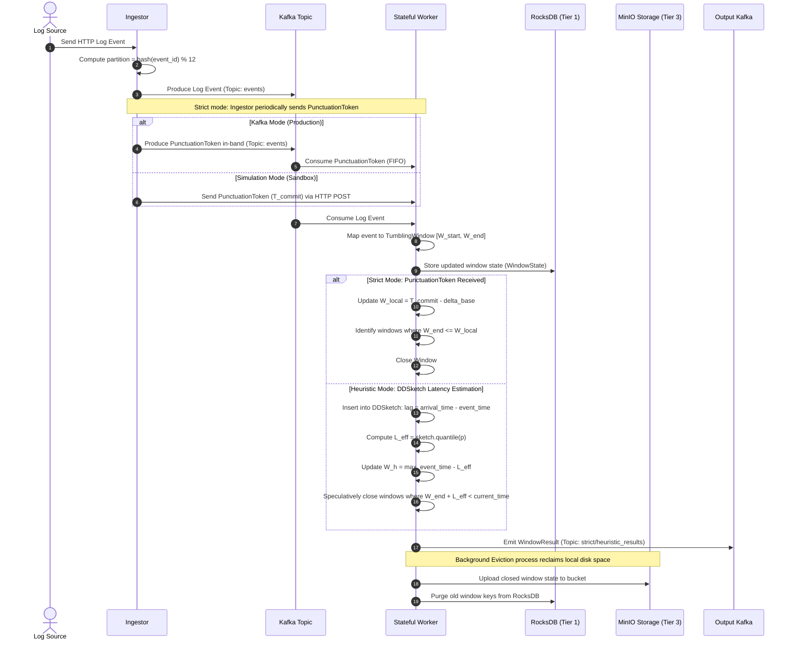

# DOCUMENT 01: SYSTEM ARCHITECTURE OVERVIEW

This document presents the overall system architecture of the distributed **Stateful Stream Processing system** within the `refactor/` package. The system is designed around a **Dual-Path** architectural model that allows distributed log processing across two concurrent modes: **Strict** (zero data loss) and **Heuristic** (low latency).

---

## 1. The Dual-Path Architectural Model

The system provides a flexible solution to resolve the challenges of late-arriving and out-of-order logs by supporting two parallel processing paths for the same log stream:

```
                  ┌──────────────────────────────┐
                  │          Log Sources         │
                  └──────────────┬───────────────┘
                                 │ HTTP / JSON
                                 ▼
                  ┌──────────────────────────────┐
                  │      Ingestor (Log Ingest)   │
                  └──────────────┬───────────────┘
                                 │ Route by Partition Key
                                 ▼
                  ┌──────────────────────────────┐
                  │      Kafka (12 Partitions)   │
                  └──────┬────────────────┬──────┘
                          │                │
             ┌────────────┘                └────────────┐
             ▼ (Strict Path)                            ▼ (Heuristic Path)
    ┌─────────────────┐                        ┌─────────────────┐
    │  Strict Worker  │                        │Heuristic Worker │
    ├─────────────────┤                        ├─────────────────┤
    │ - RocksDB State │                        │ - DDSketch      │
    │ - Punctuation   │                        │ - Adaptive P    │
    │ - Exactly-Once  │                        │ - DLQ Late Data │
    └────────┬────────┘                        └────────┬────────┘
             │                                          │
             ▼                                          ▼
    ┌─────────────────┐                        ┌─────────────────┐
    │ strict_results  │                        │heuristic_results│
    │   (Kafka Out)   │                        │   (Kafka Out)   │
    └─────────────────┘                        └─────────────────┘
```

* **Strict Path**: Guarantees **0% data loss** and absolute processing correctness (Exactly-Once processing semantics). This path relies on *Punctuation Tokens* injected by the upstream ingestor to determine when log events for a specific time range have been fully transmitted. The window closure latency is bound by the frequency of punctuation tokens (typically 10–15 seconds).
* **Heuristic Path**: Prioritizes **low latency**. This path dynamically estimates the empirical log transmission delay distribution using *DDSketch* instance running locally on each worker. When it is estimated to be safe, the worker speculatively closes windows and emits low-latency results (typically 3–5 seconds), accepting a small, configurable target error rate of late logs (e.g., $\le 1\%$). Any log event that arrives after the speculative closure is routed to the Dead Letter Queue (DLQ) for the downstream *Correction Protocol*.

---

## 2. Roles of the 4 System Components

The system is launched via the single entrypoint `run.py` and is decomposed into 4 independent roles:

### 2.1. Ingestor
* **Responsibilities**: Reads raw data from the log source (e.g., a file or a stream) and distributes events uniformly across 12 Kafka partitions using the hashing algorithm `hash(event_id) % 12`.
* **Strict Path Behavior**: Periodically injects `PunctuationToken` events (defaulting to every 1 second) containing a committed Event-Time ($T_{commit}$) to notify downstream workers to update their local watermarks.

### 2.2. Stateful Worker
* **Responsibilities**: Consumes log events from assigned partitions and assigns them to corresponding time windows (Tumbling Windows) based on their Event-Times.
* **State Management**: Uses an embedded RocksDB instance to persist local window states. When a local watermark progresses beyond the window boundary, the worker closes the window and emits the aggregated result.
* **State Eviction**: Periodically evicts completed window states from RocksDB (Tier 1 - Local SSD) to MinIO (Tier 3 - Cold Object Storage) to reclaim disk space.

### 2.3. Coordinator (Strict Mode Only)
* **Responsibilities**: Monitors heartbeats and aggregates local watermarks ($W_{local}$) from all active worker nodes.
* **Global Synchronization**: Determines the global watermark ($W_{global}$) as the minimum of the maximum local watermarks reported by active workers: $W_{global} = \min_{i} (LW_i)$.
* **Failover Management**: Detects worker node failures and triggers deterministic partition reassignment. It supports High Availability (HA) deployment using Raft consensus or ZooKeeper.

### 2.4. Aggregator (Heuristic Mode Only)
* **Responsibilities**: Collects local heuristic watermarks ($W_h$) from heuristic workers and merges them to output a global heuristic watermark ($W_{global\_h}$).
* **Active-Standby HA**: Runs two Aggregator instances in an Active-Standby configuration. The Active instance maintains an exclusive lock via local file-lock or ZooKeeper Lock (`zk_lock.py` using `kazoo`). If the Active node fails, the Standby node automatically assumes leadership within $\le 2$ seconds.

---

## 3. Hybrid Routing Mechanism

When the system runs in `hybrid` mode (workers executed with the `--mode hybrid` CLI option), the **Hybrid Router** is initialized at the worker level for each consumed partition:

```
                        LogEvent from Kafka
                                │
                                ▼
                 HybridRouter._resolve_priority()
                                │
               ┌───────────────┴───────────────┐
               │                               │
               ▼ (Priority: CRITICAL)          ▼ (Priority: STANDARD)
         StrictEngine                    HeuristicEngine
         (Punctuation-based)             (DDSketch-based)
               │                               │
               └───────────────┬───────────────┘
                                ▼
                      WindowResult Output
                                │
                                ▼
                        LossAccounting
                (Computes completeness metrics)
```

### 3.1. Priority Resolution
When a log event is consumed by a worker, the `HybridRouter` inspects the payload to route it:
* **CRITICAL**: Log events that have a `"critical"` priority in their metadata, or HTTP access logs with system errors (`status >= 500`). These events are routed to the **StrictEngine** to ensure zero loss and absolute correctness.
* **STANDARD**: Standard log events (e.g., `status < 500`). These events are routed to the **HeuristicEngine** to be processed and emitted quickly for real-time dashboards or fast alerting.

### 3.2. Loss Accounting
Upon closing any time window, the system compares the log counts processed by the two engines to compute completeness metrics:
* `strict_loss_pct`: Always 0% since the StrictEngine waits for the corresponding punctuation.
* `heuristic_loss_pct`: The percentage of events missed by the HeuristicEngine compared to the StrictEngine at the time of speculative window closure.
* `dlq_corrected`: The count of late-arriving events that are subsequently backfilled via the DLQ to correct the heuristic window aggregates.

---

## 4. System-Wide Data Flow

The sequence diagram below details the processing lifecycle of a log event from its creation to its final output:


