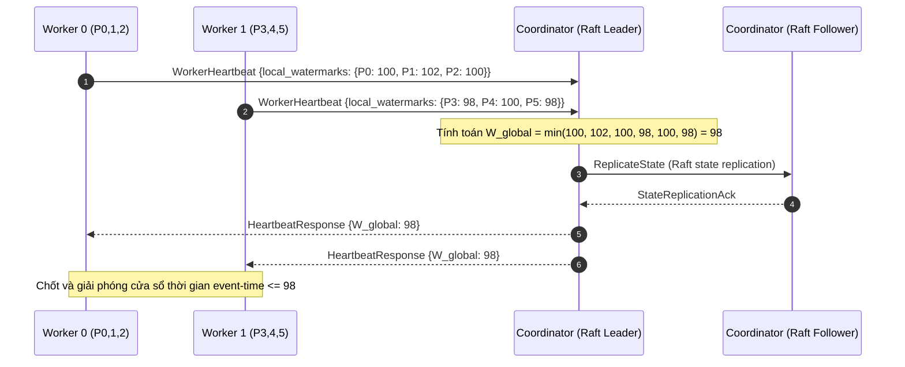

# Báo cáo biện minh lựa chọn thiết kế dựa trên lý thuyết Özsu và Valduriez

**Dự án**: Distributed Watermark Tracker / Log Delay Compensator (Hệ thống theo dõi mốc thời gian Watermark phân tán)

---

## 1. Mục đích báo cáo

Báo cáo này phân tích và biện minh các quyết định thiết kế cốt lõi của hệ thống **Distributed Watermark Tracker (Log Delay Compensator)** dựa trên nền tảng lý thuyết hệ cơ sở dữ liệu phân tán (Distributed Database Systems) của **M. Tamer Özsu và Patrick Valduriez**.

Mặc dù hệ thống không phải là một DBMS quan hệ phân tán truyền thống (Distributed Relational DBMS), nó phải đối mặt và giải quyết các bài toán quản lý dữ liệu phân tán tương đương:
- **Phân mảnh và cấp phát dữ liệu (Data Fragmentation & Allocation)**: Chia luồng dữ liệu vô hạn thành các phân mảnh nhỏ và phân bổ cho các Worker xử lý.
- **Xử lý phân tán (Distributed Processing)**: Tính toán song song tại các Worker nhằm duy trì hiệu năng cao.
- **Đồng bộ và điều phối toàn cục (Global Coordination & Consistency)**: Hợp nhất tiến trình cục bộ thành mốc thời gian Watermark toàn cục thống nhất để chốt cửa sổ (Window).
- **Tính chịu lỗi và khôi phục (Fault Tolerance & Recovery)**: Đảm bảo hoạt động liên tục, không mất mát và không trùng lặp dữ liệu (Exactly-Once Semantics) khi xảy ra lỗi mạng hoặc sập node.

Hệ thống được thiết kế và hiện thực hóa với hai chiến lược chuyên biệt nhằm đáp ứng các yêu cầu đánh đổi khác nhau:
1. **Strict Watermark**: Ưu tiên tính đúng đắn tuyệt đối (Correctness), tính nhất quán nghiêm ngặt (Strong Consistency) và không để mất mát dữ liệu do đến muộn (Late Arrival).
2. **Heuristic Watermark**: Ưu tiên độ trễ cực thấp (Low Latency), tính tự trị cục bộ cao (Site Autonomy), sử dụng thống kê thích ứng và bù đắp dữ liệu muộn thông qua Hàng đợi xử lý muộn (Dead-Letter Queue - DLQ) cùng cơ chế Correction.

Báo cáo dựa trên các đặc tả thiết kế và kiến trúc triển khai thực tế của hệ thống xử lý dòng dữ liệu watermark logic phân tán.

---

## 2. Cơ sở lý thuyết Özsu và Valduriez làm tiêu chí đánh giá

Dưới đây là bảng ánh xạ các khái niệm lý thuyết của Özsu và Valduriez vào các thành phần thực tế trong dự án:

| Khái niệm lý thuyết | Ý nghĩa trong Distributed Database | Ánh xạ trong dự án |
| :--- | :--- | :--- |
| **Phân mảnh (Fragmentation)** | Chia nhỏ dữ liệu thành các mảnh (fragments) để xử lý song song và tăng dung lượng lưu trữ. | **Kafka Partitions**: Phân mảnh ngang dòng dữ liệu log web server vô hạn theo cơ chế băm (`hash(host) % 12`). |
| **Cấp phát (Allocation)** | Quyết định vị trí lưu trữ và xử lý của từng mảnh dữ liệu tại các trạm (sites). | Phân bổ 12 phân mảnh Kafka cố định cho 4 Worker nodes; tái phân bổ động khi xảy ra lỗi. |
| **Nhân bản (Replication)** | Tạo các bản sao dữ liệu/metadata để tăng tính sẵn sàng (Availability) và khả năng phục hồi. | Kafka Replication, cơ chế nhân bản trạng thái Raft của Coordinator, Active-Standby của Aggregator, Tier-2 và Tier-3 storage. |
| **Xử lý phân tán (Distributed Processing)** | Thực thi tính toán tại các trạm cục bộ và hợp nhất kết quả toàn cục. | Các Worker tự xử lý cửa sổ thời gian cục bộ; Coordinator/Aggregator hợp nhất thành Watermark toàn cục. |
| **Điều phối phân tán (Distributed Coordination)** | Quản lý trạng thái và metadata dùng chung, tránh xung đột giữa các trạm. | Bầu chọn Leader và ghi nhật ký đồng thuận qua Raft/ZooKeeper; gửi Fencing Token ngăn chặn Split-brain. |
| **Quản lý nhất quán (Consistency)** | Đảm bảo tính đúng đắn khi nhiều node cùng cập nhật trạng thái logic toàn hệ thống. | Bảo đảm Exactly-Once input/output, mô hình máy trạng thái phân mảnh và giao thức bàn giao 5 bước (5-Step Failback). |
| **Tính tin cậy và Phục hồi (Reliability & Recovery)** | Khôi phục trạng thái đúng đắn sau sự cố sập node, mất mạng hoặc hỏng thiết bị lưu trữ. | Ghi nhận Checkpoint định kỳ, nạp trạng thái RocksDB cục bộ, replay offset từ Kafka, và cơ chế DLQ reconciliation. |
| **Tính minh bạch (Transparency)** | Che giấu cấu trúc phân tán bên dưới, cung cấp cho người dùng một góc nhìn logic thống nhất. | Người dùng quan sát thấy một luồng kết quả cửa sổ tích hợp duy nhất từ Kafka kết quả, không cần biết phân mảnh nội bộ. |
| **Chi phí truyền thông (Communication Cost)** | Tối ưu hóa số lượng và kích thước thông điệp trao đổi giữa các node. | Sự đánh đổi giữa Strict (chấp nhận chi phí điều phối cao để lấy tính đúng) và Heuristic (giảm điều phối để giảm trễ). |
| **Tự trị trạm (Site Autonomy)** | Cho phép các trạm cục bộ đưa ra quyết định độc lập mà không cần chờ đợi điều phối trung tâm. | Worker trong chế độ Heuristic tự tính toán tiến độ dựa trên DDSketch đo đạc cục bộ. |

---

## 3. Biện minh thiết kế Strict Watermark

### 3.1. Mục tiêu thiết kế
Thiết kế Strict Watermark ưu tiên hàng đầu tính đúng đắn và toàn vẹn của kết quả tổng hợp. Mốc thời gian logic toàn cục chỉ tiến lên khi và chỉ khi hệ thống chứng minh được rằng **tất cả** các phân mảnh đang hoạt động đã đi qua mốc thời gian đó. Thiết kế này loại bỏ hoàn toàn khả năng mất mát dữ liệu do đến muộn, đảm bảo tính nhất quán mạnh mẽ và khả năng chịu lỗi cao.

### 3.2. Lý do thiết kế Strict Watermark trước và Giải pháp cho bài toán Straggler
Trong thiết kế hệ thống xử lý dữ liệu phân tán, việc ưu tiên hiện thực hóa giải pháp **Strict Watermark** trước tiên là một quyết định mang tính chiến lược vì các lý do sau:

1. **Mẫu tham chiếu tính đúng đắn (Correctness Baseline)**: Để đánh giá hiệu quả của bất kỳ giải pháp tối ưu hóa hoặc xấp xỉ nào (như Heuristic), hệ thống cần một mốc so sánh chuẩn xác tuyệt đối (baseline). Strict Watermark cung cấp tính nhất quán mạnh mẽ (Strong Consistency) và bảo đảm dữ liệu hoàn thiện 100%, đóng vai trò là cột mốc để đo lường mức độ đánh đổi (trade-off) về cả độ trễ và độ hao hụt dữ liệu của Heuristic.
2. **Cam kết an toàn tuyệt đối (Safety Guarantees)**: Các nghiệp vụ cốt lõi như đối soát tài chính hay kiểm toán bảo mật đòi hỏi độ chính xác không sai lệch. Bằng cách thiết kế Strict trước, chúng tôi chứng minh rằng hệ thống có khả năng đạt được trạng thái an toàn tối đa trước khi tìm cách hạ thấp tiêu chuẩn để tăng hiệu năng.
3. **Xây dựng nền tảng hạ tầng chịu lỗi (Infrastructure Foundation)**: Giải thuật Strict đòi hỏi sự vận hành đồng bộ của các thành phần hạ tầng phức tạp: điều phối phân mảnh ngang, chuyển giao trạng thái Exactly-Once qua 5 bước failback, và bầu chọn đồng thuận qua Raft. Thiết kế Strict trước giúp kiểm thử và hoàn thiện toàn bộ hạ tầng điều phối này một cách độc lập trước khi tích hợp thêm các mô hình thống kê phức tạp.

> [!IMPORTANT]
> **Bài toán Straggler (Nút cổ chai trạm chậm) và Giải pháp hiện thực hóa:**
> Trong lý thuyết xử lý luồng phân tán, giải pháp Strict Watermark tiêu chuẩn thường dễ bị tổn thương bởi hiện tượng Straggler (phân mảnh chậm tiến độ làm tắc nghẽn toàn cụm). Tuy nhiên, thiết kế hệ thống của chúng tôi đã chủ động giải quyết bài toán Straggler trong chế độ Strict bằng hai cơ chế phối hợp:
> - **Cơ chế Bỏ qua phân mảnh nhàn rỗi (Idleness Bypass / Bypass Idle Partitions)**: Khi một phân mảnh tạm thời không phát sinh dữ liệu mới vượt quá cấu hình giới hạn thời gian (`IDLE_TIMEOUT_S`), Worker quản lý sẽ tự động đánh dấu phân mảnh đó là nhàn rỗi (`TEMPORARY_IDLE`) và báo cáo trong heartbeat. Coordinator Leader khi nhận được nhịp tim sẽ tự động loại trừ phân mảnh nhàn rỗi này ra khỏi hàm tối thiểu toàn cục:
>   $$\large \boxed{W_{\text{global}} = \min_{P_k \notin \text{Idle}} LW_i(P_k)}$$
>   Điều này cho phép dòng chảy thời gian của toàn cụm tiếp tục tịnh tiến, giải phóng trạng thái cửa sổ của các phân mảnh đang hoạt động bình thường mà không bị nghẽn bởi phân mảnh nhàn rỗi. Khi phân mảnh nhàn rỗi có log mới nạp vào, nó sẽ tự động được đưa trở lại danh sách tính toán watermark toàn cục.
> - **Tái phân bổ động dựa trên hết hạn nhịp tim (Heartbeat Timeout Failover)**: Nếu một Worker bị sập vật lý hoặc bị phân mảnh mạng nghiêm trọng (trở thành trạm chậm vĩnh viễn), Coordinator Leader sẽ phát hiện sau khi hết hạn nhịp tim (`HEARTBEAT_TIMEOUT_S` là 10 giây). Hệ thống sẽ kích hoạt giao thức tái phân bổ động, thu hồi quyền sở hữu phân mảnh của node lỗi, tăng `fencing term` logic để phong tỏa các lệnh cũ, và phân phối đều các phân mảnh bị ảnh hưởng cho các Worker còn sống gánh hộ. Worker mới nạp trạng thái từ checkpoint Tier-2 để tiếp tục tiêu thụ dữ liệu, giải phóng nghẽn dòng chảy watermark.
>
> Ngược lại, *Heuristic Watermark* tiếp cận giải quyết bài toán Straggler từ góc độ tự trị cục bộ (Site Autonomy): các Worker tự tịnh tiến mốc chốt cửa sổ thích ứng dựa trên quan sát trễ cục bộ (DDSketch). Các bản ghi của các trạm chậm đến sau khi cửa sổ chốt không làm nghẽn hệ thống mà được chuyển hướng sang hàng đợi DLQ để phục vụ việc sửa đổi và đối chiếu đền bù bất đồng bộ sau (Eventual Consistency).

### 3.3. Phân mảnh và Xử lý song song (Fragmentation)
Áp dụng lý thuyết phân mảnh của Özsu và Valduriez:
- **Phân mảnh ngang (Horizontal Fragmentation)**: Dòng sự kiện log khổng lồ được chia nhỏ thành 12 phân mảnh logic dựa trên hàm băm của trường `host`. Phân mảnh ngang giúp phân phối đều tải lượng ghi nhận sự kiện và cho phép mở rộng quy mô xử lý.
- **Xử lý song song phân tán (Distributed Parallel Processing)**: 4 Worker Nodes hoạt động song song để tiêu thụ dữ liệu từ các phân mảnh tương ứng. Mỗi Worker quản lý các RocksDB cục bộ được cô lập hoàn toàn cho từng phân mảnh để bảo đảm tính tự trị dữ liệu, tránh hiện tượng tranh chấp khóa (lock contention) giữa các phân mảnh.

### 3.4. Cấp phát và Tái phân bổ động (Allocation & Dynamic Reallocation)
Lý thuyết phân bổ quyết định cách đặt các mảnh dữ liệu (fragments) tại các trạm (sites). Hệ thống phân bổ cố định các phân mảnh cho từng Worker trong điều kiện bình thường để tối ưu hóa tính cục bộ dữ liệu (Data Locality) khi truy cập RocksDB. Khi xảy ra sự cố sập node, hệ thống triển khai cơ chế **Tái phân bổ động có kiểm soát (Controlled Dynamic Reallocation)**:

* **Tái phân bổ cân bằng tải phân tán (Distributed Rebalancing)**:
  Để tránh hiện tượng dồn toàn bộ tải trọng của node lỗi cho một node gánh hộ duy nhất (gây quá tải cục bộ), bộ quản lý failover của Coordinator Leader sẽ tính toán lại sơ đồ phân mảnh và chia đều chúng cho các Worker còn sống. Ví dụ: khi Worker 3 (giữ $P_9, P_{10}, P_{11}$) bị sập, hệ thống phân bổ $P_9$ cho Worker 0, $P_{10}$ cho Worker 1, và $P_{11}$ cho Worker 2. Việc phân chia đều này giúp duy trì thông lượng ổn định của hệ thống theo tối ưu hóa phân bổ tài nguyên.
  
* **Nguyên tắc Độc quyền Sở hữu (Partition Exclusive Ownership)**:
  Tại một thời điểm, một phân mảnh chỉ được gán cho duy nhất một Worker xử lý. Trạng thái phân mảnh được bảo vệ nghiêm ngặt qua mô hình máy trạng thái (`ASSIGNED`, `REASSIGNING`, `PAUSED`, `ORPHANED`) lưu trữ trong nhật ký đồng thuận, ngăn chặn hoàn toàn hiện tượng ghi trùng lặp dữ liệu đầu ra.

* **Cơ chế bàn giao failback 5 bước (5-Step Failback State Machine)**:
  Khi Worker cũ phục hồi và muốn nhận lại phân mảnh, hệ thống thực thi giao thức bàn giao có kiểm soát qua 5 trạng thái gRPC tuần tự (`PAUSE` → `FLUSH_ACK` → `KAFKA_REASSIGN` → `SEEK_RESUME` → `COMPLETE`), được minh họa trong sơ đồ trình tự dưới đây:

Giao thức này đảm bảo bàn giao trạng thái nhất quán và không trùng lặp thông điệp giữa các site.

### 3.5. Điều phối toàn cục và Nhất quán mạnh (Global Coordination & Strong Consistency)
Strict Watermark yêu cầu một quyết định nhất quán toàn cục để đóng một cửa sổ thời gian. Vì mỗi Worker chỉ nắm bắt tiến độ cục bộ của phân mảnh mình quản lý, hệ thống cần một cơ chế điều phối metadata toàn cục:

$$\large \boxed{W_{\text{global}} = \min_{\forall P_k \in \text{Active}} LW_i(P_k)}$$

* **Lựa chọn Cơ chế Đồng thuận (Consensus Selection)**:
  Để bảo đảm tính nhất quán nghiêm ngặt và chống lỗi phân mảnh mạng (Split-Brain), hệ thống sử dụng hai cơ chế điều khiển khác nhau:
  - **Strict Coordinator (Raft/ZK HA)**: Cụm 3 Coordinator chạy điều phối. Hệ thống hỗ trợ bầu chọn Leader qua (1) thuật toán đồng thuận Raft nhúng (Embedded Raft) với nhân bản log và bầu cử theo nhiệm kỳ, hoặc (2) ZooKeeper Leader Election (khi cấu hình `ZK_ENSEMBLE`) tranh chấp khóa phân tán tại `/csdlpt/coordinator-lock` và ghi Leader ID vào node tạm `/csdlpt/coordinator-leader`. Các chỉ thị điều phối kèm cặp `(term, command_id)` làm token fencing ngăn chặn split-brain khi phân mảnh mạng.
  - **Heuristic Aggregator (ZooKeeper/File Lock HA)**: Sử dụng cấu hình dự phòng nóng (Active-Standby) thông qua khóa phân tán ZooKeeper tại `/csdlpt/aggregator-lock` hoặc File Lock dùng chung (`FileLockLeader` dùng `fcntl`/`msvcrt`). Cơ chế này hoạt động bất đồng bộ, giúp hạ thấp chi phí điều phối truyền thông để ưu tiên hiệu năng và tính tự trị cục bộ.

### 3.6. Punctuation Token làm tiến độ Metadata tuần tự
Strict Watermark sử dụng các thông điệp kiểm soát đặc biệt là **Punctuation Tokens** phát ra từ nguồn (Ingestor) để báo hiệu dòng chảy thời gian của phân mảnh. Khi phân mảnh rơi vào trạng thái nhàn rỗi (không phát sinh log), Ingestor định kỳ gửi các *Empty Punctuation Tokens* với giá trị thời gian tăng dần.

Thiết kế này giải quyết bài toán cốt lõi trong hệ phân tán: **sự vắng mặt của dữ liệu không đồng nghĩa với việc thời gian dừng lại**. Nếu không có punctuation, hệ thống không thể phân biệt giữa một phân mảnh nhàn rỗi và một phân mảnh bị tắc nghẽn do hỏng hóc hoặc mạng chậm. Nhờ punctuation, hệ thống tiếp tục tịnh tiến Watermark toàn cục và tránh làm nghẽn toàn bộ luồng xử lý.

> [!NOTE]
> **Đồng bộ với mã hiện thực (`strict/coordinator.py::_compute_global`)**: Empty Punctuation là cơ chế *chính* giữ $W_{global}$ luôn tịnh tiến, do đó Strict **không** dùng cơ chế Idleness Bypass ngầm tại Coordinator (việc tự loại các phân mảnh "im lặng" sẽ gây mất dữ liệu khi chúng hoạt động lại). Cụ thể, các phân mảnh phản hồi chậm (`STALE`) và nhàn rỗi ngầm (`IDLE`) **vẫn** tham gia hàm $\min()$ để bảo toàn cam kết 0% loss; chỉ những phân mảnh được xác nhận lỗi (`FAILED`) hoặc được Worker đánh dấu nhàn rỗi *tường minh* (`is_temporary_idle` sau `IDLE_TIMEOUT_S` = 30.0 giây) mới bị loại trừ tạm thời, và tự động quay lại danh sách khi có sự kiện mới.

### 3.7. Nhân bản và Tính sẵn sàng cao (Replication & HA)
Hệ thống sử dụng các cơ chế dự phòng ở nhiều tầng để loại bỏ các điểm lỗi đơn lẻ (Single Point of Failure):
- **Tầng dữ liệu (Data Plane)**: Kafka Broker nhân bản (Replication Factor = 3) bảo đảm dòng dữ liệu đầu vào không bị mất mát.
- **Tầng điều phối (Control Plane)**: Cụm 3 Coordinator hoạt động đồng thuận Raft để bảo đảm tính sẵn sàng cao của bộ điều phối.
- **Tầng trạng thái (State Storage)**: RocksDB SST files được checkpoint định kỳ và sao lưu sang Tier-2 Shared Volume phục vụ khôi phục nhanh.
- **Tầng kết quả (Output Plane)**: Kết quả cửa sổ đã chốt được phát song song vào topic chính `strict_results` và một **Critical Audit Sink** (`audit_results`) để các consumer kiểm toán/đối soát replay độc lập. Kết hợp với `window_id` định danh duy nhất (idempotent emit) và máy trạng thái phân mảnh độc quyền sở hữu, tầng này bảo đảm **Exactly-Once output** — không phát trùng kết quả cửa sổ xuống downstream.

### 3.8. Phục hồi và Exactly-Once (Recovery)
Özsu và Valduriez định nghĩa phục hồi là yêu cầu cơ bản để bảo đảm tính đúng đắn của dữ liệu. Hệ thống triển khai recovery thông qua:
1. Checkpoint trạng thái cửa sổ tích lũy tại RocksDB.
2. Lưu trữ Kafka offsets tương ứng với checkpoint.
3. Khi xảy ra lỗi, Worker tải checkpoint, thực hiện `seek(offset + 1)` để phục hồi đúng trạng thái cũ.
4. Cơ chế lọc trùng (Deduplication) thông điệp đầu vào bằng bảng băm ID sự kiện cục bộ, bảo đảm tính Exactly-Once Processing.

### 3.9. Lưu trữ trạng thái phân tầng (Tiered State Storage)
Trạng thái xử lý được tổ chức thành 3 tầng lưu trữ chuyên biệt:
- **Tier-1: Local RocksDB** (Đọc/ghi nhanh trên đĩa cục bộ SSD NVMe): Đảm bảo độ trễ truy xuất thấp dưới 1ms cho các phép cập nhật cửa sổ nóng.
- **Tier-2: Shared Volume** (Sao lưu checkpoint định kỳ 10 giây): Cung cấp khả năng bàn giao trạng thái nhanh chóng giữa các trạm khi xảy ra lỗi.
- **Tier-3: Object Storage** (Lưu trữ nén lâu dài trên Object Storage): Đảm bảo lưu trữ dữ liệu lịch sử bền vững và khôi phục khi toàn bộ cluster local bị lỗi.

### 3.10. Đánh đổi chi phí truyền thông (Communication Cost)
Strict Watermark yêu cầu các luồng heartbeat liên tục từ Worker về Coordinator, các punctuation tokens truyền tải trong dòng sự kiện Kafka và cơ chế đồng thuận Raft. Điều này làm tăng chi phí băng thông mạng. Tuy nhiên, theo lý thuyết Özsu và Valduriez, chi phí truyền thông này hoàn toàn được biện minh vì nó là điều kiện bắt buộc để hệ thống đạt được tính nhất quán nghiêm ngặt và không mất mát dữ liệu.

### 3.11. Kết luận cho Strict Watermark
Strict Watermark được biện minh theo lý thuyết Özsu và Valduriez vì nó sử dụng fragmentation để mở rộng, allocation để quản lý partition ownership, replication để tăng reliability, distributed coordination để duy trì global watermark consistency, recovery protocols để chịu lỗi, exactly-once semantics để bảo toàn correctness, và transparency để che giấu sự phức tạp phân tán. Thiết kế này phù hợp khi correctness quan trọng hơn latency.

---

## 4. Biện minh thiết kế Heuristic Watermark

### 4.1. Mục tiêu thiết kế
Heuristic Watermark được thiết kế nhằm tối ưu hóa độ trễ xử lý (Latency) và nâng cao khả năng hoạt động tự trị (Autonomy) của các Worker. Hệ thống không chờ đợi các Punctuation Tokens hay thực hiện điều phối nhất quán toàn cục ngăn chặn (blocking coordination). Thay vào đó, nó sử dụng phương pháp ước lượng thống kê để dự đoán phân vị độ trễ của dòng sự kiện và đóng cửa sổ sớm.

### 4.2. Phân mảnh và Xử lý phân tán (Fragmentation)
Giống như Strict, dòng dữ liệu được phân mảnh ngang qua Kafka partitions để tận dụng xử lý song song. Sự cách biệt lớn nhất là Heuristic Watermark trao quyền **Tự trị trạm (Site Autonomy)** tối đa cho các Worker Nodes.

### 4.3. Tự trị cục bộ (Site Autonomy)
Özsu và Valduriez nhấn mạnh tính tự trị trạm giúp giảm sự phụ thuộc vào điều phối trung tâm, từ đó cải thiện hiệu năng và giảm trễ. Trong chế độ Heuristic:
- Mỗi Worker tự quan sát khoảng trễ của dòng sự kiện cục bộ: $\ell = T_{\text{arrival}} - T_{\text{event}}$.
- Mỗi Worker tự cập nhật cấu trúc dữ liệu DDSketch của riêng mình.
- Mỗi Worker tự đưa ra quyết định tịnh tiến mốc thời gian Watermark thích ứng cục bộ $W_{\text{heur}}$ để chốt cửa sổ mà không cần phối hợp hay chờ đợi tiến độ của các phân mảnh khác.

### 4.4. DDSketch làm thống kê trễ cục bộ (Distributed Metadata Estimation)
DDSketch là một cấu trúc dữ liệu phác thảo thống kê (streaming sketch) được sử dụng để duy trì phân phối độ trễ. DDSketch cung cấp các đặc tính lý tưởng cho metadata phân tán:
- **Bộ nhớ giới hạn (Bounded Memory)**: Sử dụng các thùng logarit giới hạn kích thước, tránh làm tràn bộ nhớ khi lưu trữ phân phối dữ liệu khổng lồ.
- **Khả năng cộng gộp (Mergeability)**: Nhiều DDSketch từ các phân mảnh khác nhau có thể được gộp lại với sai số giới hạn ($\alpha = 0.01$).
- **Độ chính xác phân vị**: Cho phép ước lượng chính xác phân vị $p$ của độ trễ thực tế (ví dụ: p95 hoặc p99) để tính toán biên an toàn hiệu dụng:

$$\large \boxed{W_{\text{heur}} = T_{\text{event\_max}} - Q_p(\{\ell\})}$$

### 4.5. Aggregator HA và Lược bớt điều phối (Reduced Coordination)
Chế độ Heuristic không sử dụng Strict Coordinator với thuật toán Raft chặn (blocking). Thay vào đó, nó sử dụng **Aggregator** đóng vai trò gom hợp metadata thích ứng từ các Worker. 

Để bảo đảm tính sẵn sàng cao mà không cần trả chi phí đồng thuận Raft đắt đỏ, Aggregator sử dụng cấu hình dự phòng nóng (Active-Standby) qua khóa phân tán ZooKeeper (`/csdlpt/aggregator-lock`) hoặc File Lock dùng chung (`FileLockLeader`). Active gửi tệp nhịp tim mỗi 1.0 giây, Standby giám sát tệp này và tự động takeover nâng lên Active nếu nhịp tim mất hoặc quá hạn (> 1.5 giây), tải lại trạng thái phân mảnh và watermark từ RocksDB/JSON. Bộ điều phối này hoạt động bất đồng bộ, cập nhật watermark toàn cục thích ứng $W_{\text{global\_heur}} = \min(W_{\text{heur}})$ mà không chặn tiến độ xử lý của bất kỳ Worker nào.

### 4.6. Sửa lỗi đền bù (Eventual Consistency & DLQ correction)
Vì Heuristic Watermark chốt cửa sổ dựa trên ước lượng phân vị (speculative chốt), các sự kiện đến muộn hơn mốc Watermark đã chốt sẽ không thể đưa vào cửa sổ xử lý chính. Hệ thống giải quyết bằng mô hình **Nhất quán sau cùng (Eventual Consistency)**:

```mermaid
flowchart LR
    classDef worker fill:#264653,stroke:#1d3557,color:#fff,stroke-width:2px;
    classDef kafka fill:#e76f51,stroke:#c1440e,color:#fff,stroke-width:2px;
    classDef store fill:#e9c46a,stroke:#c9a227,color:#333,stroke-width:2px;

    EVENT["Dữ liệu đến muộn<br/>(T_event < W_heur)"] --> W3["Worker Node"]:::worker
    W3 -->|1. Xác định trễ| DLQ["Dead-Letter Queue<br/>(late_logs_dlq topic)"]:::kafka
    DLQ -->|2. Đối chiếu bất đồng bộ| REC["Downstream Emitter<br/>(Historical Reconciliation)"]:::worker
    REC -->|3. Phát thông điệp sửa lỗi| SINK["Audit Results Database"]:::store
```

- **Định tuyến DLQ**: Các sự kiện muộn được Worker chuyển hướng tự động sang Kafka topic cho dữ liệu muộn.
- **Correction Message**: Một tiến trình xử lý dữ liệu muộn bất đồng bộ sẽ nạp lại trạng thái lịch sử của cửa sổ bị thiếu, tính toán độ lệch và phát ra thông điệp sửa lỗi (Correction Message) để cập nhật lại kết quả cửa sổ ở downstream.
- **Tính lũy kế sau cùng**: Nhờ cơ chế này, hệ thống đạt độ hoàn thiện dữ liệu sau cùng (Eventual Completeness) là 100% mà không bắt các cửa sổ thời gian thực phải chờ đợi lâu.

### 4.7. Khởi động lạnh và Biên an toàn thống kê (Cold Start & Warmup)
Tại thời điểm khởi động hệ thống, DDSketch chưa tích lũy đủ mẫu thống kê. Nếu sử dụng ngay các ước lượng phân vị từ tập mẫu nhỏ, Watermark có thể tiến lên quá nhanh và đánh dấu sai các bản ghi hợp lệ thành dữ liệu muộn.

Hệ thống tích hợp module thiết lập một giai đoạn khởi động ấm (Warm-up Phase). Trong thời gian này, hệ thống áp dụng một biên an toàn bảo thủ (Conservative Prior) dựa trên dữ liệu lịch sử hoặc cấu hình tĩnh để tích lũy đủ số lượng mẫu quy định trước khi chuyển sang chế độ ước lượng động.

### 4.8. Xử lý độ trễ âm và lệch đồng hồ (Negative Lag & Clock Skew)
Trong môi trường phân tán, sự lệch đồng hồ vật lý (Clock Skew) giữa các máy chủ là không thể tránh khỏi. Hệ thống xử lý độ trễ âm ($\ell < 0$ khi thời gian nhận nhỏ hơn thời gian sinh sự kiện logic do đồng hồ trạm nhận chạy chậm hơn trạm phát) nhằm ngăn chặn việc đưa các giá trị nhiễu này vào DDSketch, bảo toàn tính chính xác của phân phối độ trễ thống kê.

### 4.9. Tránh nhiễm bẩn thống kê khi phục hồi (Replay-mode Sketch rollbacks)
Khi một Worker phục hồi và thực hiện replay dòng sự kiện cũ từ Kafka offset cũ, tốc độ nạp dữ liệu rất nhanh khiến độ trễ đo đạc vật lý tạm thời bị phóng đại cực lớn (do sự kiện sinh ra trong quá khứ được xử lý ở hiện tại). Nếu đưa các mẫu này vào DDSketch, phân phối độ trễ sẽ bị nhiễm bẩn nghiêm trọng, đẩy Watermark dừng lại vô lý.

Hệ thống giải quyết tại công cụ xử lý chính bằng cơ chế chụp ảnh trạng thái DDSketch (Snapshot) trước khi ghi checkpoint. Khi khôi phục, Worker khôi phục DDSketch từ bản chụp sạch đó và tạm dừng việc thu thập mẫu thống kê trong suốt quá trình replay, chỉ kích hoạt lại khi Worker đã đuổi kịp dòng sự kiện thời gian thực (catch-up).

### 4.10. Đánh đổi chi phí truyền thông (Communication Cost)
So với Strict Watermark, Heuristic Watermark giảm đáng kể sự phụ thuộc vào Punctuation Tokens và phối hợp đồng thuận toàn cục của các trạm. Chi phí giảm trễ chờ đợi là tính nhất quán tức thời yếu hơn, nhưng hệ thống hoàn toàn bù đắp được nhờ cơ chế DLQ bất đồng bộ. Đây là một sự đánh đổi chi phí truyền thông vô cùng hợp lý dưới góc nhìn lý thuyết Özsu và Valduriez khi nghiệp vụ cho phép thực hiện sửa lỗi muộn.

### 4.11. Kết luận cho Heuristic Watermark
Heuristic Watermark được biện minh theo lý thuyết Özsu và Valduriez vì nó sử dụng fragmentation để mở rộng, site autonomy cục bộ nâng cao hiệu năng, cấu trúc DDSketch làm xấp xỉ metadata tối ưu, và mô hình nhất quán sau cùng phối hợp DLQ/Correction đền bù trạng thái. Chế độ này tối ưu nhất cho các nghiệp vụ ưu tiên độ trễ chờ thấp.

---

## 5. Phân tích Hệ thống dưới Định lý PACELC

Định lý PACELC là một bản mở rộng của định lý CAP truyền thống nhằm mô tả chi tiết hơn các đánh đổi trong hệ phân tán. Định lý này phát biểu rằng: Nếu xảy ra hiện tượng phân mảnh mạng (**P**artition), hệ thống phải đánh đổi giữa tính khả dụng (**A**vailability) và tính nhất quán (**C**onsistency); ngược lại, trong điều kiện hoạt động bình thường (**E**lse), hệ thống phải đánh đổi giữa độ trễ (**L**atency) và tính nhất quán (**C**onsistency).

Hai hướng thiết kế watermark của dự án thể hiện sự lựa chọn rõ ràng trên hai góc phần tư khác nhau của định lý PACELC:

### 5.1 Strict Watermark: Hệ thống PC/EC (Consistency-First)
Strict Watermark đại diện cho mô hình thiết kế đặt tính nhất quán lên hàng đầu ở cả hai điều kiện:
- **Khi xảy ra phân mảnh mạng (P $\rightarrow$ C)**: Hệ thống chọn tính nhất quán (**C**) và chấp nhận hy sinh tính khả dụng (**A**). Khi một Worker bị cô lập mạng hoặc mất kết nối, Coordinator Leader không nhận được heartbeat và tiến độ cục bộ của phân mảnh đó. Theo thuật toán tối thiểu toàn cục $W_{global} = \min(LW_i)$, hệ thống sẽ dừng tịnh tiến watermark toàn cục. Các cửa sổ xử lý ở các Worker khác bị chặn lại, không thể phát kết quả. Hệ thống chấp nhận dừng hoạt động (unavailability) để bảo đảm không phát ra dữ liệu thiếu sót.
- **Trong điều kiện bình thường (E $\rightarrow$ C)**: Hệ thống chọn tính nhất quán (**C**) và chấp nhận tăng độ trễ (**L**). Hệ thống thực hiện cơ chế điều phối chặn (blocking coordination), bắt buộc các Worker phải đợi Punctuation Tokens từ Ingestor và đợi tín hiệu broadcast watermark từ Coordinator Leader. Mọi cửa sổ sự kiện đều phải đợi đầy đủ bằng chứng rồi mới được chốt, khiến độ trễ đầu cuối tăng lên để đảm bảo tính đúng đắn tuyệt đối.

### 5.2 Heuristic Watermark: Hệ thống PA/EL (Availability & Latency)
Heuristic Watermark được thiết kế nhằm tối ưu hóa hiệu năng bằng cách chấp nhận nhất quán sau cùng:
- **Khi xảy ra phân mảnh mạng (P $\rightarrow$ A)**: Hệ thống chọn tính khả dụng (**A**) và chấp nhận giảm tính nhất quán (**C**). Nhờ nguyên tắc tự trị trạm (Site Autonomy), các Worker bị cô lập hoặc các Worker còn sống vẫn tiếp tục ước lượng watermark cục bộ bằng DDSketch và chốt cửa sổ để xuất kết quả ra downstream mà không bị block bởi Coordinator hay các phân mảnh bị mất kết nối mạng.
- **Trong điều kiện bình thường (E $\rightarrow$ L)**: Hệ thống chọn giảm độ trễ (**L**) và chấp nhận hy sinh tính nhất quán tức thời (**C**). Dựa trên ước lượng phân vị của DDSketch, hệ thống đóng cửa sổ sớm để giảm thời gian chờ chốt. Dữ liệu đến muộn hơn watermark được chuyển hướng sang hàng đợi DLQ để sửa đổi đền bù bất đồng bộ sau (Eventual Consistency), giúp hệ thống đạt độ trễ đầu cuối cực thấp trong vận hành thực tế.

---

## 6. Phân tích so sánh trực tiếp

| Tiêu chí phân tích | Chế độ Strict Watermark | Chế độ Heuristic Watermark |
| :--- | :--- | :--- |
| **Mục tiêu ưu tiên** | Tính đúng đắn tuyệt đối, nhất quán mạnh mẽ. | Độ trễ xử lý thấp, khả năng tự trị cao. |
| **Nguồn dữ liệu tiến độ** | Punctuation Token từ Ingestor nguồn. | DDSketch Lag Estimation. |
| **Bộ điều phối toàn cục** | Strict Coordinator (Raft Consensus). | Lighter Aggregator (ZooKeeper HA lock). |
| **Mô hình nhất quán** | Chốt khi an toàn toàn cục (Immediate Consistency). | Chốt speculative, đối chiếu đền bù sau (Eventual). |
| **Xử lý dữ liệu muộn** | Chờ đợi dữ liệu, không chấp nhận trễ. | Định tuyến DLQ và phát Correction Messages. |
| **Chi phí truyền thông** | Cao (Quorum Acks, Heartbeats liên tục). | Thấp (Heartbeats thống kê bất đồng bộ). |
| **Tự trị trạm (Autonomy)** | Thấp (Phụ thuộc vào tiến độ toàn cục). | Cao (Worker tự chốt cửa sổ dựa trên DDSketch). |
| **Mô hình phục hồi** | Checkpoint, Replay, Fencing, Failback 5 bước. | DDSketch Snapshot, Replay-mode catchup, DLQ. |
| **Trường hợp áp dụng** | Kiểm toán, hóa đơn, báo cáo tuân thủ (Billing). | Dashboard thời gian thực, giám sát mạng (Monitoring). |

---

## 7. Kết luận chung

Lựa chọn thiết kế của dự án **Distributed Watermark Tracker** được chứng minh hoàn toàn phù hợp và chặt chẽ dưới góc nhìn lý thuyết hệ cơ sở dữ liệu phân tán của Özsu và Valduriez:
1. **Phân mảnh ngang hiệu quả**: Sử dụng Kafka partitions để chia nhỏ luồng log, bảo toàn tính độc lập của fragment qua cô lập RocksDB cục bộ.
2. **Tối ưu hóa phân bổ (Allocation)**: Triển khai giải thuật tái phân bổ động cân bằng tải đều (Even redistribution round-robin) và bảo đảm nguyên tắc độc quyền sở hữu phân mảnh.
3. **Mặt phẳng điều khiển chịu lỗi**: Sử dụng cụm Raft đồng thuận đối với Strict Coordinator nhằm bảo đảm nhất quán mạnh, và khóa ZooKeeper Active-Standby đối với Heuristic Aggregator nhằm giảm thiểu chi phí truyền thông.
4. **Phục hồi trạng thái tin cậy**: Máy trạng thái failback 5 bước bảo đảm bàn giao trạng thái nhất quán Exactly-Once mà không gây mất mát hay trùng lặp kết quả.
5. **Cơ chế đối phó Straggler hiệu quả**: Giải pháp bypass các phân mảnh nhàn rỗi (`TEMPORARY_IDLE`) trong Strict và mô hình nhất quán sau cùng kết hợp DLQ/Correction trong Heuristic.

Kiến trúc tổng thể thể hiện một sự hiểu biết sâu sắc về các ràng buộc hệ thống phân tán, cung cấp các giải pháp tối ưu hóa thiết kế linh hoạt tương ứng với các điểm đánh đổi hiệu năng (Completeness-at-Latency Trade-off) khác nhau.

---

## 8. Tài liệu tham khảo

- Özsu, M. T., and Valduriez, P. *Principles of Distributed Database Systems*. Springer.
