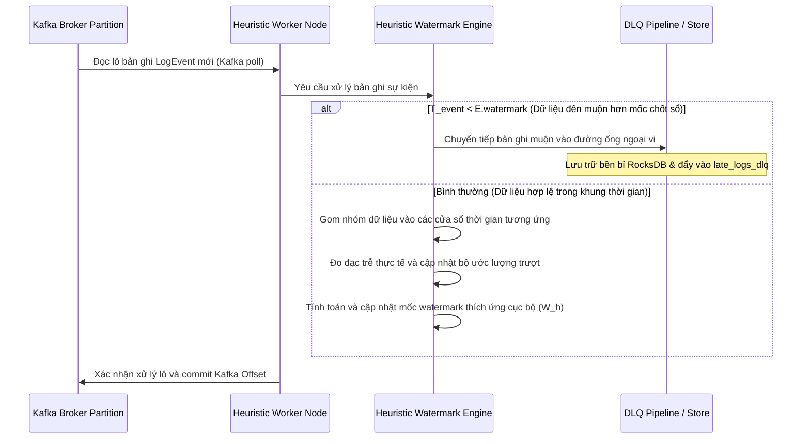

# TÀI LIỆU THIẾT KẾ HEURISTIC WATERMARK + DDSKETCH

## Stateful Stream Processing với Heuristic Watermark dựa trên DDSketch + DLQ Correction

**Bài toán #112 — Log Delay Compensator**

| Trường        | Giá trị                                                  |
|---------------|----------------------------------------------------------|
| Phiên bản     | 2.0 (Consolidated Production Specification)              |
| Trạng thái    | Design Specification — Mục tiêu triển khai               |
| Phạm vi       | Stateful Distributed Stream Processing (Low-Latency)     |
| Cam kết       | Bounded Loss (≤ ε) + Adaptive Estimation + DLQ Correction + Aggregator HA |
| Loại tài liệu | **Tài liệu thiết kế mục tiêu** — đặc tả đầy đủ kiến trúc đích   |

---

## Mục lục

1. [Tổng quan và mục tiêu](#1-tổng-quan-và-mục-tiêu)
2. [Bảng ký hiệu và thuật ngữ](#2-bảng-ký-hiệu-và-thuật-ngữ)
3. [Kiến trúc tổng thể](#3-kiến-trúc-tổng-thể)
4. [Windowing Logic](#4-windowing-logic)
5. [DDSketch — Estimator Core](#5-ddsketch--estimator-core)
6. [Cold Start Strategy](#6-cold-start-strategy)
7. [Negative Lag Handler](#7-negative-lag-handler)
8. [State Management](#8-state-management)
9. [Global Merge Protocol — Aggregator HA](#9-global-merge-protocol--aggregator-ha)
10. [Latency Analysis](#10-latency-analysis)
11. [Robustness](#11-robustness)
12. [Late Data Pipeline & DLQ Correction Protocol](#12-late-data-pipeline--dlq-correction-protocol)
13. [Operational Mandates](#13-operational-mandates)
14. [Bảng tham số cấu hình mặc định](#14-bảng-tham-số-cấu-hình-mặc-định)
15. [Trade-offs và giới hạn](#15-trade-offs-và-giới-hạn)

---

## 1. Tổng quan và mục tiêu

### 1.1. Bài toán và động lực

Khi Strict Watermark đạt 0% data loss, nó trả giá bằng:
- Latency cao (≥ 15s).
- Phụ thuộc Upstream phát Punctuation Token.
- Coordinator blocking phức tạp.

**Heuristic Watermark** phù hợp khi:
- Upstream là legacy, không thể inject Punctuation.
- SLA latency khắt khe (< 5 giây).
- Chấp nhận loss rate nhỏ có kiểm soát.
- Có pipeline xử lý dữ liệu muộn riêng (DLQ).

### 1.2. Lựa chọn DDSketch làm Estimator

**DDSketch** (Distributable Quantile Sketch — Datadog 2019) vượt trội các phương án khác cho ước lượng lag distribution heavy-tail:

| Đặc tính                  | DDSketch | T-digest | EWMA | Histogram cố định |
|---------------------------|----------|----------|------|-------------------|
| Relative Error guarantee  | ✓ (α)    | ✗        | ✗    | ✗                 |
| Heavy-tail accuracy       | ★★★      | ★★       | ★    | ★                 |
| Mergeable (distributed)   | ✓ exact  | ~ approx | ✗    | ✗                 |
| Bounded Memory            | ✓        | ✓        | ✓    | ✓                 |
| O(1) update              | ✓        | O(log K) | ✓    | ✓                 |

### 1.3. Mục tiêu thiết kế

| Tiêu chí                 | Cam kết kỹ thuật                                          |
|--------------------------|-----------------------------------------------------------|
| **Expected Loss**        | ≤ 1% trong steady state (đo per-minute)                   |
| **Bounded Loss**         | ≤ 5% trong burst scenarios (auto-mitigate qua Adaptive Percentile)|
| **End-to-end Latency**   | ≈ `W + P99(lag)` ≈ 5 giây                                 |
| **Memory per partition** | DDSketch ≤ 100 KB (với α=0.01, range 1ms–1h)              |
| **Late data handling**   | 100% — không log nào mất silently; tất cả đi DLQ           |
| **Aggregator HA**        | Failover ≤ 2 giây                                          |
| **Cold start recovery**  | Conservative Prior emit WM trong warm-up phase             |

### 1.4. Giả định và phạm vi

- **Hạ tầng**: Kafka (12 partitions), Worker Nodes Docker, Shared Volume SSD, MinIO.
- **DDSketch**: dùng implementation chính thức từ Datadog open-source library.
- **Downstream support**: Cần hỗ trợ Correction Pattern (Incremental Update / Replace / Append-Versioning).
- **Ngoài phạm vi**: Strict guarantee tuyệt đối (use Strict path nếu cần).

---

## 2. Bảng ký hiệu và thuật ngữ

### 2.1. Ký hiệu toán học

| Ký hiệu                       | Ý nghĩa                                                          |
|-------------------------------|------------------------------------------------------------------|
| `T_event`                     | Event-time của log                                                |
| `arrival_time`                | Processing-time khi Worker nhận log                              |
| `lag = arrival - T_event`     | Độ trễ truyền log từ source đến Worker                          |
| `[window_start, window_end]`  | Tumbling Window                                                   |
| `W_h_i^{P_k}(t)`              | Heuristic Watermark cục bộ của Worker `i` cho phân vùng `P_k`    |
| `W_global_h(t)`               | Heuristic Watermark toàn cục, do Aggregator hợp nhất             |
| `α`                           | Relative error parameter của DDSketch                            |
| `γ = (1+α)/(1-α)`             | Hệ số nhân log-scale bucket                                       |
| `p`                           | Percentile chọn để tính watermark (mặc định 0.99)                |
| `L_eff(t)`                    | `P_p(lag history)` — lag effective tại thời điểm `t`             |
| `ε`                           | Loss budget tunable (= 1 - p)                                    |
| `negative_lag_rate`           | Tỷ lệ sample có lag < 0 (clock skew)                             |
| `is_replaying`                | Flag node đang trong replay-mode                                 |

### 2.2. Thuật ngữ chính

- **Heuristic Watermark**: Watermark được ước lượng từ phân phối thực nghiệm của lag.
- **DDSketch**: Cấu trúc quantile sketch với log-scale buckets và relative error guarantee.
- **Adaptive Percentile**: Cơ chế nâng `p` lên P99.9 khi detect tail spike.
- **Conservative Prior**: Lag estimate dùng trong warm-up khi sketch chưa đủ sample.
- **Bucket Collapse**: Gộp bucket index thấp khi memory vượt cap.
- **Sliding Window Sketch**: N sub-sketches × 1 giây để track lag gần đây.
- **DLQ (Dead-Letter Queue)**: Kafka topic chứa late data để xử lý offline.
- **Correction Message**: Thông điệp emit để sửa Window đã chốt với late data.
- **Replay-Mode Fallback**: Freeze sketch update khi node đang replay.
- **Snapshot + Rollback**: Cơ chế clean sketch khỏi sample nhiễm bẩn.

---

## 3. Kiến trúc tổng thể

```
┌──────────────────────────────────────────────────────────────────────────┐
│              Web Servers (Log Sources — không cần thay đổi)               │
└──────────────────────────────┬───────────────────────────────────────────┘
                               │ log events (FIFO OK, không cần Min-Heap)
                               ▼
┌──────────────────────────────────────────────────────────────────────────┐
│              Kafka Cluster (12 Partitions, standard FIFO)                 │
└──────────────────────────────┬───────────────────────────────────────────┘
                               │
            ┌──────────────────┴──────────────────┐
            ▼                  ▼                  ▼              ▼
   ┌──────────────┐   ┌──────────────┐   ┌──────────────┐   ┌──────────────┐
   │  Worker 1    │   │  Worker 2    │   │  Worker 3    │   │  Worker 4    │
   │              │   │              │   │              │   │              │
   │ DDSketch     │   │ DDSketch     │   │ DDSketch     │   │ DDSketch     │
   │ per P1-P3    │   │ per P4-P6    │   │ per P7-P9    │   │ per P10-12   │
   │ + Snapshot   │   │ + Snapshot   │   │ + Snapshot   │   │ + Snapshot   │
   │   Manager    │   │   Manager    │   │   Manager    │   │   Manager    │
   │              │   │              │   │              │   │              │
   │ WM Gen       │   │ WM Gen       │   │ WM Gen       │   │ WM Gen       │
   │ + Adaptive   │   │ + Adaptive   │   │ + Adaptive   │   │ + Adaptive   │
   │   Percentile │   │   Percentile │   │   Percentile │   │   Percentile │
   │              │   │              │   │              │   │              │
   │ RocksDB      │   │ RocksDB      │   │ RocksDB      │   │ RocksDB      │
   └──────┬───────┘   └──────┬───────┘   └──────┬───────┘   └──────┬───────┘
          │ W_h_i^{P_k} (200ms) + Worker Heartbeat
          └──────────────────┬──────────────────┬──────────────────┘
                             ▼
              ┌─────────────────────────────────────┐
              │   Aggregator Cluster (HA, 2 nodes)   │
              │  ┌──────────┐         ┌──────────┐  │
              │  │  Active  │◄────────┤  Standby │  │
              │  │ (Leader) │ ZK Lock │ (Hot)    │  │
              │  └──────────┘         └──────────┘  │
              │   - Per-partition status table      │
              │   - W_global_h = min(W_h_i)         │
              │   - Worker failure detection         │
              └────────────────┬────────────────────┘
                               │ Broadcast W_global_h (500ms)
                               ▼
              ┌─────────────────────────────────────┐
              │  Worker Nodes — Chốt sổ Window       │
              └────┬───────────────────────┬────────┘
                   │                       │
                   ▼                       ▼
        [Main Results Topic]      [late_logs_dlq Topic]
        (is_speculative: true)              │
                                            ▼
                                  [DLQ Consumer / Offline Job]
                                            │
                                            ▼
                                  [Correction Messages]
                                            │
                                            ▼
                                  [Downstream Reconciliation]

   ┌────────────────────────────────────────────────────────────────┐
   │  Shared Volume (Warm State)                                      │
   │  /data/checkpoint/                                                │
   │   ├── partition_k/ {metadata.json, state.db/, sketch.bin}         │
   └─────────────────────────────┬──────────────────────────────────┘
                                 │ Async checkpoint flush (10s)
                                 │ Baseline history backup (gracefully on shutdown)
                                 ▼
   ┌────────────────────────────────────────────────────────────────┐
   │  Object Storage (Cold State)                                     │
   │  minio/bucket/heuristic-watermark/                                 │
   │   ├── baseline_history/      (per partition, dùng cho cold start)│
   │   ├── dlq_archive/           (correction history)                 │
   │   └── disaster_recovery/                                          │
   └────────────────────────────────────────────────────────────────┘
```

### 3.1. Khác biệt so với Strict

| Thành phần           | Strict                              | Heuristic                              |
|----------------------|-------------------------------------|----------------------------------------|
| Punctuation Token    | Bắt buộc, từ Ingestor               | Không cần                              |
| Kafka Partition      | Min-Heap (Priority Queue)           | FIFO thông thường                      |
| Watermark source     | Token từ upstream                   | DDSketch ước lượng từ lag history     |
| Coordinator          | Raft HA, blocking hội tụ            | Aggregator HA, eventually consistent  |
| Failover mechanism   | Tiered Partition-Level Eviction     | Replay-Mode Fallback (sketch frozen)  |
| State Backend        | RocksDB + Offset                    | RocksDB + Offset + DDSketch state     |
| Late data path       | Không tồn tại                       | DLQ pipeline + Correction (bắt buộc)  |
| Memory overhead      | Thấp                                | ~100KB/partition cho sketch           |

---

## 4. Windowing Logic

> **Mục tiêu**: Phân chia Window trên Event-Time. Watermark được ước lượng từ DDSketch để chốt Window kịp thời, chấp nhận `loss ≤ ε`.

### 4.1. Event-Time vs Processing-Time

Kế thừa từ Strict (đã loại bỏ Processing-Time khỏi phân chia Window).

### 4.2. Tumbling Window

Kế thừa từ Strict — kích thước **5 giây**:

$$window\_start = \lfloor T_{event} / 5 \rfloor \times 5$$

$$window\_end = window\_start + 5$$

### 4.3. Heuristic Watermark — Định nghĩa

Watermark tại Worker `i` cho partition `P_k`:

$$W_{h,i}^{P_k}(t) = \max\Big(W_{h,i}^{P_k}(t-1),\ \max_{j \le t}(T_{event,j}) - L_{eff}^{P_k}(t)\Big)$$

Trong đó:
- `max(T_event)` là Event-Time lớn nhất quan sát được.
- `L_eff^{P_k}(t) = DDSketch_{P_k}.quantile(p)` — lag effective.
- `max(W_prev, ...)` bảo đảm **monotonic** (chỉ tiến, không lùi).

### 4.4. Per-Partition WM + Global Aggregation

Mỗi partition có DDSketch riêng vì:
- Lag distribution mỗi partition khác nhau (mạng, skew traffic).
- Dùng global distribution sẽ làm partition slow chịu loss cao hơn dự kiến.

Aggregator hợp nhất:

$$W_{global\_h}(t) = \min_{P_k \in \text{Active}} W_{h,i}^{P_k}(t)$$

Chi tiết Aggregator HA xem §9.

---

## 5. DDSketch — Estimator Core

> **Mục tiêu**: Ước lượng quantile của lag với relative error bounded, memory cố định, merge perfect giữa partitions.

### 5.1. Vì sao DDSketch cho lag

**Lag span nhiều orders of magnitude**: 1ms (intra-DC) đến 10s (cross-region với retry). Spread 10000x.

**Relative error tự nhiên cho latency**: ±1% ở P99=5000ms (= ±50ms) có ý nghĩa hơn ±5ms cố định.

**Heavy-tail distribution**: network spike, GC pause, retry storm tạo tail dày. DDSketch log-scale buckets tự nhiên xử lý tail.

### 5.2. Cơ chế Log-Scale Buckets

Mỗi giá trị `x` được map tới bucket index:

$$\text{bucket}(x) = \lceil \log_\gamma(x) \rceil, \quad \gamma = \frac{1+\alpha}{1-\alpha}$$

Ví dụ với `α = 0.01`:
- `γ = 1.0202`
- Số bucket cần cho range 1ms–1h ≈ 770

### 5.3. Relative Error Guarantee

Cam kết toán học khi query `quantile(q)`:

$$\frac{|\hat{q} - q|}{q} \le \alpha$$

Áp dụng đồng đều trên toàn miền phân phối (khác T-digest có sai số tuyệt đối).

### 5.4. Mergeability

Hai DDSketch cùng `α` merge bằng cách cộng counters:

$$\text{Merged.buckets}[i] = \text{Sketch}_A\text{.buckets}[i] + \text{Sketch}_B\text{.buckets}[i]$$

Merge **không mất accuracy** → sai số sau merge vẫn là `α`.

Đặc tính này cho phép:
- Per-partition merge thành per-node merge.
- Cross-node aggregation cho global lag distribution.

### 5.5. Bounded Memory với Hard Cap

**Multi-strategy bound**:

**Strategy 1 — Tail Truncation**:

```
MAX_LAG_ACCEPTED = 1 giờ (= 3,600,000 ms)
```

Lag > MAX_LAG_ACCEPTED:
- Không add vào sketch (treat như anomaly).
- Đẩy vào DLQ với metadata.
- Alert "Extreme lag detected".

**Strategy 2 — Bucket Collapse**:

Khi số bucket > `max_buckets = 1024`, gộp các bucket index thấp nhất (low-value side).

DDSketch ưu tiên tail accuracy (P99) → collapse phía low-value ít ảnh hưởng watermark calculation.

**Strategy 3 — Adaptive α**:

Nếu sample distribution cho thấy range hẹp (vd 1ms–10s), giảm range giả định → α nhỏ hơn cho cùng bucket count.

**Bound thiết kế**:

| Tham số            | Giá trị             |
|--------------------|---------------------|
| `α`                | 0.01 (1%)           |
| `MAX_LAG_ACCEPTED` | 1 giờ               |
| `max_buckets`      | 1024 (hard cap)     |
| Effective range    | 1ms – 1h            |
| Bucket dự kiến     | ~770 (an toàn)      |

### 5.6. Sliding Window over DDSketch

DDSketch chuẩn là cumulative. Sliding window:

```
Total window: 60 giây
Chia thành: 60 sub-sketches × 1 giây mỗi cái

[s_0, s_1, ..., s_59]
              ↑
        current (đang add)

Mỗi giây:
  - Tạo sub-sketch mới s_60
  - Đẩy s_0 ra khỏi window
  - Total sketch = merge(s_1..s_60)

Query:
  - Merge tất cả sub-sketch active
  - quantile = total.quantile(p)
```

**Tối ưu**: Cache merged sketch, rebuild mỗi 200ms khi emit watermark.

**Memory tổng**: O(60 × 1024) ≈ 60KB per partition.

### 5.7. Adaptive Percentile (Loss Budget Guarantee)

Cố định `p = 0.99` cho expected loss 1%, nhưng burst tail spike có thể vượt SLA.

**Logic adaptive**:

```
Bình thường:
  L_eff = sketch.quantile(p_normal)    ← p_normal = 0.99

Detection (tail spike):
  if sketch.quantile(0.99) > 2x quantile(0.99) trong 1 phút trước:
    → switch p_safe = 0.999

Recovery:
  if sketch ổn định trong 5 phút:
    → switch back p_normal
```

**SLA viết lại**:

| Cam kết                  | Định lượng                                                       |
|--------------------------|------------------------------------------------------------------|
| Expected Loss            | ≤ 1% trong steady state                                          |
| Bounded Loss             | ≤ 5% trong burst (auto-mitigate)                                 |
| Mean Time to Recover     | ≤ 5 phút sau khi detect SLA violation                            |

---

## 6. Cold Start Strategy

> **Mục tiêu**: Đảm bảo watermark accuracy trong giai đoạn khởi động, khi sketch chưa đủ sample.

### 6.1. Vấn đề

Warm-up 10s không đảm bảo sketch có đủ sample. Nếu traffic ban đầu 10 log/s, 10s × 10 = 100 sample → P99 không có ý nghĩa thống kê.

### 6.2. Two-Condition Exit

Exit warm-up khi **CẢ HAI** thỏa mãn:

1. **Time**: ≥ 10 giây từ start.
2. **Sample**: sketch có ≥ 1000 samples.

### 6.3. Cold Start Phases

| Phase           | Điều kiện                              | Behavior                          |
|-----------------|----------------------------------------|-----------------------------------|
| **Phase 0**     | 0–5s, < 100 sample                     | Buffer-only, không emit WM        |
| **Phase 1**     | 5–10s, 100–1000 sample                 | Emit WM dùng Conservative Prior   |
| **Phase 2**     | ≥ 10s VÀ ≥ 1000 sample                 | Normal mode, dùng sketch          |

### 6.4. Conservative Prior

```
L_prior = max(
  L_max,                       ← cận trên từ design (60s)
  P99 từ baseline_history       ← nếu có run trước
)

W_h = max(T_event) - L_prior  ← rất conservative, ít loss
```

### 6.5. Baseline History

Worker khi shutdown gracefully → ghi sketch state hiện tại lên MinIO:

```
minio/bucket/heuristic-watermark/baseline_history/{partition_id}/latest.json
```

Restart: đọc baseline → dùng làm prior cho warm-up phase.

---

## 7. Negative Lag Handler

> **Mục tiêu**: Phát hiện và xử lý clock skew (lag < 0) — không để nhiễu sketch.

### 7.1. Phát hiện và phân loại

Track:

```
negative_lag_rate = count(lag < 0 in last 1min) / count(total in last 1min)
```

### 7.2. Tier Actions

| Negative Lag Rate | Diagnosis                     | Action                              |
|-------------------|-------------------------------|-------------------------------------|
| < 0.1%            | Jitter bình thường            | Skip, không alert                   |
| 0.1% – 1%         | Clock skew nhẹ                | Skip + log warning                  |
| 1% – 5%           | Clock skew rõ                 | Alert + Recalibration               |
| > 5%              | Clock chaos / Ingestor bug    | Alert critical + Degrade to BOO     |

### 7.3. Recalibration (Tier 3)

Khi rate > 1%:

1. Track `median_neg_lag = median(lag for lag < 0)`.
2. Apply offset: `adjusted_lag = original_lag + |median_neg_lag|`.
3. Re-feed sketch với `adjusted_lag >= 0`.

### 7.4. Degrade to BOO Fallback (Tier 4)

Khi rate > 5%:

- Switch tạm từ DDSketch → BOO (Bounded Out-of-Orderness) với `L_max` conservative.
- Alert ops fix NTP/clock.
- Resume DDSketch khi rate < 1% trong 5 phút.

---

## 8. State Management

> **Mục tiêu**: Lưu trữ Active Windows + DDSketch state bền bỉ, recovery nhanh, không phình đĩa.

### 8.1. RocksDB cho Active Windows

Kế thừa từ Strict — WAL + MemTable + SST + Purge khi `W_global_h` vượt qua.

### 8.2. Checkpoint với DDSketch state

Mở rộng checkpoint package:

```
/data/checkpoint/partition_k/
├── metadata.json      ← Offset, active windows, term
├── state.db/          ← SST files (RocksDB)
└── sketch.bin         ← Serialized DDSketch state ← MỚI
```

**Format `sketch.bin`** (Protobuf):

```
SketchCheckpoint {
  alpha: float
  window_seconds: int
  sub_sketches: [
    {
      timestamp_sec: int64
      buckets: map<int32, int64>   // bucket_index → count
      total_count: int64
    }
  ]
  monotonic_W_h: float  // last emitted watermark
}
```

Kích thước: ≤ 100KB per partition.

### 8.3. Restore với Warm Restart

Khi tiếp quản partition:

1. Load SST → RocksDB.
2. Load `sketch.bin` → SlidingWindowDDSketch.
3. Seek Kafka `Offset_{P_k} + 1`.
4. **Bật Replay-Mode Fallback** trong 30s đầu (xem §11.3).

Không cần warm-up lại — đã có sketch state đầy đủ.

---

## 9. Global Merge Protocol — Aggregator HA

> **Mục tiêu**: Hợp nhất Per-partition watermark thành Global. Aggregator HA để failover < 2 giây.

### 9.1. Aggregator State Table

Aggregator giữ:

```
per_partition_watermark:
  partition_id: int
  worker_id: str
  W_h_i^{P_k}: float
  last_update: timestamp
  status: enum {ACTIVE, STALE, IDLE, FAILED}
```

### 9.2. Status Logic

| Last Update vs now  | Status   | Include in min()? |
|----------------------|----------|-------------------|
| ≤ 500ms              | ACTIVE   | Yes               |
| 500ms – 2s           | STALE    | Yes (with warning)|
| 2s – 30s             | IDLE     | No (idleness)     |
| > 30s                | FAILED   | No + alert        |

### 9.3. Global Emit

Mỗi 500ms:

```
active_wm = [w.W_h_i for w in workers if w.status in {ACTIVE, STALE}]

if len(active_wm) == 0:
  log_error("All workers idle/failed")
  skip emit

W_global_h_new = max(W_global_h_prev, min(active_wm))   ← monotonic
broadcast(W_global_h_new)
```

### 9.4. Aggregator HA (2 instance Active-Standby)

```
[Active Aggregator] ───ZK lock───► [Standby Aggregator (hot)]
                                          ▲
                                          │
                                  Worker push to BOTH

When Active fails:
  - ZK lock released
  - Standby acquires lock → becomes Active
  - RTO ≤ 2 giây
```

**Trade-off so với Coordinator HA của Strict**: Aggregator nhẹ hơn (chỉ track watermark, không điều phối failover) → đơn giản hơn Raft, dùng ZK lock active-standby là đủ.

### 9.5. Worker Failure → Sketch Recovery

Sketch state đã backup vào Tier 2 mỗi 10s. Worker khác tiếp quản:

1. Load sketch từ `/data/checkpoint/partition_k/sketch.bin`.
2. Apply Replay-Mode Fallback 30s.
3. Resume normal sketch update.

---

## 10. Latency Analysis

> **Mục tiêu**: Đo đạc cấp nano-giây. Thêm metric đặc thù Heuristic để giám sát chất lượng estimator.

### 10.1. High-Resolution Profiling

Kế thừa từ Strict — 3 chỉ số vàng `T_network_ingest`, `T_deduplication`, `T_state_write`.

**Bổ sung 2 chỉ số DDSketch**:

| Chỉ số              | Ý nghĩa                                         |
|---------------------|-------------------------------------------------|
| `T_sketch_update`   | Thời gian cập nhật DDSketch khi log đến (~1µs)  |
| `T_sketch_query`    | Thời gian merge sub-sketches + quantile (~100µs)|

### 10.2. Node Skew

Kế thừa từ Strict — `Skew_i = W_max - W_h_i`. Red alert > 5000ms.

### 10.3. Heuristic-specific Metrics (Bắt buộc)

| Metric                       | Ý nghĩa                                                          | SLO mục tiêu       |
|------------------------------|------------------------------------------------------------------|--------------------|
| `late_arrival_rate`          | Tỷ lệ log đến muộn (`T_event < W_global_h` khi nhận)            | ≤ 1%               |
| `watermark_lag`              | `now - W_global_h` — độ chậm của watermark so với real-time     | ≤ 5s               |
| `sketch_quantile_p50/95/99`  | Quantile lag distribution                                         | Dashboard          |
| `sketch_total_count`         | Số sample trong sliding window                                    | ≥ 1000             |
| `dlq_backlog`                | Lượng message tồn đọng trong late_logs_dlq                       | < threshold        |
| `estimator_drift`            | `|L_eff(t) - L_eff(t-1)| / L_eff(t-1)`                          | < 10% trong burst |
| `negative_lag_rate`          | Tỷ lệ lag < 0                                                     | < 0.1%             |
| `replay_mode_active`         | Số Worker đang trong replay-mode                                 | = 0                |
| `adaptive_percentile_active` | 1 nếu đang dùng p=0.999, 0 nếu p=0.99                            | Track              |

---

## 11. Robustness

> **Mục tiêu**: 5 tầng phòng thủ kế thừa từ Strict + 2 cơ chế đặc thù Heuristic (DLQ Pipeline + Sketch Rollback).

### 11.1. 5 Tầng phòng thủ cơ bản (kế thừa Strict)

**Tầng 1 — Backpressure**: `asyncio.Queue(maxsize=500)`, pause khi đầy, resume khi < 20%.

**Tầng 2 — Even Redistribution**: 12 partitions chia đều khi 1 Worker sập.

**Tầng 3 — Cascading Failure Protocol**: Khi 2 Worker sập, chia tiếp cho 2 sống.

**Tầng 4 — Idempotent Duplicate Filter**: Watermark Filter + State Hash Filter (kèm TTL).

**Tầng 5 — Idleness Detection**: `T_idle = 2000ms`, loại partition idle khỏi `min()`.

### 11.2. Tầng 6 — Late Data Pipeline (xem §12)

**Bắt buộc** — không được drop late data silently. Chi tiết §12.

### 11.3. Tầng 7 — Khôi phục trạng thái bộ ước lượng (Sketch Snapshot & Rollback) trong chế độ Replay

**Vấn đề**: Khi node sập và khởi động lại, hệ thống sẽ thực hiện đọc lại dữ liệu lịch sử từ Kafka (Replay). Trong quá trình replay, dòng dữ liệu có độ trễ đo được (lag) lớn bất thường so với thời gian xử lý thực tế. Nếu bộ ước lượng trễ (DDSketch) liên tục tiếp nhận các mẫu trễ ảo này, trạng thái thống kê sẽ bị sai lệch nghiêm trọng ("nhiễm bẩn"), dẫn đến việc tính toán watermark sau khi replay xong không còn chính xác.

#### Trình quản lý ảnh chụp trạng thái (Snapshot Manager)
Để bảo vệ bộ ước lượng, hệ thống thiết lập cơ chế lưu trữ ảnh chụp lịch sử của DDSketch:
- **Cơ cấu lưu trữ**: Lưu trữ một hàng đợi gồm tối đa 6 ảnh chụp trạng thái (mỗi ảnh tương ứng với một mốc thời gian vật lý, lưu giữ tổng cộng 60 giây lịch sử gần nhất).
- **Chu kỳ chụp**: Cứ mỗi 10 giây (đồng bộ với chu kỳ lưu checkpoint trạng thái), hệ thống chụp lại trạng thái hiện tại của bộ ước lượng và đưa vào hàng đợi. Nếu hàng đợi đầy, ảnh chụp cũ nhất sẽ bị loại bỏ.
- **Quy trình phục hồi (Rollback)**: Khi cần thiết, hệ thống có thể truy vấn lại hàng đợi và tìm kiếm ảnh chụp trạng thái tại mốc thời gian an toàn gần nhất trước sự cố để khôi phục lại bộ ước lượng.

#### Cơ chế phát hiện chế độ Replay (Replay-Mode Detection)
- **Kích hoạt**: Khi nhận được một mẫu dữ liệu có độ trễ lớn gấp 10 lần độ trễ cơ sở trung bình đang theo dõi:
  1. Xác định hệ thống đang trong quá trình khôi phục (Replay).
  2. Xác định mốc thời gian khôi phục an toàn (ví dụ: thời điểm hiện tại trừ đi một khoảng đệm 5 giây).
  3. Tìm kiếm và phục hồi trạng thái của bộ ước lượng về ảnh chụp trạng thái tại mốc an toàn đó.
  4. Tạm dừng hoàn toàn việc cập nhật các mẫu trễ mới vào bộ ước lượng trong suốt quá trình chạy replay.
- **Thoát chế độ Replay**:
  - Điều kiện thoát: Khi độ trễ của các mẫu dữ liệu giảm xuống dưới 2 lần độ trễ cơ sở trung bình và duy trì ổn định liên tục trong 10 giây.
  - Hành động: Hủy bỏ trạng thái Replay, cho phép tiếp tục ghi nhận mẫu trễ vào bộ ước lượng, và thực hiện hiệu chuẩn lại độ trễ cơ sở theo phân phối thực tế mới.

**Chi phí bộ nhớ**: Khoảng 300 KB cho mỗi phân vùng dữ liệu để lưu trữ 6 bản sao trạng thái của bộ ước lượng, hoàn toàn phù hợp cho vận hành thực tế.

---

## 12. Late Data Pipeline & DLQ Correction Protocol

> **Mục tiêu**: Mọi log `T_event < W_global_h` đến muộn được route vào DLQ, sau đó emit correction xuống downstream. Không drop silently.

### 12.1. Cấu trúc thông điệp hàng đợi dữ liệu muộn (DLQ Topic Schema)

Hàng đợi dữ liệu muộn (Kafka topic với 12 phân vùng, thời gian lưu giữ dữ liệu 7 ngày) lưu trữ các bản ghi log bị muộn hơn mốc watermark toàn cục ước lượng tại thời điểm tiếp nhận. Mỗi thông điệp chứa các trường thông tin:
- **Định danh bản ghi**: Chuỗi ký tự định danh duy nhất của log.
- **Thời gian sự kiện**: Mốc thời gian logic khi log được tạo ra.
- **Thời gian tiếp nhận**: Mốc thời gian vật lý khi Worker tiếp nhận bản ghi.
- **Độ trễ đo được**: Hiệu số giữa thời gian tiếp nhận và thời gian sự kiện.
- **Watermark toàn cục ước lượng**: Mốc watermark toàn cục tại thời điểm bản ghi đến.
- **Thời gian trễ**: Khoảng thời gian bản ghi bị muộn hơn mốc watermark.
- **Định danh phân vùng**: Số hiệu phân vùng Kafka chứa bản ghi.
- **Định danh Worker**: Định danh Worker tiếp nhận dữ liệu.
- **Nội dung bản ghi gốc**: Dữ liệu log gốc ban đầu.

### 12.2. Tiến trình xử lý dữ liệu muộn (DLQ Consumer)

Tiến trình xử lý dữ liệu muộn chạy định kỳ theo giờ (hoặc liên tục tùy thuộc vào yêu cầu nghiệp vụ):
1. **Thu thập**: Đọc một lô (batch) các thông điệp dữ liệu muộn tích lũy từ hàng đợi trong khoảng thời gian xác định.
2. **Phân nhóm**: Gom các thông điệp muộn theo cặp định danh phân vùng và định danh cửa sổ thời gian tương ứng.
3. **Tính toán lại**: Nạp lại trạng thái cũ của cửa sổ và thực hiện tính toán cộng dồn dữ liệu muộn (cập nhật các chỉ số tổng hợp như số lượng, tổng giá trị).
4. **Xác định chênh lệch**: Tính toán độ lệch giữa kết quả sau khi cập nhật và kết quả đã phát đi trước đó.
5. **Phát bản tin sửa lỗi**: Gửi thông điệp sửa lỗi xuống hệ thống tiêu thụ (downstream).
6. **Xác nhận hoàn thành**: Ghi nhận offset đã xử lý xong của lô dữ liệu.

### 12.3. Cấu trúc thông điệp sửa lỗi (Correction Message Schema)

Thông điệp sửa lỗi gửi xuống hệ thống tiêu thụ chứa các thông tin:
- **Loại thông điệp**: Xác định đây là thông điệp sửa lỗi cửa sổ.
- **Định danh cửa sổ**: Chuỗi định danh kết hợp giữa phân vùng và khoảng thời gian bắt đầu/kết thúc của cửa sổ.
- **Định danh sửa lỗi**: Mã định danh duy nhất cho phiên giao dịch sửa lỗi này.
- **Thời gian phát lần trước**: Thời điểm phát kết quả cửa sổ lần đầu tiên.
- **Thời gian sửa lỗi**: Thời điểm phát bản tin sửa lỗi hiện tại.
- **Kết quả cũ**: Các giá trị tổng hợp đã phát trước đó (ví dụ: số đếm cũ, tổng cũ).
- **Kết quả mới**: Các giá trị tổng hợp mới sau khi đã cộng dồn dữ liệu muộn.
- **Chênh lệch (Delta)**: Giá trị chênh lệch tăng/giảm của các chỉ số tổng hợp.
- **Danh sách định danh log muộn**: Danh sách các bản ghi log muộn đã được xử lý trong đợt này.

### 12.4. Các mô hình cập nhật phía hệ thống tiêu thụ (Downstream Sink Patterns)

Hệ thống tiêu thụ kết quả có thể lựa chọn 1 trong 3 mô hình cập nhật:
1. **Mô hình cập nhật cộng dồn (Incremental Update)**: Thực hiện cộng thêm giá trị chênh lệch (Delta) trực tiếp vào cơ sở dữ liệu dựa trên định danh cửa sổ thời gian.
2. **Mô hình ghi đè (Replace)**: Thay thế hoàn toàn kết quả cũ của cửa sổ thời gian bằng kết quả mới vừa nhận được.
3. **Mô hình ghi nhật ký phiên bản (Append with Versioning)**: Ghi thêm một bản ghi mới với mã loại phù hợp (ví dụ: `INITIAL` cho kết quả đầu tiên, `CORRECTION` cho kết quả sửa lỗi) và tăng số hiệu phiên bản (`version++`). Hệ thống tiêu thụ khi đọc sẽ luôn lấy phiên bản cao nhất.

### 12.5. Khử trùng lặp bản tin sửa lỗi (Correction Deduplication)

Để đảm bảo an toàn, hệ thống tiêu thụ duy trì một bảng ghi nhận các bản tin sửa lỗi đã xử lý:
- Tra cứu theo cặp định danh cửa sổ và định danh sửa lỗi.
- Nếu đã tồn tại, bỏ qua bản tin (tránh xử lý trùng lặp).
- Nếu chưa tồn tại, thực hiện cập nhật kết quả và lưu lại thông tin phiên sửa lỗi.

Existed → skip. Không → apply + insert.

### 12.6. Correction Latency SLA

| Window Type           | Initial Emit | Correction Emit                          |
|-----------------------|--------------|------------------------------------------|
| Normal Window         | ≤ 5s         | ≤ 1 giờ (DLQ batch hourly)               |
| Burst-affected Window | ≤ 5s         | ≤ 15 phút (DLQ priority queue)           |

### 12.7. Final Reconciliation

Sau 24h, emit `FINAL` message confirming Window kết quả không còn thay đổi → downstream có thể purge correction history.

---

## 13. Operational Mandates

> Đây là **bắt buộc** khi triển khai Heuristic. Bỏ qua = hệ thống broken silently.

### 13.1. Monotonic Enforcement

```
W_h(t) = max(W_h(t-1), estimator(t))
```

**Vì sao**: lùi watermark → re-open Window → state corruption.

### 13.2. Warm-up Phase (xem §6)

Two-condition exit + Conservative Prior.

**Vì sao**: emit watermark khi sketch chưa đủ sample → loss 100%.

### 13.3. Per-Partition WM

DDSketch riêng per partition, hợp nhất `min()` ở Aggregator.

**Vì sao**: distribution không đồng đều giữa các partitions.

### 13.4. Late Data Pipeline (xem §12)

Bắt buộc một trong: side_output (khuyến nghị), discard+metric, allowed_lateness.

**Vì sao**: Heuristic = có loss. Không pipeline = bug ẩn.

### 13.5. Metric & Observability (xem §10.3)

Bắt buộc emit ít nhất 9 metric trong bảng §10.3.

**Vì sao**: Heuristic sai âm thầm. Không metric = không phát hiện.

### 13.6. Bounded Memory Sketch (xem §5.5)

`max_buckets`, `MAX_LAG_ACCEPTED`, sub-sketch cap.

**Vì sao**: traffic burst hoặc outlier có thể OOM.

### 13.7. Hysteresis / Rate-Limiting

- Watermark tăng không quá 1.5x giây thực tế.
- Update `L_eff` khi thay đổi ≥ 10%.

**Vì sao**: watermark giật → Window chốt giật → downstream alert nhầm.

### 13.8. Idleness Detection

`T_idle = 2000ms` → loại partition idle khỏi `min()`.

**Vì sao**: 1 partition idle treo toàn cụm.

### 13.9. Replay-Mode Fallback (xem §11.3)

Detect replay → freeze sketch → fallback L_eff → rollback nếu nhiễm bẩn.

**Vì sao**: không có → watermark hỗn loạn sau recovery.

### 13.10. Loss Accounting Per-Window

```
loss_rate(W_k) = late_dropped_count(W_k) / total_arrived_count(W_k)
```

**Vì sao**: global average che giấu burst loss. Có thể trung bình 0.05% nhưng có 5 phút loss 10%.

---

## 14. Bảng tham số cấu hình mặc định

| Tham số                       | Giá trị         | Mục       | Ghi chú                                          |
|-------------------------------|-----------------|-----------|--------------------------------------------------|
| **Windowing**                 |                 |           |                                                  |
| Window size (Tumbling)        | 5 giây          | §4.2      |                                                  |
| `p_normal` (percentile)       | 0.99            | §5.7      | Expected loss 1%                                 |
| `p_safe` (adaptive)           | 0.999           | §5.7      | Burst mode, loss 0.1%                            |
| `wm_emit_interval` (Worker)   | 200 ms          | §4.4      |                                                  |
| **DDSketch**                  |                 |           |                                                  |
| `α` (relative error)          | 0.01 (1%)       | §5.2      |                                                  |
| `max_buckets`                 | 1024            | §5.5      | Hard cap                                          |
| `MAX_LAG_ACCEPTED`            | 1 giờ           | §5.5      | Tail truncation                                  |
| `window_seconds`              | 60 giây         | §5.6      | Sliding window                                   |
| `sub_sketch_granularity`      | 1 giây          | §5.6      |                                                  |
| **Cold Start**                |                 |           |                                                  |
| `warmup_min_seconds`          | 10 giây         | §6.2      |                                                  |
| `warmup_min_samples`          | 1000            | §6.2      |                                                  |
| `L_max` (Conservative Prior)  | 60 giây         | §6.4      |                                                  |
| **State Management**          |                 |           |                                                  |
| Checkpoint interval           | 10 giây         | §8.2      | Kèm sketch state                  ### 16.2. Đặc tả Logic và Các Hợp Phần Hệ Thống (Core Logical Components)

#### 16.2.1. Bộ máy ước lượng trễ thích ứng (Heuristic Watermark Engine)
Được triển khai cục bộ cho từng phân vùng dữ liệu để chịu trách nhiệm thu thập thống kê trễ truyền dẫn và điều khiển tiến trình thời gian logic. Hợp phần này bao gồm các cấu trúc dữ liệu và thành phần logic sau:

- **Định danh phân vùng và Worker**: Liên kết động cơ với phân vùng vật lý ($P_k$) và thực thể xử lý ($Node_i$).
- **Bộ ước lượng phân vị trượt**: Lưu trữ và cập nhật phân phối thực nghiệm của trễ thông qua cấu trúc dữ liệu `SlidingWindowDDSketch`.
- **Bộ điều khiển khởi động**: Quản lý các giai đoạn chuyển tiếp thời gian khi bắt đầu nạp luồng.
- **Bộ hiệu chuẩn trễ âm**: Lọc bỏ các mẫu nhiễu do sai lệch đồng hồ vật lý giữa các nguồn phát dữ liệu.
- **Mốc thời gian sự kiện cực đại ($T_{event\_max}$)**: Ghi nhận giá trị mốc thời gian lớn nhất quan sát được trên phân vùng hiện tại.
- **Watermark cục bộ ($W_h$)**: Trạng thái đơn điệu biểu diễn tiến trình thời gian của phân vùng.

**Thuật toán xử lý gói tin sự kiện:**
1. **Tính toán độ trễ thô**: Khi một bản ghi sự kiện $e$ đến tại thời điểm vật lý $t_{arrival}$, tính toán khoảng thời gian trễ thực tế:
   $$lag = t_{arrival} - e.event\_time$$
2. **Hiệu chỉnh đồng hồ lệch**: Gửi giá trị $lag$ qua bộ kiểm soát hiệu chuẩn. Nếu hệ thống ghi nhận tỷ lệ lệch âm vượt ngưỡng (tỷ lệ mẫu $lag < 0$ lớn hơn hoặc bằng 1% tổng số mẫu quan sát gần nhất), giá trị trễ được hiệu chỉnh cộng thêm lượng bù sai lệch tuyệt đối:
   $$lag' = lag + | \text{median\_negative\_lag} |$$
   Nếu giá trị trễ hợp lệ ($lag' \ge 0$), thực hiện ghi nhận mẫu vào bộ ước lượng trượt.
3. **Lọc sự kiện đến muộn**: Đối chiếu thời gian sự kiện $e.event\_time$ với watermark cục bộ hiện tại ($W_h$). Nếu $e.event\_time < W_h$, bản ghi bị coi là đến muộn và bị loại bỏ khỏi dòng xử lý chính, tăng bộ đếm lỗi sự kiện muộn, đồng thời chuyển tiếp gói tin sang đường ống lưu trữ dữ liệu muộn (DLQ Pipeline).
4. **Tích lũy cửa sổ**: Nếu bản ghi hợp lệ, đưa bản ghi vào bộ đệm của Tumbling Window tương ứng lưu trữ trên RocksDB cục bộ.
5. **Cập nhật mốc thời gian sự kiện**: Cập nhật $T_{event\_max} = \max(T_{event\_max}, e.event\_time)$.
6. **Cập nhật Watermark cục bộ**:
   - Truy vấn phân vị trễ hiệu dụng $L_{eff}$ bằng cách lấy giá trị phân vị $p$ hiện tại (có thể là $p_{normal} = 0.99$ hoặc $p_{safe} = 0.999$) từ bộ ước lượng trượt và điều hướng qua bộ kiểm soát khởi động.
   - Tính toán mốc thời gian đề xuất: $W_{candidate} = T_{event\_max} - L_{eff}$.
   - Áp dụng bộ lọc tốc độ tiến để giới hạn tốc độ tăng của watermark không vượt quá $1.5$ lần tốc độ thực tế vật lý trôi qua.
   - Cập nhật watermark bảo đảm tính đơn điệu: $W_h = \max(W_h, W_{candidate})$.

#### 16.2.2. Hợp phần điều khiển chu trình khởi động (Cold Start Manager)
Giải quyết bài toán thiếu số liệu thống kê trong giai đoạn ấm máy (warm-up) bằng cách phân tách hành vi hệ thống thành 3 pha logic:

- **Pha 0 (Khởi động ban đầu - PHASE_0)**: Kích hoạt khi thời gian vận hành chưa đạt $5.0$ giây và số mẫu tích lũy ít hơn $100$. Trong pha này, hệ thống chỉ đệm dữ liệu và hoàn toàn không phát sinh Watermark để tránh chốt cửa sổ sớm khi chưa có thông tin.
- **Pha 1 (Ấm máy - PHASE_1)**: Kích hoạt khi chưa thỏa mãn điều kiện chuyển sang pha thường nhưng đã vượt qua Pha 0. Hệ thống cho phép phát sinh Watermark dựa trên cận an toàn (Conservative Prior):
  $$L_{eff} = \max(L_{sketch\_quantile}, L_{max\_design\_cap})$$
  Với $L_{max\_design\_cap} = 60.0$ giây. Điều này đảm bảo watermark tiến lên rất chậm để bảo vệ an toàn cho dữ liệu trong lúc bộ ước lượng thu thập đủ thông tin phân phối.
- **Pha thường (NORMAL)**: Đạt thời gian vận hành liên tục lớn hơn hoặc bằng $10.0$ giây đồng thời thu thập đủ lớn hơn hoặc bằng $1000$ mẫu trễ. Hệ thống giải phóng hoàn toàn các cận an toàn và sử dụng trực tiếp phân vị ước lượng từ bộ ước lượng trượt.

#### 16.2.3. Hàng đợi dữ liệu muộn và đường ống sửa lỗi (DLQ Pipeline)
Đảm bảo tính toàn vẹn của kết quả tổng hợp bằng cơ chế bù đắp ngoại vi:

1. **Lưu trữ đệm**: Mọi bản ghi đến muộn được ghi nhận bền bỉ vào RocksDB cục bộ với tiền tố phân biệt và đẩy đồng bộ vào hàng đợi Kafka chuyên biệt dành cho dữ liệu muộn.
2. **Gom cụm và tính toán bù đắp**: Định kỳ hoặc theo lô, tiến trình tiêu thụ dữ liệu muộn thực hiện đọc các sự kiện muộn, phân loại chúng theo phân vùng và mã nhận dạng cửa sổ thời gian.
3. **Truy vấn trạng thái cũ**: Nạp kết quả đã chốt sổ của cửa sổ từ cơ sở dữ liệu.
4. **Cập nhật số liệu**: Thực hiện cộng dồn dữ liệu muộn mới đến để tạo ra kết quả sửa đổi.
5. **Sinh thông điệp sửa đổi**: Tạo và ký thông điệp đền bù chứa các trường định danh duy nhất, mã cửa sổ, kết quả ban đầu, kết quả sửa đổi và mức chênh lệch (Delta). Thông điệp này được gửi xuống downstream để hệ thống tiêu thụ cập nhật lại số liệu.

---

### 16.3. Luồng chạy Ingestion & Xử lý thời gian thực (Execution Flow)

Trong chế độ Heuristic, sự tương tác diễn ra song song trực tiếp trên luồng tiêu thụ:



### 16.4. Cơ chế Đảm bảo Độ khả dụng cao của Aggregator (Active-Standby HA)

Để gom mốc watermark cục bộ $W_h$ từ các Worker mà không tạo điểm sập duy nhất (SPOF) cho toàn hệ thống, cấu phần điều phối phân tán triển khai mô hình Active-Standby dựa trên ZooKeeper:

1. **Tranh chấp Quyền sở hữu (Leader Election)**: Cả hai thực thể Aggregator khi khởi động đều cố gắng thiết lập khóa loại trừ (ephemeral node lock) tại đường dẫn chung trong hệ thống điều phối phân tán ZooKeeper `/csdlpt/locks/heuristic-aggregator`.
2. **Thực thể Đang Hoạt Động (Active Node)**:
   - Đăng ký thành công khóa ZK.
   - Nhận báo cáo watermark cục bộ gửi từ các Worker.
   - Thực hiện tính toán watermark toàn cục $W_{global\_h} = \min(W_h)$ trên các phân vùng khỏe mạnh.
   - Phát định kỳ mốc $W_{global\_h}$ xuống toàn bộ các Worker để chốt cửa sổ.
3. **Thực thể Dự Phòng (Standby Node)**:
   - Thất bại khi tranh chấp khóa ZK. Đăng ký cơ chế theo dõi (Watcher) trạng thái của khóa đó.
   - Chạy ngầm liên tục, đồng bộ hóa thông tin metadata phân vùng và các mốc watermark cục bộ từ đĩa chia sẻ chung (Shared Volume) để duy trì trạng thái nóng.
4. **Quy trình Phục hồi sau sự cố (Failover)**:
   - Khi thực thể Active gặp sự cố, kết nối với hệ thống điều phối phân tán bị đứt, khóa loại trừ tự động bị thu hồi sau $2.0$ giây.
   - Thực thể Standby nhận tín hiệu Watcher thay đổi, lập tức đăng ký thành công khóa mới và chuyển trạng thái hoạt động sang `Active`.
   - Nhờ có trạng thái đồng bộ nóng từ trước, thực thể mới tiếp quản ngay lập tức tính toán và phát tiếp watermark toàn cục mà không làm gián đoạn dòng chảy dữ liệu. Thời gian khôi phục dịch vụ thực tế (RTO) $\le 2$ giây.

---

### 16.5. Khắc phục lỗi Mismatch Alpha trên DDSketch

Trong quá trình vận hành ở chế độ Heuristic Watermark với cơ chế tự thích ứng sai số (DDSketch Strategy 3), hệ thống thực hiện điều chỉnh động tham số sai số $\alpha$ của cấu trúc `SlidingWindowDDSketch` dựa trên độ ổn định của dòng dữ liệu đầu vào.

#### 16.5.1. Nguyên nhân lỗi
Do `SlidingWindowDDSketch` quản lý lịch sử trượt bằng cách chia nhỏ thành các phân đoạn con (sub-sketches) cho từng khoảng thời gian trượt ngắn. Khi giá trị $\alpha$ toàn cục của bộ ước lượng bị thay đổi đột ngột:
- Các phân đoạn con đã tồn tại trong lịch sử trượt vẫn mang cấu hình tham số $\alpha$ cũ.
- Khi thực hiện tích hợp gộp (`merge`) các phân đoạn này để thực hiện truy vấn phân vị tổng thể, thư viện tính toán sẽ phát hiện sự không đồng nhất về tham số sai số giữa các sketch con và bắn ra lỗi ngoại lệ sai cấu hình: `ValueError: alpha mismatch`.

#### 16.5.2. Giải pháp khắc phục
Khi bộ lọc phát hiện sự thay đổi hoặc chuyển dịch của tham số $\alpha$:
1. Thực hiện thiết lập tham số $\alpha$ mới cho đối tượng ước lượng chính.
2. Thực hiện xóa sạch (clear) toàn bộ danh sách các phân đoạn con trượt đang được lưu trữ trong hàng đợi lịch sử.
3. Giải phóng toàn bộ bộ nhớ cache phân vị đã lưu để ngăn ngừa dữ liệu lỗi thời.

Cơ chế giải phóng này cho phép làm sạch tức thời các phân đoạn mang tham số sai số cũ không tương thích, đồng thời kích hoạt việc khởi tạo các phân đoạn con mới mang cấu hình đồng nhất theo tham số $\alpha$ mới, đảm bảo hệ thống tiếp tục hoạt động ổn định và chính xác mà không gặp lỗi dừng đột ngột.

---

## 17. Phụ lục — Đồng bộ với code đã implement (Implementation Sync)

> Mục này ghi nhận **hành vi thực tế của code** (`run.py`, `heuristic/`, `deploy/`).
> Khi có khác biệt với văn bản phía trên, **mục này là nguồn đúng**. Xem thêm
> [system_architect.md](system_architect.md).

### 17.1. Topology & control plane

- Cùng cụm 4 worker / 12 partition (đánh số `0..11`) như strict; chuyển sang chế độ
  heuristic bằng `MODE=heuristic` (`docker compose --profile heuristic`).
- Control plane heuristic là **Aggregator HA** (`aggregator` primary + `aggregator-standby`,
  HA qua lock volume `/lock`), thay cho cụm Raft coordinator của strict.
- Giao tiếp control plane qua **gRPC `AggregatorServiceStub`** ở cổng HTTP+50, có
  **HTTP fallback** (`/health`, `/state`). Worker gửi `W_h`, `L_eff`, sketch lên
  aggregator; aggregator tính `W_global_h = min(W_h)` trên các partition active.

### 17.2. Cơ chế watermark heuristic

- Mỗi partition nạp lag (`now - T_event`) vào **DDSketch**, đặt
  `L_eff = quantile(p_normal)` rồi `W_h = max_event_time - L_eff`.
- Cấu hình qua biến môi trường: `HEURISTIC_ALPHA`, `HEURISTIC_P_NORMAL`,
  `HEURISTIC_P_SAFE`, `HEURISTIC_L_MAX`, `HEURISTIC_WARMUP_S/SAMPLES`,
  `HEURISTIC_WM_ADVANCE_RATE` (xem [deploy/docker-compose.yml](../deploy/docker-compose.yml)).
- Sự kiện vượt biên (`T_event < W_h`) được đẩy vào **DLQ** (`rocksdb-dlq-{node}`) và
  hạch toán loss qua `per_window_loss` / `overall_loss_rate` thay vì chặn dòng chính.

### 17.3. State & recovery (chia sẻ với strict)

- RocksDB khoá theo node: `rocksdb-heuristic-{node_id}-p{pid}`; checkpoint Tier-2 tại
  `partition_{pid}/` trên Shared Volume; Tier-3 trên MinIO.
- `entrypoint.sh` dọn checkpoint **chỉ theo node của chính nó** (`NODE_ID`+`PARTITIONS`)
  để tránh cascade crash trên volume dùng chung. Xem [deploy/entrypoint.sh](../deploy/entrypoint.sh).

### 17.4. "Wait Time" và deliverable Completeness % vs Wait Time

- Trong heuristic, "wait time" hiệu dụng là `L_eff` (do percentile `p` quyết định):
  `p` cao ⇒ chờ lâu hơn ⇒ completeness cao hơn, latency tăng. Biến `DELTA_BASE_S`
  (δ) cũng được truyền vào worker để so sánh đồng trục với strict.
- Dashboard ([deploy/dashboard.py](../deploy/dashboard.py)) tab **📐 Completeness vs
  Wait** ghi điểm `(wait_time, completeness%, late%, event_lag_p95_ms)` cho cả hai
  chế độ, vẽ đường đánh đổi strict-vs-heuristic và tải CSV — đúng deliverable #112.
- Quan sát loss/latency: `data_completeness_pct`, `late_arrival_rate_pct`,
  `dlq_backlog`, `sketch_quantile_p50/95/99_ms`, `extreme_lag_count` qua `/api/metrics`.
