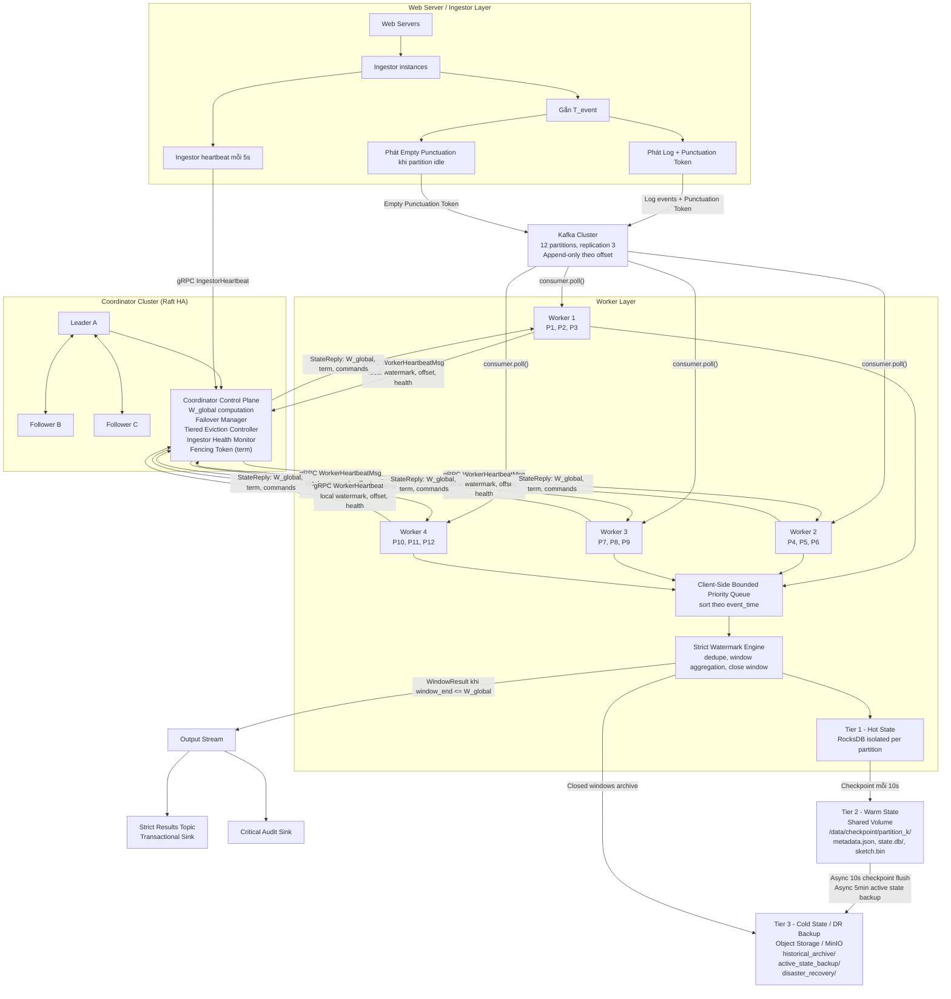
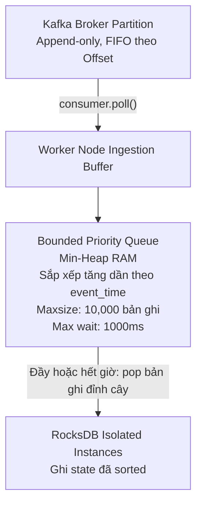
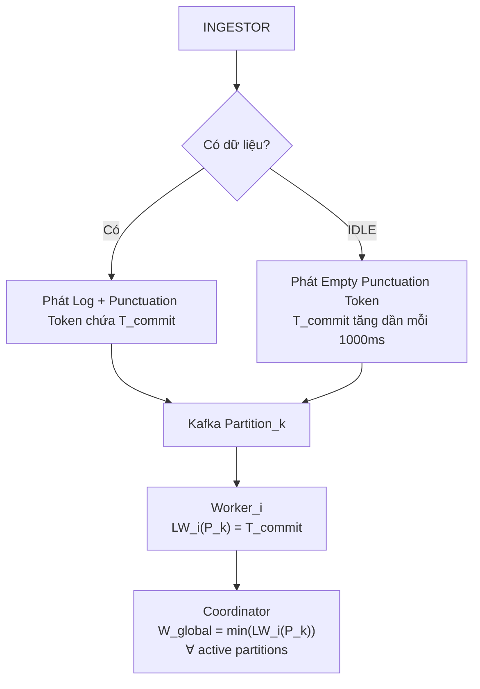
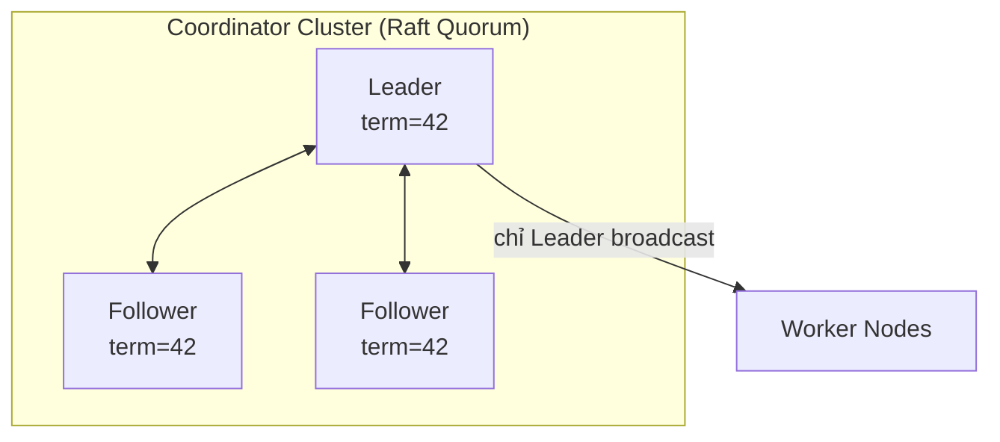
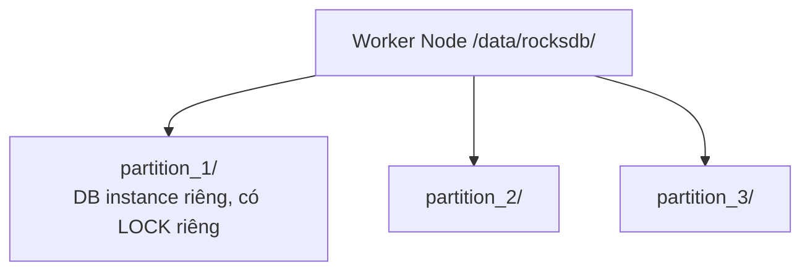
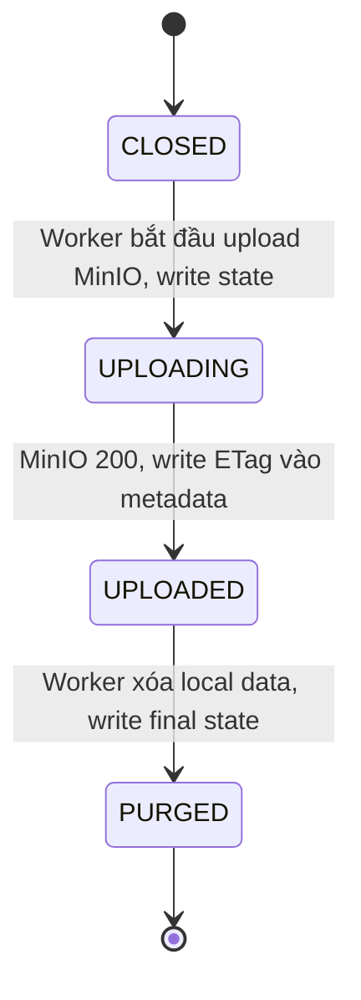
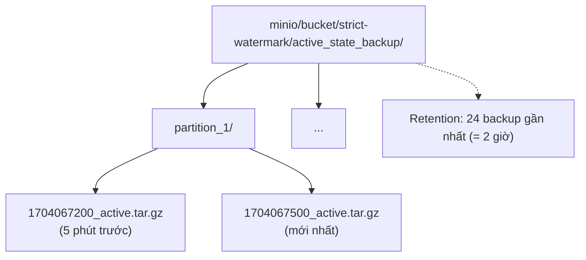
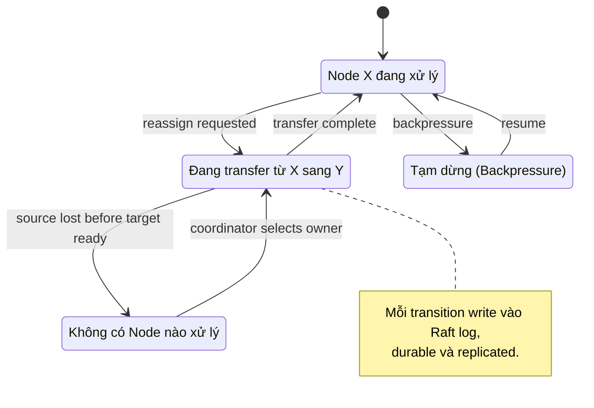
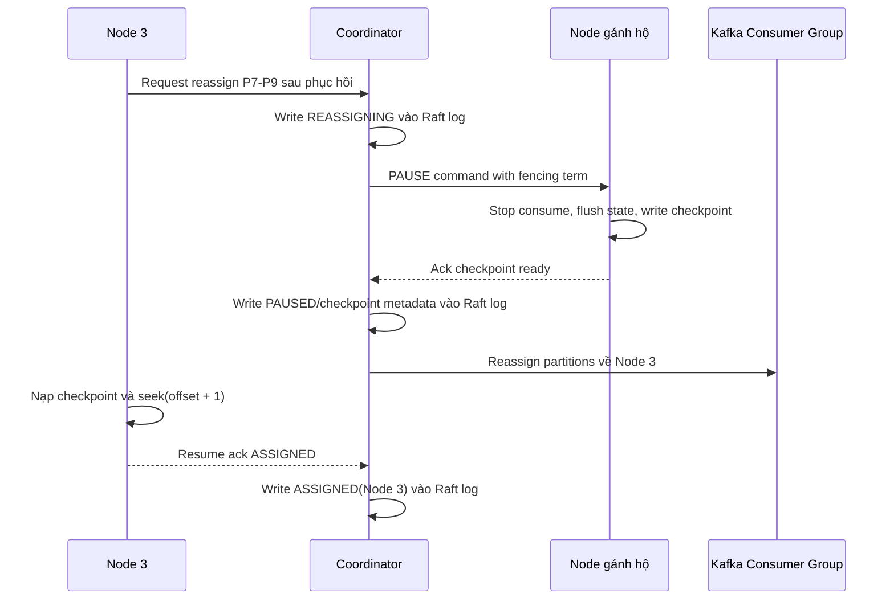
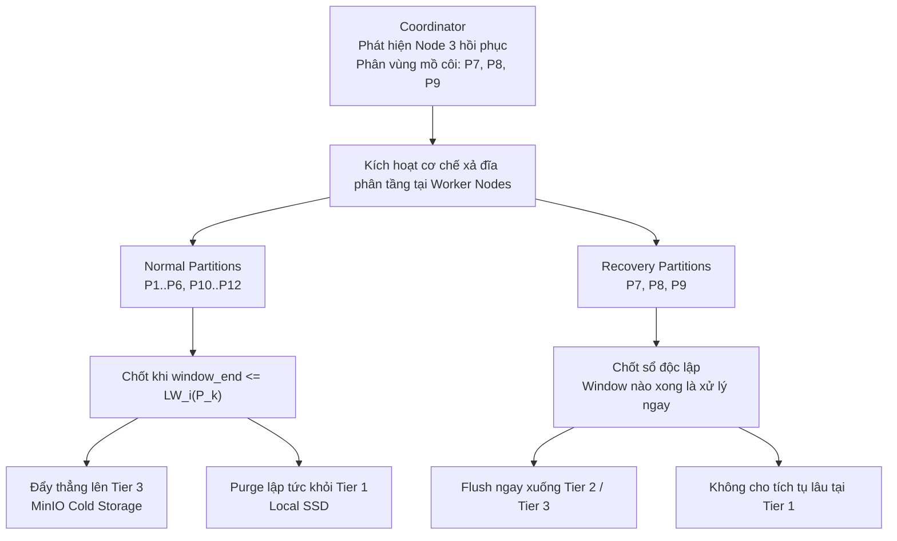

# TÀI LIỆU THIẾT KẾ STRICT WATERMARK

## Stateful Stream Processing với Strict Watermark + Tiered State Storage + Coordinator HA

**Bài toán #112 — Log Delay Compensator**

| Trường        | Giá trị                                                  |
|---------------|----------------------------------------------------------|
| Phiên bản     | 3.0 (Consolidated Production Specification)              |
| Trạng thái    | Design Specification — Mục tiêu triển khai               |
| Phạm vi       | Stateful Distributed Stream Processing 24/7              |
| Cam kết       | Exactly-Once (input & output) + Strict Watermark (0% Loss) + Tiered State Storage + Coordinator HA |
| Loại tài liệu | **Tài liệu thiết kế mục tiêu** — đặc tả đầy đủ kiến trúc đích   |

---

## Mục lục

1. [Tổng quan và mục tiêu](#1-tổng-quan-và-mục-tiêu)
2. [Bảng ký hiệu và thuật ngữ](#2-bảng-ký-hiệu-và-thuật-ngữ)
3. [Kiến trúc tổng thể](#3-kiến-trúc-tổng-thể)
4. [Windowing Logic & Trục thời gian](#4-windowing-logic--trục-thời-gian)
5. [Cluster Coordination — Coordinator HA](#5-cluster-coordination--coordinator-ha)
6. [State Management & Tiered Storage](#6-state-management--tiered-storage)
7. [Latency & Bottleneck Analysis](#7-latency--bottleneck-analysis)
8. [Robustness & Fault Tolerance](#8-robustness--fault-tolerance)
9. [Output Exactly-Once Protocol](#9-output-exactly-once-protocol)
10. [Ingestor Health Monitoring](#10-ingestor-health-monitoring)
11. [Bảng tham số cấu hình mặc định](#11-bảng-tham-số-cấu-hình-mặc-định)
12. [Phân tích Trade-offs và giới hạn](#12-phân-tích-trade-offs-và-giới-hạn)

---

## 1. Tổng quan và mục tiêu

### 1.1. Bài toán

Hệ thống xử lý luồng log từ tầng Web Server hoạt động liên tục 24/7/365. Dòng dữ liệu có các đặc tính phân tán phức tạp:

- **Vô hạn (Unbounded)**: dòng dữ liệu không có điểm dừng.
- **Bất tuần tự nghiêm trọng (Heavy-Tail Out-of-Order)**: log đến muộn do độ trễ mạng, buffering, TCP retransmission.
- **Tích lũy trạng thái (Stateful)**: hệ thống gom log vào các cửa sổ thống kê trước khi chốt sổ.

### 1.2. Mục tiêu thiết kế

| Tiêu chí                    | Cam kết kỹ thuật                                                          |
|-----------------------------|---------------------------------------------------------------------------|
| **Strict Watermark**        | 0% mất dữ liệu do đến muộn (cam kết toán học)                            |
| **Exactly-Once (Input)**    | Không xử lý trùng lặp khi replay sau sự cố                                |
| **Exactly-Once (Output)**   | Không emit duplicate kết quả Window xuống downstream                      |
| **High Availability**       | Tự khôi phục với ≥ 2 node sập đồng thời + Coordinator HA                  |
| **Storage Optimization**    | SSD cục bộ ổn định không phình to nhờ Tiered Storage                      |
| **Memory Safety**           | Không OOM dù backpressure kéo dài                                         |
| **End-to-end Latency**      | ≈ 15 giây (= δ_base + W) trong điều kiện vận hành thường                  |
| **Disaster Recovery**       | RTO ≤ 30 phút khi mất Shared Volume; RPO ≤ 5 phút                         |

### 1.3. Giả định và phạm vi

- **Hạ tầng**: Kafka làm message broker (12 partitions), Worker Nodes trong Docker container, Shared Volume SSD, MinIO cho Cold State.
- **Coordinator Cluster**: 3 instance với Raft (hoặc ZooKeeper-based).
- **Ingest layer**: 1 hoặc nhiều Ingestor có khả năng phát Punctuation Token.
- **Ngoài phạm vi**: thiết kế tầng tiêu thụ kết quả (downstream consumer logic).

---

## 2. Bảng ký hiệu và thuật ngữ

### 2.1. Ký hiệu toán học

| Ký hiệu                       | Ý nghĩa                                                                |
|-------------------------------|------------------------------------------------------------------------|
| `T_event`                     | Event-time của một bản ghi log                                          |
| `[window_start, window_end]`  | Khung thời gian định danh một Tumbling Window                          |
| `T_commit`                    | Mốc thời gian cam kết gắn vào Punctuation Token                         |
| `LW_i(P_k)`                   | Local Watermark của Worker Node `i` cho phân vùng `P_k`                |
| `W_global`                    | Global Watermark — mốc watermark toàn cục, do Coordinator Leader tính  |
| `W_max(t)`                    | Mốc Local Watermark cao nhất của các Node đang Active                  |
| `Node Skew_i(t)`              | Lệch pha thời gian logic của Node `i` so với Node đi nhanh nhất        |
| `Watermark Lag(t)`            | Độ trễ của `W_global` so với wall-clock time                            |
| `δ_base`                      | Độ trễ Watermark mặc định ở vận hành bình thường (= 10 giây)            |
| `P_k`                         | Phân vùng Kafka thứ `k` (k ∈ [1, 12])                                  |
| `Offset_{P_k}`                | Offset đã commit của phân vùng `P_k`                                    |
| `term`                        | Số term của Coordinator Leader (Raft term)                              |

### 2.2. Thuật ngữ chính

- **Hot State (Tier 1)**: Trạng thái hoạt động trên RAM (MemTable) và SSD cục bộ (RocksDB SST) của Worker.
- **Warm State (Tier 2)**: Checkpoint phục hồi nhanh trên Docker Shared Volume.
- **Cold State (Tier 3)**: Lưu trữ dài hạn trên Object Storage (MinIO).
- **Heartbeat Punctuation**: Gói tin kiểm soát do Ingestor phát định kỳ để tránh đóng băng Watermark khi partition idle.
- **Bounded Priority Queue**: Hàng đợi ưu tiên đặt tại Worker để sắp xếp dữ liệu theo Event-Time.
- **Strict Failback Protocol**: Quy trình bàn giao ngược an toàn, dựa trên State Machine và Raft log.
- **Fencing Token**: Cơ chế term-based đảm bảo chỉ một Leader tại mỗi thời điểm.
- **Watermark of Watermarks**: Meta-metric đo health của các Ingestor đang phát Punctuation.

---

## 3. Kiến trúc tổng thể



### Thành phần chính

- **Web Server / Ingestor Layer**: Nhận log từ Web Server, gắn `T_event`, phát log vào Kafka và phát Punctuation Token để báo tiến độ event-time. Khi partition idle, Ingestor vẫn phát Empty Punctuation để watermark không bị đứng. Ngoài data path, Ingestor gửi heartbeat trực tiếp lên Coordinator để báo health, offset và clock.
- **Kafka Cluster**: Broker trung gian, 12 partitions, replication factor 3. Kafka giữ thứ tự theo offset trong từng partition nhưng không sort theo event-time; việc xử lý out-of-order được đẩy xuống Worker.
- **Worker Layer**: Mỗi Worker quản lý một nhóm partition. Worker poll Kafka, đưa event vào Client-Side Bounded Priority Queue, sắp xếp theo `event_time`, lọc duplicate, gom window và ghi state vào RocksDB instance riêng theo partition.
- **Coordinator Cluster**: Cụm 3 node HA dùng Raft/ZooKeeper-style quorum. Leader tính `W_global`, phát command có fencing token, điều phối failover/failback, theo dõi Ingestor health và điều khiển tiered eviction. Follower replicate state để takeover khi Leader sập.
- **Output Layer**: Khi window đủ điều kiện chốt theo `W_global`, Worker emit `WindowResult` ra Strict Results Topic hoặc Critical Audit Sink theo cơ chế exactly-once/idempotent.
- **Tiered State Storage**: Tier 1 là RocksDB local để xử lý nóng; Tier 2 là Shared Volume để failover nhanh; Tier 3 là MinIO/Object Storage để lưu closed windows, active-state backup và disaster recovery.

### Luồng làm việc tổng thể

1. **Ingest data path**: Web Server sinh log, Ingestor gắn `T_event`, rồi gửi log cùng Punctuation Token vào Kafka. Kafka chỉ đảm bảo durability và thứ tự offset, không quyết định watermark.
2. **Worker processing path**: Worker poll partition được gán, đưa record vào Bounded Priority Queue, drain theo thứ tự event-time, lọc duplicate/late data, cập nhật open window trong RocksDB và tạo local watermark từ Punctuation Token.
3. **Coordination path**: Worker gửi heartbeat gồm local watermark, Kafka offset, trạng thái backpressure và fencing term lên Coordinator. Coordinator Leader tính `W_global = min(LW_i(P_k))` trên các partition hợp lệ, rồi trả `W_global` và command điều phối cho Worker.
4. **Window close/output path**: Khi `window_end <= W_global`, Worker chốt window, tạo `WindowResult`, ghi dấu output/checkpoint và emit xuống sink. Sink quan trọng dùng transactional protocol; sink không hỗ trợ transaction dùng deterministic `window_id` để dedupe.
5. **State durability path**: State nóng nằm ở RocksDB local. Mỗi 10 giây Worker checkpoint partition state sang Shared Volume. Closed windows và active-state backup được đẩy lên MinIO để giảm local disk và phục vụ disaster recovery.
6. **Failure handling path**: Nếu Worker sập, Coordinator chuyển partition sang Worker khác dựa trên checkpoint Tier 2 và fencing token. Nếu Coordinator Leader sập, follower được bầu làm Leader mới và tiếp tục từ replicated state trong Raft log.

---

## 4. Windowing Logic & Trục thời gian

> **Mục tiêu**: Phân chia cửa sổ chính xác trên Event-Time. Đảm bảo Strict Watermark — 0% data loss, ngay cả khi có partition idle hoặc clock skew giữa các Ingestor.

### 4.1. Event-Time vs Processing-Time

- **Event-Time** (`T_event`): Trục thời gian logic bất biến, định danh tại thời điểm log sinh ra ở Web Server.
- **Processing-Time**: Trục thời gian vật lý của Worker Node, hoàn toàn bị loại bỏ khỏi phân chia Window.

### 4.2. Tumbling Window

Dòng log vô hạn được gom thành các cửa sổ thời gian cố định kích thước **5 giây**. Mỗi log có `T_event` được gán vào một cửa sổ duy nhất:

$$window\_start = \lfloor T_{event} / 5 \rfloor \times 5$$

$$window\_end = window\_start + 5$$

### 4.3. Client-Side Bounded Priority Queue

Vì Kafka Partition là cấu trúc append-only bất biến, **không thể** sort lại bên trong Broker. Hệ thống đặt **Bounded Priority Queue** tại Worker Node (client-side):



Lợi ích: dữ liệu vào bộ chia Window đã sorted theo Event-Time, tối ưu RocksDB write path và giảm Skew.

**High-level**: Worker tách luồng nạp dữ liệu và luồng xử lý state. Luồng nạp chỉ poll từ Kafka, kiểm tra backpressure và đưa event vào hàng đợi ưu tiên; luồng xử lý chạy nền rút event theo thứ tự `event_time` rồi ghi vào RocksDB/window state.

**Low-level**:
- Hàng đợi là min-heap theo tuple `(event_time, sequence, event)` để giữ thứ tự tăng dần theo event-time và vẫn ổn định khi hai event trùng timestamp.
- Nếu queue vượt `maxsize`, Worker pop phần tử nhỏ nhất ngay để tránh tràn RAM.
- Nếu queue không đầy nhưng event bị giữ quá `max_wait_ms`, drain loop vẫn pop để tránh kẹt vô hạn khi input chậm.
- Drain loop xử lý theo batch (`STRICT_DRAIN_BATCH_SIZE`) và sleep theo chu kỳ (`STRICT_DRAIN_SLEEP_S`) để cân bằng throughput với CPU.

### 4.4. Strict Watermark & Upstream Heartbeat Punctuation

Cơ chế Idleness Bypass tại Coordinator (loại partition idle khỏi `min()`) là **sai sót logic nghiêm trọng** vì gây data loss khi partition idle hoạt động lại. Hệ thống dùng **Heartbeat Punctuation từ Upstream**:



Coordinator **không cần** Idleness Bypass — `W_global` luôn tiến đều nhờ Heartbeat Punctuation.

**High-level**: Punctuation Token là tín hiệu "upstream đã đi qua mốc thời gian này". Kể cả khi partition không có log mới, Ingestor vẫn phát Empty Punctuation để Worker cập nhật local watermark và Coordinator có đủ dữ liệu tính `W_global`.

**Low-level**:
- Worker chỉ update `LW_i(P_k)` nếu `T_commit` mới lớn hơn `last_T_commit_seen`.
- Coordinator lấy `min(LW_i(P_k))` trên toàn bộ partition chưa failed để giữ strict correctness.
- Khi `window_end <= LW_i(P_k)`, partition có thể chốt cửa sổ cục bộ; khi `window_end <= W_global`, kết quả đủ an toàn để emit theo cam kết toàn cục.

### 4.5. Monotonic Punctuation + Clock Skew Monitor

Khi có nhiều Ingestor, clock có thể lệch → `T_commit` không monotonic → `W_global` có thể lùi. Bảo vệ:

**Bảo vệ tính đơn điệu phía Worker (Worker-side Monotonic Enforcement)**:

Quy trình xử lý khi nhận gói tin kiểm soát (Punctuation Token):
1. **Kiểm tra**: So sánh mốc thời gian cam kết của gói tin hiện tại ($T_{commit}$) với mốc thời gian cam kết lớn nhất từng ghi nhận ($last\_T\_commit\_seen$).
2. **Cập nhật**: Nếu $T_{commit} > last\_T\_commit\_seen$, cập nhật mốc ghi nhận lớn nhất mới và thiết lập Watermark cục bộ của phân vùng $LW_i(P_k) = T_{commit}$.
3. **Bỏ qua**: Ngược lại (mốc thời gian bị lùi do lệch đồng hồ), tăng chỉ số lỗi không đơn điệu và bỏ qua gói tin (không cập nhật lùi watermark).

**Coordinator-side Clock Skew Monitor**:

Tracking clock skew từ Ingestor heartbeat (xem §10):

| Skew                 | Severity | Action                          |
|----------------------|----------|---------------------------------|
| < 100ms              | OK       | -                               |
| 100–500ms            | Info     | Log only                        |
| 500ms–2s             | Warning  | Alert ops                       |
| > 2s                 | Critical | Page on-call, investigate NTP   |

**Mitigation**: Triển khai NTP/Chrony bắt buộc trên Ingestor; mount `/etc/localtime` cho container.

---

## 5. Cluster Coordination — Coordinator HA

> **Mục tiêu**: Loại bỏ SPOF tại Coordinator. Đảm bảo failover < 5 giây mà không gây split-brain hoặc state corruption.

### 5.1. Yêu cầu HA

- Tự động leader election khi leader sập.
- Replicate state (W_global, partition assignment, failover history, ingestor health) sang follower.
- Total RTO ≤ 5 giây.
- Tránh split-brain qua quorum + fencing token.

### 5.2. Kiến trúc Coordinator Cluster — 3 instance Raft



**Lựa chọn công nghệ**:
- **Production-ready**: ZooKeeper-based leader election (tương tự Kafka Controller cũ).
- **Self-contained**: Embedded Raft (etcd-style) — phức tạp hơn nhưng tự chủ.

Khuyến nghị: ZooKeeper-based cho Phase 1-2, đánh giá migrate sang Raft cho Phase 3+.

### 5.3. State Replication

Mọi quyết định của Leader đi qua Raft log replication, chỉ commit khi majority (2/3) ack.

**State được replicate**:

```
ReplicatedState {
  current_term: int
  W_global: float (cập nhật 200ms)
  partition_assignment: Map<PartitionID, NodeID>
  partition_state_machine: Map<PartitionID, State>  // §8.5
  failover_history: List<FailoverEvent>            // audit
  ingestor_health: Map<IngestorID, HealthRecord>   // §10
}
```

### 5.4. Leader Failover Protocol

1. **Detect**: Followers thấy leader silent qua heartbeat timeout (3s).
2. **Election**: Raft election → new leader với term++ .
3. **State recovery**: New leader đọc replicated state.
4. **Resume**: New leader broadcast `W_global` và resume failover coordination.
5. **Worker reconnect**: Worker detect leader change qua ZK watch / Raft endpoint discovery → reconnect.

**Total RTO**: ≤ 5 giây.

### 5.5. Fencing Token (chống Split-Brain)

Mỗi chỉ thị (command) gửi từ Coordinator xuống Worker được đính kèm cặp giá trị `(term, command_id)`:

**Logic xử lý chỉ thị tại phía Worker**:
1. **Kiểm tra nhiệm kỳ**: Nếu nhiệm kỳ của chỉ thị (`term`) nhỏ hơn nhiệm kỳ lớn nhất đã biết tại Worker (`known_term`), chỉ thị bị loại bỏ lập tức vì đã lỗi thời.
2. **Kiểm tra trùng lặp (Idempotency)**: Nếu mã chỉ thị (`command_id`) đã nằm trong danh sách các chỉ thị đã xử lý, Worker gửi xác nhận thành công nhưng không thực hiện lại chỉ thị đó.
3. **Thực thi**: Đối với chỉ thị hợp lệ mới, Worker ghi nhận mã chỉ thị vào danh sách đã xử lý và tiến hành thực thi.

Đảm bảo: Leader cũ "sống lại" sau network partition và gửi chỉ thị lỗi thời sẽ bị từ chối.

### 5.6. Giao thức gRPC và đặc tả mô hình thông tin

Hệ thống loại bỏ hoàn toàn các REST endpoints chậm cho control plane và thay thế bằng kênh gRPC out-of-band. Cổng gRPC được mặc định là `HTTP_PORT + 50` (ví dụ: HTTP `9000` -> gRPC `9050`).

Đặc tả chi tiết các dịch vụ giao tiếp gRPC giữa các thành phần trong hệ thống:

#### Dịch vụ Điều phối (Coordinator Service)
Định nghĩa các giao thức giao tiếp mức điều phối và đồng thuận:
1. **WorkerHeartbeat**: Định kỳ gửi thông điệp báo cáo từ Worker để cập nhật tình trạng hoạt động và thông số watermark cục bộ.
2. **IngestorHeartbeat**: Nhận dữ liệu kiểm soát và báo cáo tiến trình phát từ các nguồn phát dữ liệu (Ingestor).
3. **GetGlobalState**: Cung cấp trạng thái toàn cục và mốc watermark toàn cục để các Worker đồng bộ.
4. **Giao thức đồng thuận (Raft/ZooKeeper-based calls)**: Các hàm bầu cử và đồng bộ trạng thái giữa các Coordinator trong cụm độ khả dụng cao (HA).

#### Cấu trúc các thông điệp truyền thông (Message Schema)
- **Thông điệp nhịp tim Worker (Worker Heartbeat Message)**:
  - `worker_id` (Kiểu chuỗi): Định danh duy nhất của Worker.
  - `partitions` (Bản đồ Phân vùng -> Mốc thời gian thực): Mốc watermark cục bộ của từng phân vùng.
  - `max_event_time` (Kiểu số thực): Event-time lớn nhất nhận được.
  - `timestamp` (Kiểu số thực): Thời gian vật lý gửi tin.
  - `fencing_token` (Kiểu số nguyên): Số nhiệm kỳ của Coordinator.
  - `idle_partitions` (Danh sách phân vùng): Các phân vùng không phát sinh dữ liệu.
  - `backpressure_partitions` (Bản đồ phân vùng -> Trạng thái logic): Trạng thái nghẽn của từng phân vùng.
  - `kafka_offsets` (Bản đồ phân vùng -> Vị trí đọc): Vị trí offset đã đọc trên mỗi phân vùng.
- **Yêu cầu lấy trạng thái toàn cục (State Request)**:
  - `worker_id` (Kiểu chuỗi): Định danh duy nhất của Worker.
- **Phản hồi trạng thái toàn cục (State Reply)**:
  - `W_global` (Kiểu số thực): Mốc watermark toàn cục hiện tại.
  - `term` (Kiểu số nguyên): Số nhiệm kỳ của Coordinator Leader.
  - `partition_types` (Bản đồ phân vùng -> Trạng thái gán phân vùng): Phân bổ phân vùng của các Node.

#### 5.6.1. Báo cáo watermark từ Worker
Định kỳ mỗi 1 giây, tiến trình gửi nhịp tim của Worker đóng gói thông điệp nhịp tim gửi qua kênh gRPC chứa bản đồ mốc watermark cục bộ của các phân vùng do Worker xử lý cùng với vị trí offset Kafka hiện tại.

#### 5.6.2. Đồng bộ watermark toàn cục
Để chốt cửa sổ, Worker chủ động thực hiện cơ chế kéo (pull) định kỳ mỗi 500ms thông qua yêu cầu lấy trạng thái toàn cục để nhận mốc watermark toàn cục ($W_{global}$) cùng số nhiệm kỳ hoạt động, sau đó cập nhật mốc này cho bộ máy xử lý của từng phân vùng.

---

## 6. State Management & Tiered Storage

> **Mục tiêu**: Lưu trữ trạng thái Active Windows bền bỉ, không phình đĩa, có DR. Khắc phục lỗi File Locking của RocksDB qua Isolated Instances per Partition.

### 6.1. RocksDB Isolated Partition Instances

RocksDB Embedded có LOCK file độc quyền trên thư mục dữ liệu. Việc nạp chung thư mục giữa các Worker container gây xung đột → crash.

**Giải pháp**: Mỗi partition có **DB Instance hoàn toàn biệt lập**:



Khi Node A nhả tải partition `P_7`:
1. Graceful close DB instance của `P_7` (release LOCK).
2. Node B (gánh hộ) mount `partition_7` thư mục trên Shared Volume.
3. Mở DB instance độc quyền — không xung đột.

### 6.2. Kiến trúc 3 tầng (Tiered State Storage)

**Tier 1 — Hot State (RAM + Local SSD)**:
- MemTable trên RAM, WAL + SST trên SSD cục bộ.
- Latency < 1ms cho mọi update.
- Capacity ~50GB per Worker.

**Tier 2 — Warm State (Docker Shared Volume)**:
- Checkpoint phân vùng tại `/data/checkpoint/partition_k/`.
- Failover < 2 giây — Node khác mount thư mục, restore state.
- Capacity ~100GB total.

**Tier 3 — Cold State (Object Storage)**:
- Closed Window aggregation (long-term archive).
- Active Window State backup (DR — mỗi 5 phút).
- Cold checkpoint (compressed, > 10 phút tuổi).
- Capacity vô hạn (MinIO object storage).

**High-level**: Tier 1 phục vụ đường xử lý nóng, Tier 2 phục vụ failover nhanh, Tier 3 phục vụ lưu dài hạn và disaster recovery. Dữ liệu luôn đi theo hướng nóng → ấm → lạnh; dữ liệu đã chốt sổ không ở lại local SSD lâu hơn cần thiết.

**Low-level**:
- State đang mở được ghi theo partition trong RocksDB instance riêng để tránh tranh chấp `LOCK`.
- Các key state cần tách namespace rõ ràng: `ow:{window_start}` cho open window, `cw:{window_start}` cho closed window, `si:{event_id}` cho seen-id dedupe, `meta:state` cho watermark/offset metadata.
- Checkpoint Tier 2 lưu `metadata.json`, snapshot RocksDB/SST và offset Kafka đã commit để Worker khác có thể `seek(offset + 1)` khi tiếp quản.
- Tier 3 dùng object key deterministic theo `{partition_id}/{window_id}` để retry upload không tạo duplicate object.

### 6.3. Partition-Level Checkpointing

Định kỳ mỗi 10 giây, độc lập per-partition:

```
1. Ghi nhận Offset_{P_k} đã commit thành công.
2. RocksDB checkpoint API → chụp incremental SST files.
3. Copy SST mới sang /data/checkpoint/partition_k/state.db/.
4. Write metadata.json:
   {
     "partition_id": 7,
     "checkpoint_timestamp": 1704067200,
     "kafka_committed_offset": 1500,
     "active_windows": ["10:00-10:05", "10:05-10:10"],
     "sst_files_manifest": ["00012.sst", "00015.sst"],
     "term_at_checkpoint": 42
   }
5. Commit metadata (fsync).
```

### 6.4. Tiered Storage Consistency Protocol (4-state Eviction)

Để tránh duplicate hoặc mất data khi Worker sập giữa eviction, mỗi Window được track qua state machine:

| State        | Ý nghĩa                                                  |
|--------------|----------------------------------------------------------|
| `CLOSED`     | Window đã chốt sổ, kết quả còn tại Tier 1                |
| `UPLOADING`  | Đang upload MinIO, chưa confirm                             |
| `UPLOADED`   | MinIO confirm 200, chưa purge local                         |
| `PURGED`     | Xóa khỏi Tier 1, chỉ còn Tier 3                          |

**Transitions** (mỗi transition fsync metadata trước action):



**Recovery Logic** sau crash:

| State on Recovery | Action                                                                    |
|-------------------|---------------------------------------------------------------------------|
| `CLOSED`          | Re-trigger upload                                                         |
| `UPLOADING`       | Check MinIO (qua deterministic key): tồn tại → UPLOADED. Không → re-upload  |
| `UPLOADED`        | Purge local                                                               |
| `PURGED`          | (terminal, no action)                                                     |

**MinIO object key format** (deterministic): `minio/bucket/strict-watermark/historical/{partition_id}/{window_id}.json`

Deterministic key → re-upload không tạo duplicate, chỉ overwrite cùng key.

### 6.5. Idempotent Filter TTL

Bảng băm `log_id` trong RocksDB cần TTL để tránh phình đĩa:

```
Mỗi entry log_id lưu kèm T_event của log.

Định kỳ mỗi checkpoint cycle (10s):
  - Lấy W_global hiện tại
  - Purge entries có T_event < W_global - dedupe_window
  - dedupe_window = δ_base + replay_safety_margin = 60 giây
```

**Lý do an toàn**: Sau khi `W_global` vượt một mốc, log có `T_event < W_global` bị filter ở vòng lọc ngoài (Watermark Filter) trước khi tới vòng lọc trong (log_id hash). Vòng trong chỉ cần handle log đến muộn trong 60s gần nhất.

**Triển khai**: dùng RocksDB Column Family với TTL Compaction Filter native, hoặc Bloom filter cho prefilter.

### 6.6. Disaster Recovery — Active Window Backup lên Tier 3

Shared Volume mất → toàn bộ state dở dang mất. Mitigation:

**Định kỳ mỗi 5 phút, backup Active Window State lên MinIO**:



**DR Procedure**:

1. Detect: Worker không mount được Shared Volume.
2. Provision new Shared Volume.
3. Restore từ MinIO backup mới nhất per-partition.
4. Restart cluster.

**RTO**: ≤ 30 phút. **RPO**: ≤ 5 phút.

---

## 7. Latency & Bottleneck Analysis

> **Mục tiêu**: Đo đạc hiệu năng cấp nano-giây. Phát hiện Node bị nghẽn (Skew) VÀ trường hợp "cụm chậm đều" (Watermark Lag).

### 7.1. High-Resolution Hardware Profiling

Sử dụng `time.perf_counter_ns()` để đo latency các toán tử chính:

$$\text{Processing Latency (ms)} = \frac{T_{end} - T_{start}}{1{,}000{,}000}$$

**3 chỉ số vàng per partition**:

| Chỉ số             | Ý nghĩa                                                  |
|--------------------|----------------------------------------------------------|
| `T_network_ingest` | Thời gian poll + decode log từ Kafka                     |
| `T_deduplication`  | Thời gian tra Idempotent Filter + Watermark Filter        |
| `T_state_write`    | Thời gian ghi state vào RocksDB Instance                 |

### 7.2. Node Skew — Lệch pha tiến độ

$$\text{Node Skew}_i(t) = W_{max}(t) - LW_i(t)$$

Trong đó:
- $LW_i(t) = \min_{P_k \in Node_i}(LW_i(P_k))$ — partition chậm nhất của Node $i$.
- `W_max(t) = max_{j ∈ All Nodes}(LW_j(t))` — Node đi nhanh nhất toàn cụm.

**Alert thresholds**:

| Skew                | Severity | Ý nghĩa                                  |
|---------------------|----------|------------------------------------------|
| ≤ 1000ms            | OK       | Cụm đồng bộ tốt                          |
| 1000–5000ms         | Warning  | Node có dấu hiệu chậm                    |
| > 5000ms            | Critical | Node là bottleneck, ảnh hưởng chốt sổ    |

### 7.3. Watermark Lag — Phát hiện "cụm chậm đều"

Skew không phát hiện được khi cả cụm cùng chậm. Bổ sung metric:

$$\text{Watermark Lag}(t) = \text{wall\_clock}(t) - W_{global}(t) - \delta_{base}$$

Bình thường, $W_{global}$ chậm hơn wall-clock đúng $\delta_{base} = 10s$. Lag dương = cụm đang trôi.

**Alert thresholds**:

| Watermark Lag        | Severity | Ý nghĩa                                       |
|----------------------|----------|-----------------------------------------------|
| < 12s (= 10 + 2)     | OK       | Bình thường                                   |
| 12–30s               | Warning  | Cụm chậm nhẹ, load tăng                       |
| 30–60s               | High     | Cụm chậm đáng kể, investigate                 |
| > 60s                | Critical | End-to-end latency vi phạm SLA                |

**Skew vs Lag — Combined Diagnosis**:

| Skew  | Lag   | Diagnosis                                       |
|-------|-------|-------------------------------------------------|
| Low   | Low   | Healthy                                         |
| High  | Low   | Một Node bottleneck cụ thể                      |
| Low   | High  | **Cụm chậm đều** (load toàn cụm cao)            |
| High  | High  | Cụm chậm + có Node yếu hơn                      |

---

## 8. Robustness & Fault Tolerance

> **Mục tiêu**: Đối phó với 6 lớp sự cố — backpressure, single node failure, cascading failure, duplicate replay, split-brain failback, recovery disk swelling.

### 8.1. Tầng 1 — PULL-Based Backpressure

Mỗi Worker giám sát `asyncio.Queue(maxsize=500)`:

- Đầy (500/500) → `consumer.pause(assigned_partitions)`. Kafka đệm log trên đĩa Broker.
- Vơi < 20% (= 100) → `consumer.resume(assigned_partitions)`.

Bảo vệ RAM tuyệt đối khỏi OOM.

### 8.2. Tầng 2 — Even Redistribution

12 partitions chia đều 4 Worker. Khi 1 Node PAUSE, Coordinator chia đều 3 partitions cho 3 Node còn lại:

| Node Sống   | Partitions cũ      | + Partition gánh | Tải tăng |
|-------------|--------------------|--------------------|----------|
| Node 1      | P1, P2, P3         | + P7               | +33%     |
| Node 2      | P4, P5, P6         | + P8               | +33%     |
| Node 4      | P10, P11, P12      | + P9               | +33%     |

Không dồn tải vào 1 Node duy nhất → tránh cascading sập dây chuyền.

### 8.3. Tầng 3 — Cascading Failure Protocol

Khi Node 1 sập tiếp (đang gánh P1-P3 + P7), Coordinator chia tiếp cho 2 Node sống sót:

| Node | Cũ                    | Gánh mới         | Tổng |
|------|-----------------------|-------------------|------|
| Node 2 | P4, P5, P6, P8     | + P1, P3          | 6    |
| Node 4 | P10, P11, P12, P9  | + P2, P7          | 6    |

Mỗi Node sống nạp Checkpoint từ Tier 2, seek về Offset+1, kéo từ Bounded PQ, Replay state.

### 8.4. Tầng 4 — Idempotent Duplicate Filter

Hai vòng lọc khi Replay:

- **Watermark Filter**: $T_{event} < W_{global}$ → drop (Window đã chốt).
- **State Hash Filter**: tra bảng băm `log_id` trong RocksDB (kèm TTL §6.5) → drop duplicate.

Đảm bảo Exactly-Once **input** semantics.

### 8.5. Tầng 5 — Strict Failback Protocol (State Machine)

**Failback** là quá trình trả một partition về Node ban đầu sau khi Node đó đã hồi phục. Ví dụ: Node 3 từng xử lý `P7-P9`, sau đó sập; Coordinator tạm chuyển `P7-P9` sang Node 2. Khi Node 3 sống lại, Node 3 **không được tự mở lại** các partition này. Mọi bước chuyển quyền sở hữu phải đi qua Coordinator.

Mục tiêu của tầng này là bảo vệ ba invariant:

| Invariant | Ý nghĩa |
|---|---|
| **Single owner** | Tại một thời điểm, mỗi partition chỉ có một Worker được phép consume và ghi state. |
| **Durable handoff** | Trước khi chuyển owner, Node đang gánh hộ phải pause, flush state và ghi checkpoint thành công. |
| **Fenced command** | Mọi lệnh điều phối đều kèm `term` và `command_id`; Worker từ chối lệnh cũ từ Leader đã hết nhiệm kỳ. |

Nếu không có protocol này, Node vừa hồi phục có thể xử lý cùng partition với Node đang gánh hộ, gây duplicate output, lệch Kafka offset và phá vỡ exactly-once.

#### Partition State Machine

Coordinator giữ trạng thái của từng partition trong Raft log. Mỗi transition đều durable và replicated trước khi Worker thực hiện hành động tương ứng.

| State | Ý nghĩa | Ai được consume? |
|---|---|---|
| `ASSIGNED` | Partition đang được một Node xử lý ổn định. | Owner hiện tại |
| `REASSIGNING` | Partition đang được chuyển từ Node cũ/gánh hộ sang Node đích. | Chỉ Node đang gánh hộ cho đến khi nhận lệnh pause |
| `PAUSED` | Partition đã tạm dừng consume để flush checkpoint hoặc giảm backpressure. | Không consume |
| `ORPHANED` | Chưa có Node hợp lệ sở hữu partition. | Không consume |



#### Quy trình failback 5 bước

Ví dụ dưới đây mô tả Node 3 hồi phục và xin nhận lại `P7-P9` từ Node đang gánh hộ. Mỗi bước là một command có `term` và `command_id`, đồng thời được ghi nhận trong Raft log để có thể resume nếu Coordinator Leader thay đổi giữa chừng.



Diễn giải từng bước:

1. **Request**: Node 3 chỉ báo "tôi đã hồi phục", không tự nhận partition.
2. **Mark reassignment**: Coordinator ghi `REASSIGNING` vào Raft log để khóa partition trong quá trình chuyển giao.
3. **Pause source**: Node đang gánh hộ dừng consume, flush RocksDB/WAL, ghi checkpoint và trả về offset cuối cùng đã xử lý.
4. **Move ownership**: Coordinator cập nhật Kafka consumer group, rồi chỉ định Node 3 là owner mới bằng command có fencing token.
5. **Resume target**: Node 3 nạp checkpoint, `seek(offset + 1)`, bắt đầu consume tiếp và ack để Coordinator ghi `ASSIGNED`.

#### Recovery khi Coordinator Leader thay đổi giữa failback

Leader mới đọc lại state machine từ Raft log và tiếp tục theo trạng thái hiện tại:

| State đọc từ Raft log | Hành động resume |
|---|---|
| `ASSIGNED(Node X)` | Giữ nguyên owner, không làm gì thêm. |
| `REASSIGNING(X -> Y)` | Kiểm tra source đã pause/checkpoint chưa; nếu chưa thì gửi lại PAUSE command cùng `command_id`. |
| `PAUSED` | Nếu checkpoint đã có metadata hợp lệ, tiếp tục reassign sang target; nếu thiếu checkpoint thì yêu cầu source flush lại. |
| `ORPHANED` | Chọn owner mới dựa trên partition assignment, checkpoint mới nhất và fencing term hiện tại. |

Nhờ `command_id`, Worker có thể ack lại lệnh đã xử lý mà không thực thi hai lần. Nhờ `term`, Worker từ chối lệnh từ Leader cũ sau network partition.

### 8.6. Tầng 6 — Tiered Partition-Level Eviction (Sửa lỗi Disk Swelling bằng Tiered Storage)

Mô hình hóa giải pháp thực tế: Tầng này sử dụng trực tiếp Kiến trúc lưu trữ phân tầng (Tiered State Storage) tại mục §6.2 để xử lý triệt để rủi ro phình đĩa (Disk Swelling) trong suốt tiến trình khôi phục dữ liệu lịch sử.

Khi một Node sập và hồi phục (ví dụ Node 3 sập từ mốc 10:00 đến 10:10), khoảng trống dữ liệu tích lũy trong Kafka là 10 phút. Trong khi đó, Global Watermark toàn cụm đã chạy tới mốc 10:10.

Nếu kéo giãn thời gian chờ $\delta_{temp} = 20\text{ phút}$ cho toàn cụm, lượng log khổng lồ của 11 phân vùng khỏe mạnh còn lại vẫn liên tục đổ về với throughput cực cao và bị tích lũy dồn ứ trên đĩa cứng cục bộ của Worker, phá vỡ giới hạn dung lượng lưu trữ đĩa.

Hệ thống khắc phục triệt để bằng giải pháp Quy trình xả dữ liệu phân tầng (Tiered Eviction):


#### 8.6.1. Chốt sổ độc lập & Đẩy phân tầng cấp Phân vùng (Partition-Level Window Eviction & Tiered Offloading)

Hệ thống kết hợp cơ chế tự quyết chốt sổ và quy trình di chuyển trạng thái qua 3 tầng (RAM $\rightarrow$ SSD cục bộ $\rightarrow$ MinIO):

**Đối với các phân vùng khỏe mạnh (Normal Partitions):**

Các phân vùng lành mạnh ($P_1..P_6, P_{10}..P_{12}$) hoàn toàn thoát khỏi sự trì hoãn của phân vùng đang khôi phục. Chúng liên tục chốt sổ cục bộ ngay khi mốc Local Watermark của riêng phân vùng đó vượt qua biên Window kết thúc:

$$window\_end \le LW_i(P_k)$$

**Tiered Action**: Ngay khi điều kiện trên thỏa mãn, Worker Node lập tức thực hiện chốt sổ Window, chuyển đổi kết quả thành các file nén và kích hoạt tiến trình chạy nền đẩy thẳng lên Tier 3 (Cold State - Remote Object Storage MinIO).

**Local Purge**: Ngay sau khi upload MinIO thành công, Worker Node phát lệnh xóa sạch (Purge) toàn bộ dữ liệu thô cục bộ ra khỏi Tier 1 (Hot State - NVMe local SSD) của RocksDB. Dung lượng đĩa của các node khỏe mạnh được giải phóng cuốn chiếu liên tục và duy trì ở trạng thái phẳng lì.

**Đối với các phân vùng đang khôi phục (Recovery Partitions):**

Trong lúc Node 3 chạy Replay với tốc độ cao từ Kafka Priority Queue để bù đắp 10 phút trống dở dang, nó sẽ liên tục tạo và hoàn tất hàng loạt Window trong quá khứ một cách dồn dập.

**Aggressive Flush**: Để tránh việc hàng trăm Window lịch sử này găm lại làm nổ bộ nhớ đĩa NVMe cục bộ của Node 3, hệ thống áp dụng cơ chế nén xả sớm: Window nào vừa đuổi kịp mốc thời gian sự kiện trong quá trình Replay sẽ lập tức được đóng gói thành file tĩnh SST và Flush thẳng xuống Tier 2 (Warm State - Shared SSD Volume) hoặc đẩy thẳng lên Tier 3 (MinIO Cold State), không cho phép găm giữ lâu tại RAM/SSD cục bộ (Tier 1).

### 8.7. Tầng 7 — Replay Sub-Checkpointing

Nếu Node 3 sập **lần nữa giữa quá trình Replay 10 phút**, không phải restart từ đầu.

Trong Replay-Mode, vẫn checkpoint mỗi 10s nhưng đánh dấu:

```
{
  "is_replay_checkpoint": true,
  "replay_progress": 0.4,           ← 40% xong
  "replay_offset_start": 1500,
  "replay_offset_target": 8500,
  "replay_offset_current": 4300
}
```

Recovery: Node tiếp quản đọc replay checkpoint → resume replay từ offset 4300, không từ đầu.

**High-level**: Replay không được xem là một thao tác khởi động lại nguyên khối. Nó là một tiến trình dài có thể checkpoint giữa chừng, để nếu Worker sập lần nữa thì chỉ replay tiếp phần còn thiếu.

**Low-level**:
- Replay checkpoint lưu `start_offset`, `current_offset`, `target_offset` và tỷ lệ hoàn thành.
- Sau mỗi batch đủ lớn hoặc mỗi checkpoint interval, Worker ghi `current_offset` mới xuống RocksDB/metadata.
- Khi phục hồi, Worker đọc replay checkpoint trước; nếu còn replay dở thì `seek(current_offset)` hoặc `seek(current_offset + 1)` theo offset đã xác nhận xử lý cuối cùng, thay vì quay lại `start_offset`.
- Khi `current_offset >= target_offset`, Worker xóa cờ replay và chuyển về chế độ realtime.

---

## 9. Output Exactly-Once Protocol

> **Mục tiêu**: Khi Window chốt sổ và emit kết quả downstream, không emit duplicate sau replay.

### 9.1. Vấn đề

Worker chốt Window W_k → emit downstream → Worker sập trước commit checkpoint → recovery tính lại W_k → emit duplicate.

### 9.2. Giải pháp 1 — Transactional Sink (Two-Phase Commit)

Phù hợp khi downstream là Kafka transactional, database transaction.

**Protocol**:

```
1. BEGIN_TX
2. Write Window result xuống downstream (Kafka tx / DB tx)
3. Write checkpoint mark "W_k emitted, tx_id=X" vào RocksDB (cùng tx nếu cùng backend)
4. PRE_COMMIT — record intent
5. COMMIT_TX
6. Cleanup state of W_k from RocksDB
```

Khi recovery, nếu thấy `PRE_COMMIT` chưa `COMMIT`: check downstream với tx_id để biết đã commit chưa → rollback hoặc forward.

### 9.3. Giải pháp 2 — Idempotent Sink với Deduplication Key

Phù hợp khi downstream không hỗ trợ tx (REST API, append-only).

**Deterministic Window ID**:

```
window_id = "{partition_id}_{window_start}-{window_end}"
```

Không phụ thuộc Worker → mọi recovery tạo cùng window_id.

**Downstream dedup logic**:

```
Maintain hash table window_id đã thấy trong N giờ.
On receive emit_payload:
  if payload.window_id in seen:
    reject (duplicate)
  else:
    process + seen.add(window_id)
```

### 9.4. Khuyến nghị

- **Critical sink** (billing, audit, finance) → Giải pháp 1 (Transactional).
- **Best-effort sink** (dashboard, metric, log) → Giải pháp 2 (Idempotent key).

---

## 10. Ingestor Health Monitoring

> **Mục tiêu**: Phân biệt "partition đúng là idle" vs "Ingestor sập, không phát Punctuation". Avoid silent freeze của W_global.

### 10.1. Two-Tier Heartbeat

Ngoài Punctuation Token đi qua Kafka, Ingestor gửi heartbeat **out-of-band** trực tiếp qua giao diện gRPC lên Coordinator mỗi 5 giây bằng cách truyền thông điệp nhịp tim của Ingestor.

#### Thông điệp nhịp tim Ingestor (Ingestor Heartbeat Message)
- `ingestor_id` (Kiểu chuỗi): Định danh duy nhất của Ingestor.
- `T_commit` (Kiểu số thực): Mốc thời gian cam kết hiện tại của Ingestor.
- `timestamp` (Kiểu số thực): Thời gian gửi gói tin vật lý.
- `partitions_assigned` (Danh sách phân vùng): Các phân vùng Ingestor chịu trách nhiệm gửi.
- `last_log_offset` (Kiểu số nguyên): Offset log cuối cùng được sinh ra.
- `ingestor_clock` (Kiểu số thực): Thời gian đồng hồ vật lý của Ingestor.
- `offsets` (Bản đồ phân vùng -> Vị trí): Vị trí offset gửi trên mỗi phân vùng.

Khi nhận được báo cáo nhịp tim từ Ingestor, Coordinator sẽ phân tích các thông số mốc thời gian cam kết logic, thời gian đồng hồ vật lý và vị trí offset hiện tại để giám sát sức khỏe của Ingestor.

### 10.2. Coordinator Validation

Coordinator giữ `ingestor_state` table:

| Ingestor ID | Last Heartbeat | Last T_commit | Clock Skew |
|-------------|----------------|----------------|------------|
| ingestor-1  | now - 2s       | 10:00:15.500   | 50ms       |
| ingestor-2  | now - 30s ⚠   | 10:00:00.000   | 80ms       |

**Alert conditions**:

| Condition                                     | Severity | Diagnosis                          |
|-----------------------------------------------|----------|------------------------------------|
| `now - Last Heartbeat > 15s`                  | High     | Ingestor silent/sập                |
| `now - Last T_commit > 5s` (heartbeat OK)     | High     | Ingestor sống nhưng stuck phát PT |
| `T_commit mới < T_commit cũ`                  | Critical | Clock skew, retry rule fail         |

### 10.3. Watermark of Watermarks

Meta-metric:

$$W_{meta\_global}(t) = \min_{\text{all ingestors}} (\text{last T\_commit reported})$$

Nếu `W_meta_global` lệch `W_global` quá nhiều (> 10s) → cảnh báo Ingestor đang stuck.

---

## 11. Bảng tham số cấu hình mặc định

| Tham số                          | Giá trị        | Thuộc trục    | Vai trò                                       |
|----------------------------------|----------------|---------------|------------------------------------------------|
| **Windowing**                    |                |               |                                                |
| Tumbling Window Size             | 5 giây         | Windowing     | Khung thời gian gộp dữ liệu                   |
| `δ_base` (Watermark Delay)       | 10 giây        | Windowing     | Biên dung sai trễ ở trạng thái thường         |
| Heartbeat Punctuation Period     | 1000 ms        | Windowing     | Tần suất Empty Token từ Ingestor              |
| Priority Queue RAM Buffer        | 10,000 logs    | Windowing     | Bộ đệm sắp xếp tại Worker                     |
| Priority Queue Max Wait          | 1000 ms        | Windowing     | Timeout pop bản ghi đỉnh                      |
| **Coordinator**                  |                |               |                                                |
| Coordinator Cluster Size         | 3              | Coordination  | Raft quorum                                    |
| Coordinator Heartbeat Timeout    | 3 giây         | Coordination  | Detect leader sập → election                  |
| `W_global` Broadcast Interval    | 200 ms         | Coordination  | Tần suất broadcast watermark                  |
| **State Management**             |                |               |                                                |
| Checkpoint Interval              | 10 giây        | State         | Chu kỳ flush SST + Offset                     |
| RocksDB Block Cache per Instance | 64 MB          | State         | Index lookup cache                            |
| Active State Backup Interval     | 5 phút         | State (DR)    | Backup Active Window lên MinIO                   |
| Cold Archiving Interval          | 5 phút         | State         | Đẩy Closed Window từ Shared SSD lên MinIO        |
| Dedupe Window (Idempotent TTL)   | 60 giây        | State         | TTL của log_id hash                           |
| **Latency**                      |                |               |                                                |
| Skew Warning Threshold           | 1000 ms        | Latency       | Yellow alert                                   |
| Skew Red Alert Threshold         | 5000 ms        | Latency       | Red alert — Node bottleneck                   |
| Watermark Lag Warning            | 30 giây        | Latency       | Cụm bắt đầu chậm                              |
| Watermark Lag Critical           | 60 giây        | Latency       | SLA vi phạm                                    |
| **Robustness**                   |                |               |                                                |
| Backpressure Queue Maxsize       | BP_PAUSE_THRESHOLD (500) | Robustness  | Ngưỡng dừng consumer per-partition (cấu hình qua env) |
| Backpressure Resume Threshold    | BP_RESUME_THRESHOLD (100) | Robustness | Ngưỡng tiếp tục consumer (cấu hình qua env) |
| Strict Drain Sleep               | STRICT_DRAIN_SLEEP_S (0.1) | Robustness | Chu kỳ giải phóng hàng đợi chạy nền (s) |
| Strict Drain Batch Size          | STRICT_DRAIN_BATCH_SIZE (200) | Robustness | Batch size pop khỏi Priority Queue mỗi chu kỳ |
| Worker Heartbeat Timeout         | 10 giây        | Robustness    | Detect Worker sập → Failover                  |
| Kafka Partitions Count           | 12             | Robustness    | Phân mảnh mịn                                  |
| Number of Workers                | 4              | Robustness    | Mỗi Worker quản lý 3 partitions               |
| **Ingestor Monitoring**          |                |               |                                                |
| Ingestor Heartbeat Period        | 5 giây         | Ingestor      | Out-of-band heartbeat lên Coordinator         |
| Ingestor Silent Alert            | 15 giây        | Ingestor      | High severity                                  |
| Ingestor Clock Skew Critical     | 2000 ms        | Ingestor      | NTP investigation                              |

---

## 12. Phân tích Trade-offs và giới hạn

### 12.1. Trade-offs đã chấp nhận

**Latency vs Correctness** *(Windowing × Latency)*: End-to-end latency tối thiểu ≈ 15 giây (= δ_base + W). Đổi lấy 0% data loss — xứng đáng cho billing, audit, compliance.

**Disk I/O vs RAM** *(State Management)*: RocksDB tốn IOPS hơn in-memory store, nhưng bảo vệ tuyệt đối khỏi OOM. Mitigation: Incremental Checkpoint chỉ ghi SST mới.

**Failover Complexity vs Availability**: Partition-level checkpoint + Isolated Instances + Raft Coordinator phức tạp hơn Node-level. Đổi lấy: Even Redistribution, không split-brain, DR an toàn.

**Network Bandwidth vs Storage Cost** *(Tiered)*: Tier 3 (MinIO) tốn bandwidth nhưng tiết kiệm 90% local disk. Mitigation: alert nếu MinIO upload nghẽn > 15 phút.

**Operational Overhead vs Resilience** *(Coordinator HA)*: 3 Coordinator instance tốn hạ tầng hơn 1, nhưng loại bỏ SPOF — bắt buộc cho production.

### 12.2. Giới hạn đã biết

- **Coordinator Cluster nội bộ**: Raft cần network nội bộ ổn định giữa 3 instance. Network partition giữa 3 instance → minority side step down (mất availability tạm thời).
- **Tier 3 dependency**: Nếu MinIO down, Tier 1+2 vẫn hoạt động nhưng Closed Window archive tích lũy lại trên Tier 2. Cần monitor và scale Tier 2 capacity.
- **Ingestor Heartbeat lag**: Heartbeat 5s + alert 15s → có thể detect Ingestor sập chậm 20s. Trong khoảng đó, partition có thể đã idle. Đảm bảo Heartbeat Punctuation định kỳ vẫn fail-safe.
- **Tiered Eviction giới hạn**: Sự cố > 24 giờ vượt quá retention Tier 2 → có thể cần offline backfill từ Tier 3.
- **Output Exactly-Once dependent on sink**: Cần downstream support tx hoặc idempotent dedup. Append-only sink thuần (vd dashboard live counter) khó đạt EOS hoàn hảo.

### 12.3. Không hỗ trợ

- Multi-region active-active (single region only).
- Schema changes runtime (cần migration plan, xem operational guide).
- Custom user-defined Window (chỉ Tumbling Window cố định size).
