# Kiến trúc hệ thống — Distributed Watermark Tracker ("Log Delay Compensator")

> **Bài toán #112** — Xử lý log Web Server đến *out-of-order*, dùng **Watermark** để
> quyết định chờ dữ liệu trễ bao lâu trước khi chốt cửa sổ. So sánh **Strict
> Watermark** (0% mất, độ trễ cao) vs **Heuristic Watermark** (mất ít, độ trễ thấp).
> Deliverable: báo cáo **Data Completeness % vs Wait Time (ms)**.
>
> (`run.py`, `strict/`, `heuristic/`, `common/`, `deploy/`). Mọi sơ đồ dùng Mermaid.

---

## 1. Tổng quan thành phần (Container view)

Hệ thống chạy bằng **một file duy nhất** `deploy/docker-compose.yml`. Mỗi tiến trình là `python3 -m refactor.run --role <role> --mode <mode>` ([run.py](../run.py)).

Để làm rõ các luồng giao tiếp chuyên biệt và loại bỏ bớt sự phức tạp của hạ tầng lưu trữ trạng thái (State & Storage đã được tách biệt ở phần sau), hệ thống được chia thành 4 Domain chính dưới đây:

### 1.1 Phân rã kiến trúc theo các Domain thành phần

#### 1.1.1 Domain 1: Luồng nạp dữ liệu từ Ingestor đến các Worker Nodes (Data Ingestion Domain)
Sơ đồ mô tả cách dữ liệu log từ CSV được gán event-time và đưa qua hàng đợi thông điệp Kafka đến các Worker Nodes xử lý phân tán:

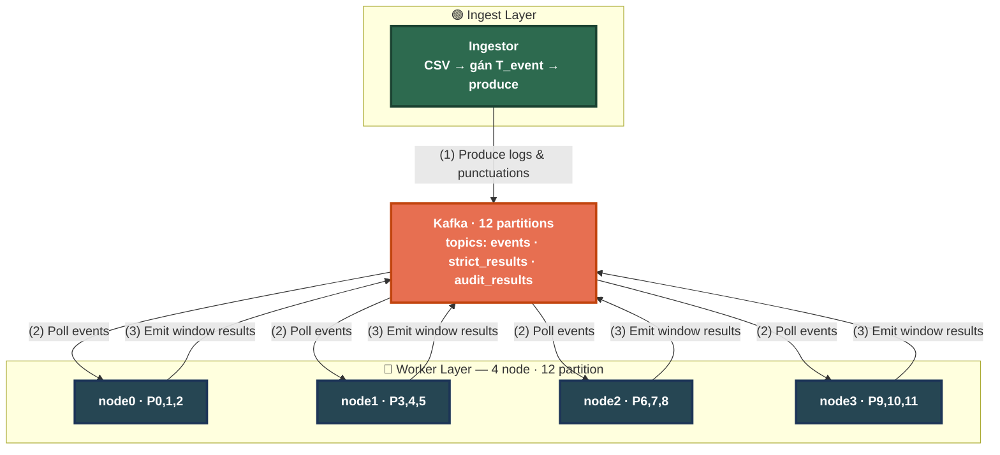

#### 1.1.2 Domain 2: Luồng điều phối Strict Watermark (Strict Coordination Domain)
Sơ đồ luồng gửi watermark cục bộ từ các Worker Nodes đến cụm Coordinator (đồng thuận Raft) để tổng hợp watermark toàn cục:

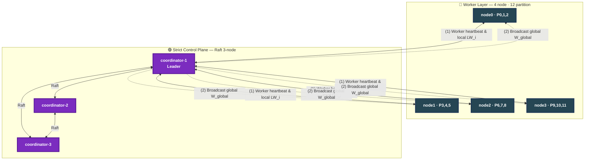

#### 1.1.3 Domain 3: Luồng điều phối Heuristic Watermark (Heuristic Aggregation Domain)
Sơ đồ gửi watermark cục bộ và DDSketch từ các Worker Nodes đến Aggregator phục vụ cho việc tính toán watermark heuristics theo thống kê:

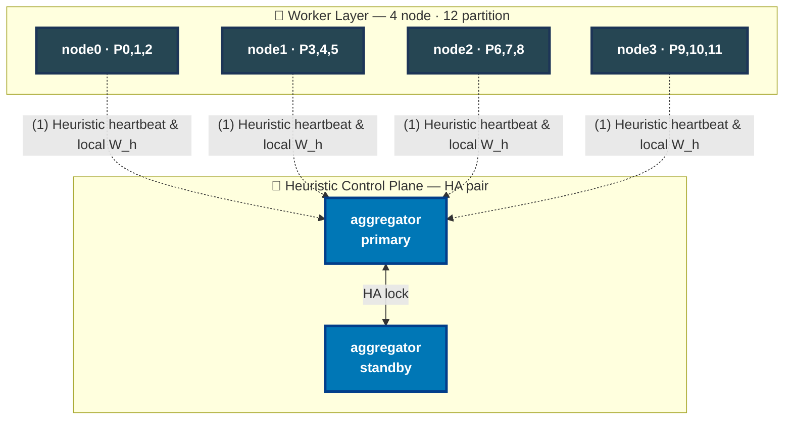

#### 1.1.4 Domain 4: Phối hợp Control & Metadata Plane (Control & Infrastructure Domain)
Sơ đồ gộp chung Ingestor, ZooKeeper, Aggregator và Coordination để thể hiện tính năng phát hiện dịch vụ và gửi tiến trình nạp dữ liệu:

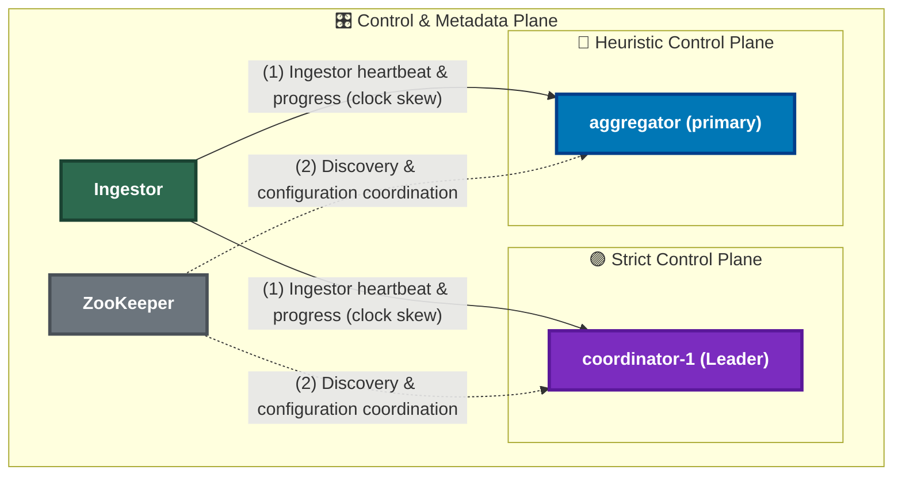

#### 1.1.5 Domain 5: Luồng lưu trữ trạng thái và Checkpoint (State & Storage Domain)
Sơ đồ mô tả tương tác lưu trữ checkpoint và dữ liệu lịch sử giữa các Worker Nodes với Shared Volume (Tier-2) và MinIO (Tier-3):

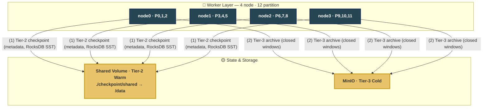

### 1.2 Chi tiết các luồng giao tiếp (Flows & Connections)

* **`Produce logs & punctuations`** (Ingestor ➔ Kafka): `Ingestor` đọc dữ liệu log từ CSV, gán nhãn `T_event` và gửi (produce) kèm Punctuation Token (trong chế độ Strict) vào Kafka topic `events`.
* **`Ingestor heartbeat`** (Ingestor ➔ Strict CP / Heur CP): `Ingestor` gửi nhịp tim thông báo tiến độ và độ lệch đồng hồ (`clock skew`) tới `Coordinator` (Strict) và `Aggregator` (Heuristic).
* **`Poll events`** (Kafka ➔ Workers): Các `Worker` poll dữ liệu log từ Kafka về sắp xếp lại theo event-time tại Bounded Priority Queue cục bộ.
* **`Worker heartbeat`** (Workers ➔ Strict CP): Worker định kỳ gửi heartbeat chứa watermark cục bộ (`LW_i`), Kafka offsets đã xử lý, chỉ số backpressure tới `Coordinator` (Leader).
* **`Get global state`** (Workers ➔ Strict CP): Worker định kỳ (500ms) truy vấn `Coordinator` để lấy Watermark toàn cục (`W_global`), term hiện tại và thông tin điều phối partition.
* **`Heuristic heartbeat`** (Workers ➔ Heur CP): Worker gửi nhịp tim chứa watermark cục bộ (`W_h`), độ trễ hiệu dụng (`L_eff`) dựa trên phân phối của `DDSketch` tới `Aggregator` primary.
* **`Emit window results`** (Workers ➔ Kafka): Khi Watermark tiến lên vượt qua biên đóng của window (`window_end <= W_global` hoặc `W_h`), worker chốt dữ liệu và đẩy kết quả `WindowResult` vào topic `strict_results` hoặc `audit_results`.
* **`Tier-2 checkpoint`** (Workers ➔ Storage): Định kỳ 10 giây, worker sao lưu trạng thái xử lý (metadata, offsets, RocksDB SST files) vào Shared Volume để hỗ trợ khôi phục tức thời khi có lỗi.
* **`Tier-3 archive`** (Workers ➔ Storage): Các window đã đóng hoàn chỉnh sẽ được worker đẩy lên kho lưu trữ MinIO Object Storage để lưu trữ lâu dài.
* **`Discovery & coordination`** (ZooKeeper ➔ Strict CP / Heur CP / Kafka): `ZooKeeper` duy trì cấu hình Kafka, bầu chọn Leader và hỗ trợ Service Discovery.

### 1.3 Vai trò của các Vertex trong sơ đồ thành phần (Container view)

| Ký hiệu Vertex | Tên thành phần | Phân lớp | Mô tả vai trò & Chức năng trong hệ thống |
|:---|:---|:---|:---|
| `ING` | Ingestor | Ingest Layer | Đọc dữ liệu CSV từ thư mục chia sẻ, gán nhãn thời gian sự kiện (`T_event`), gửi dữ liệu và Punctuation Token vào Kafka. |
| `KAFKA` | Kafka Broker | Data Plane | Broker điều phối thông điệp, lưu trữ các phân vùng (12 partitions) của các topics (`events`, `strict_results`, `audit_results`). |
| `ZK` | ZooKeeper | Auxiliary | Quản lý cấu hình cluster Kafka, hỗ trợ bầu chọn Leader (Coordinator/Aggregator) và phát hiện dịch vụ (Service Discovery). |
| `N0` - `N3` | Worker Nodes (0 - 3) | Worker Layer | Các thực thể tính toán chạy song song, tiêu thụ dữ liệu từ các partition Kafka được phân bổ, quản lý window và tính toán Watermark cục bộ. |
| `C1` - `C3` | Coordinator Nodes (1 - 3) | Strict Control Plane | Cụm điều phối trạng thái hoạt động theo giải thuật đồng thuận Raft (Leader-Follower) để tính toán Watermark toàn cục (`W_global`) trong chế độ Strict. |
| `AGG` / `AGGS` | Aggregator (Primary / Standby) | Heuristic Control Plane | Cặp cấu hình dự phòng nóng (HA qua khóa phân tán) để thu thập dữ liệu thống kê từ Workers và điều phối Watermark toàn cục trong chế độ Heuristic. |
| `VOL` | Shared Volume | Storage (Tier-2) | Phân vùng lưu trữ chia sẻ cục bộ, lưu checkpoint trạng thái (mỗi 10s) của các worker để hỗ trợ Failover tức thì. |
| `MINIO` | MinIO Storage | Storage (Tier-3) | Kho lưu trữ đối tượng dạng S3 tương thích, lưu trữ lâu dài các kết quả của các window đã được chốt (Purged/Closed). |
| `DASH` | Streamlit Dashboard | Management | Giao diện người dùng đồ họa để theo dõi hiệu năng hệ thống (completeness vs wait time), gửi lệnh Docker Compose điều khiển bật/tắt các container. |

**Vai trò của các tiến trình trong code (qua tham số dòng lệnh):**

| Role | Lệnh | Mô tả |
|------|------|-------|
| `ingestor` | `--role ingestor` | Đọc CSV trong `/data`, gắn `T_event`, produce log + Punctuation Token vào Kafka. |
| `worker` | `--role worker --mode strict\|heuristic` | Poll Kafka, sort theo event-time (Bounded PQ), dedupe, gom window, ghi RocksDB, emit kết quả. |
| `coordinator` | `--role coordinator --mode strict` | Cụm 3 node Raft. Tính `W_global = min(LW_i)`, điều phối failover, fencing token. |
| `aggregator` | `--role aggregator --mode heuristic` | Primary + standby (HA qua lock). Tổng hợp `W_global_h` từ DDSketch của worker. |

---

## 2. Hai mặt phẳng giao tiếp: Data plane vs Control plane

Hệ thống tách rõ **data plane** (Kafka, throughput cao) và **control plane**
(gRPC out-of-band, độ trễ thấp). gRPC chạy ở cổng **HTTP_PORT + 50**; nếu thư viện
`grpc` không có thì fallback sang HTTP REST (`run.py:46-102`, `run.py:233-330`).

```mermaid
flowchart LR
    subgraph dp["DATA PLANE — Kafka"]
        direction TB
        ev["events topic<br/>(log + punctuation)"]
        res["strict_results / audit_results"]
    end

    ING2["Ingestor"] -->|produce| ev
    ev -->|poll| WK["Worker"]
    WK -->|emit WindowResult| res

    subgraph cp["CONTROL PLANE — gRPC (HTTP+50) + HTTP fallback"]
        CO["Coordinator / Aggregator"]
    end

    ING2 -->|gRPC/HTTP: IngestorHeartbeat (clock skew, progress)| CO
    WK <-->|gRPC/HTTP:<br/>- WorkerHeartbeat (LW, offsets, BP)<br/>- GetGlobalState (W_global, partition types)<br/>- Reassign/Failback commands| CO
```

### Bảng cổng & endpoint (theo `deploy/docker-compose.yml`)

| Service | Host→Container HTTP | gRPC (HTTP+50) | Endpoint chính |
|---------|--------------------|----------------|----------------|
| coordinator-1 | `9000→8000` | `9050→8050` | `/health` `/state` `/api/metrics` `/ingestor-health` |
| coordinator-2 | `9003→8000` | `9053→8050` | nt |
| coordinator-3 | `9004→8000` | `9054→8050` | nt |
| aggregator | `9007→8000` | `+50` | `/health` `/state` |
| aggregator-standby | `9005→8000` | `+50` | nt |
| node0..node3 | `9101..9104→8000` | `+50` | `/health` `/api/metrics` `/state` |
| ingestor | (health `:8100`) | — | `/health` |
| Kafka | `29092` | — | broker |
| ZooKeeper | `2181` | — | — |
| Prometheus / Grafana / MinIO | `9090 / 3000 / 9002,9001` | — | scrape / UI / S3 |

**HTTP handler** (`run.py` `HealthHandler`):
- `GET /health` → liveness.
- `GET /api/metrics` → JSON metrics (dashboard + nội bộ).
- `GET /state` → trạng thái đầy đủ (W_global, term, partition_types, recovery_info, failover...).
- `GET /ingestor-health` → bảng health/clock-skew của ingestor.
- `POST /ingestor-heartbeat` → nhận heartbeat khi không dùng gRPC.

---

## 3. Luồng xử lý trong Worker (internal threads)

Mỗi worker tách luồng **nạp** (poll Kafka) và luồng **xử lý** (drain theo event-time),
cộng các luồng nền: HTTP server, heartbeat, checkpoint (`strict/worker.py`,
`run.py` `kafka_poll_loop`).

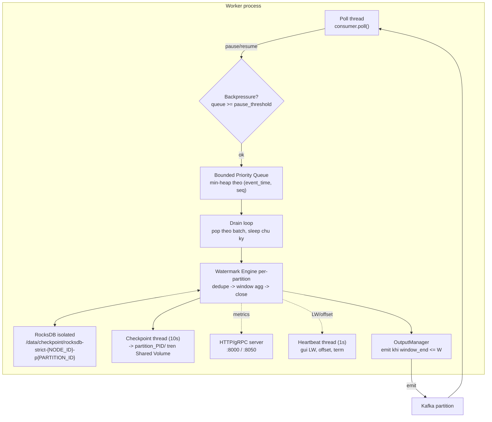

**Chi tiết:**
- **Bounded Priority Queue**: min-heap `(event_time, sequence, event)`; vượt `maxsize`
  thì pop ngay để chống OOM; giữ quá `max_wait_ms` cũng pop để không kẹt.
- **Backpressure PULL**: queue đầy → `consumer.pause()`, vơi < ngưỡng → `consumer.resume()`
  (`BP_PAUSE_THRESHOLD`, `BP_RESUME_THRESHOLD`).
- **Dedupe**: `Watermark Filter` (`T_event < W` → drop) + `seen-id hash` trong RocksDB (TTL).
- **Checkpoint**: 10s/lần, ghi `partition_PID/checkpoint.json` + `emitted.json` lên
  Shared Volume (Tier-2) để node khác tiếp quản khi failover.

---

## 4. Strict Watermark — chuỗi giao tiếp đầy đủ

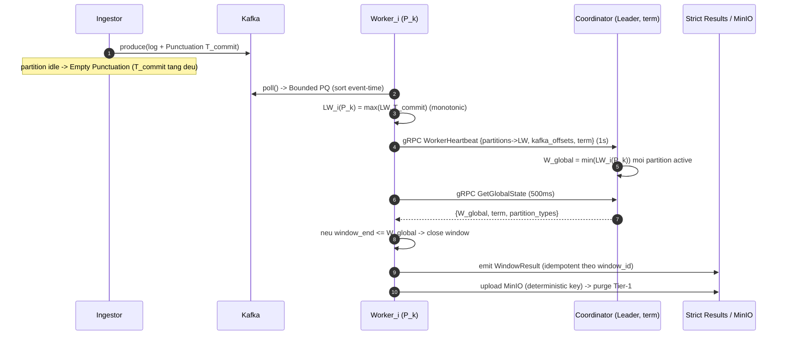

**Bất biến strict:** `W_global = min` trên *mọi* partition chưa-failed (không Idleness
Bypass) → Empty Punctuation giữ watermark luôn tiến. `window_end ≤ W_global` mới emit
⇒ **0% mất dữ liệu**. "Wait Time" = `DELTA_BASE_S` (δ): càng lớn càng chờ lâu data trễ.

---

## 5. Heuristic Watermark — chuỗi giao tiếp

```mermaid
sequenceDiagram
    autonumber
    participant K as Kafka
    participant W as Worker_i (P_k)
    participant AGG as Aggregator (primary)
    participant AS as Aggregator standby
    participant DLQ as DLQ store

    W->>K: poll() event
    W->>W: DDSketch.add(lag = now - T_event)
    W->>W: L_eff = quantile(p_normal) (data-driven)
    W->>W: W_h = max_event_time - L_eff
    W->>W: window_end <= W_h -> close (chap nhan mat it)
    W->>W: event qua tre (T_event < W_h) -> day DLQ
    W->>AGG: gRPC heartbeat {W_h, L_eff, sketch}
    AGG->>AGG: W_global_h = min(W_h) active partitions
    AGG-->>AS: replicate qua lock; standby takeover neu primary chet
    DLQ-->>W: replay/account loss (per_window_loss)
```

**Khác strict:** không cần punctuation toàn cục — mỗi partition tự ước lượng độ trễ
bằng **DDSketch** rồi đặt `L_eff = quantile(p)`. `p` càng cao ⇒ chờ lâu hơn ⇒ completeness
cao hơn nhưng latency tăng. Sự kiện vượt biên → **DLQ** (đo loss thay vì chặn).

---

## 6. Fault Tolerance — Failover & Failback (Strict)

### 6.1 Partition State Machine (giữ trong Raft log)

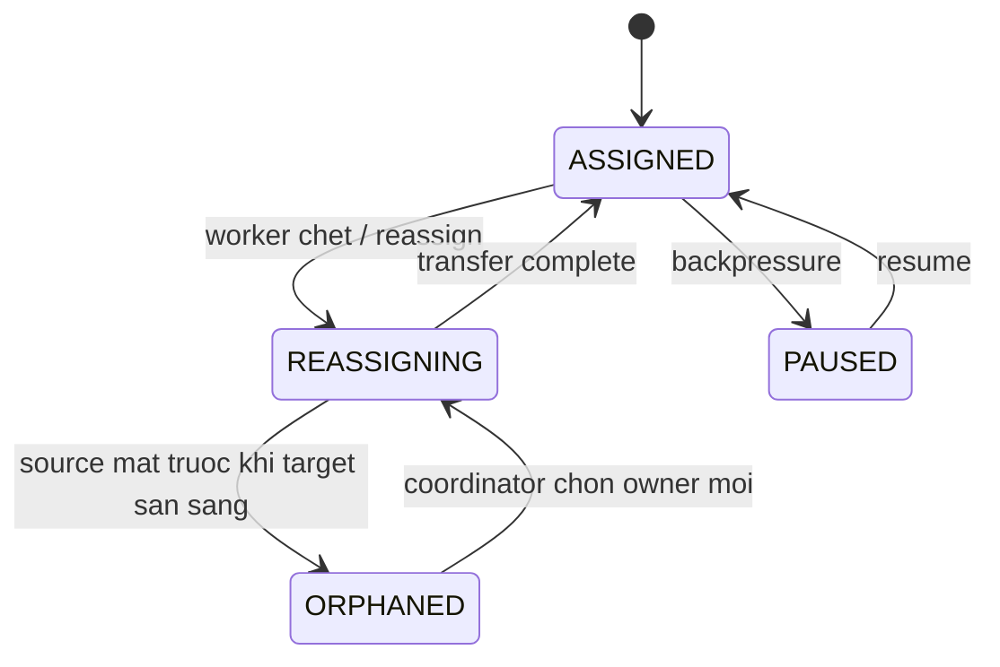

### 6.2 Chuỗi failover khi một worker chết

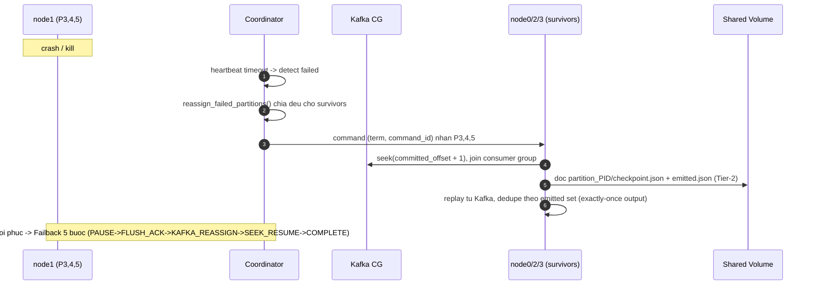

> **Quyết định thiết kế quan trọng (đã implement):** 4 worker **dùng chung** Shared
> Volume (`./checkpoint/shared → /data`) để survivor đọc được checkpoint Tier-2 của
> node chết. Vì `entrypoint.sh` xoá checkpoint khi container khởi động, nó **chỉ xoá
> dữ liệu partition của chính node** (`NODE_ID` + `PARTITIONS`) — không đụng RocksDB
> đang mở của 3 node kia, tránh cascade crash. Xem [entrypoint.sh](../deploy/entrypoint.sh).

---

## 7. Tiered State Storage

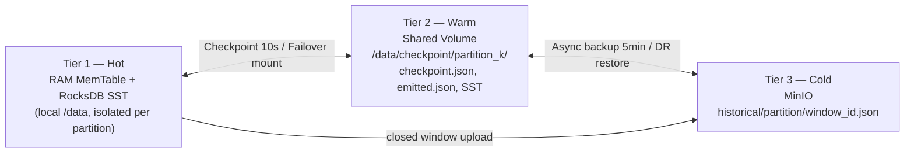

**Eviction 4 trạng thái** (chống mất/trùng khi crash giữa upload):
`CLOSED → UPLOADING → UPLOADED → PURGED`, mỗi bước fsync metadata trước khi hành động.
MinIO key **deterministic** theo `{partition_id}/{window_id}` ⇒ re-upload không tạo bản trùng.

---

## 8. Coordinator HA (Raft)

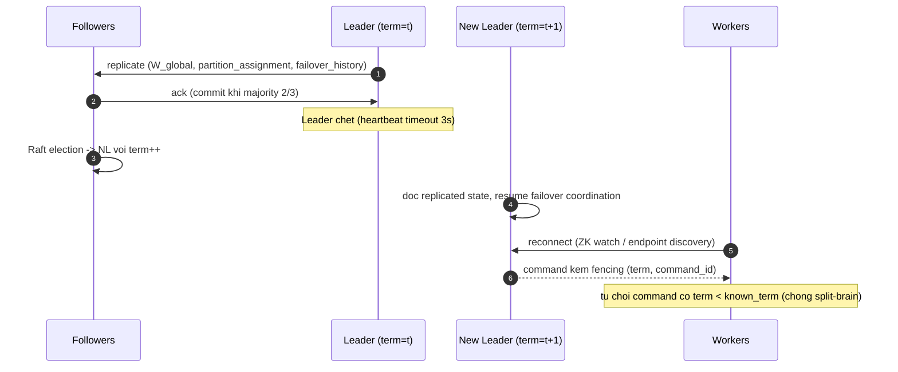

---

## 9. Dashboard ↔ Cluster

`deploy/dashboard.py` (Streamlit) là mặt phẳng điều khiển cho người dùng. **Chỉ điều
khiển `docker-compose.yml`** (sim bị vô hiệu hoá vĩnh viễn).

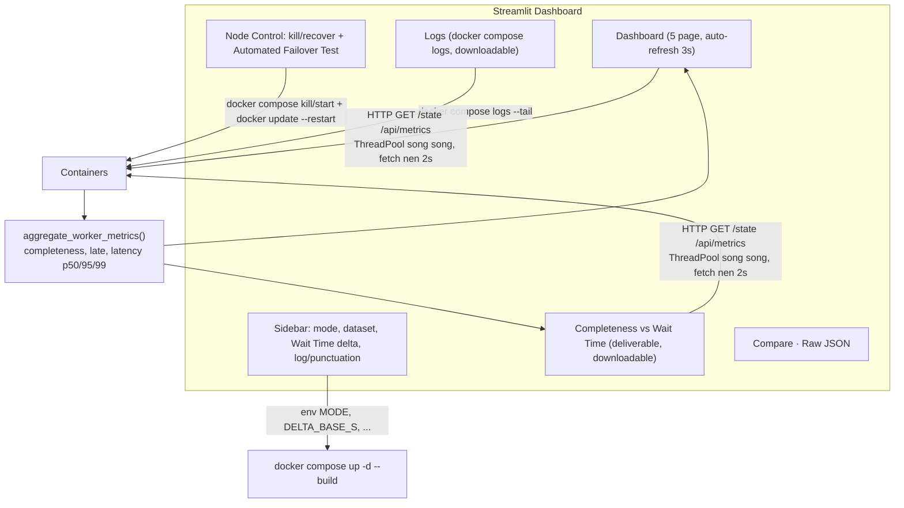

- **Wait Time δ** ở sidebar → biến `DELTA_BASE_S` truyền qua compose vào coordinator + worker.
- **Completeness vs Wait Time**: ghi từng điểm `(δ, completeness%, late%, latency)` → bảng +
  đồ thị trade-off + tải CSV (đúng deliverable #112).
- **Automated Failover Test**: kill node → quan sát reassignment → recover, ghi timeline
  `before/just_killed/during_outage/after_recover` và tải CSV.

---

## 10. Triển khai (Deployment topology)

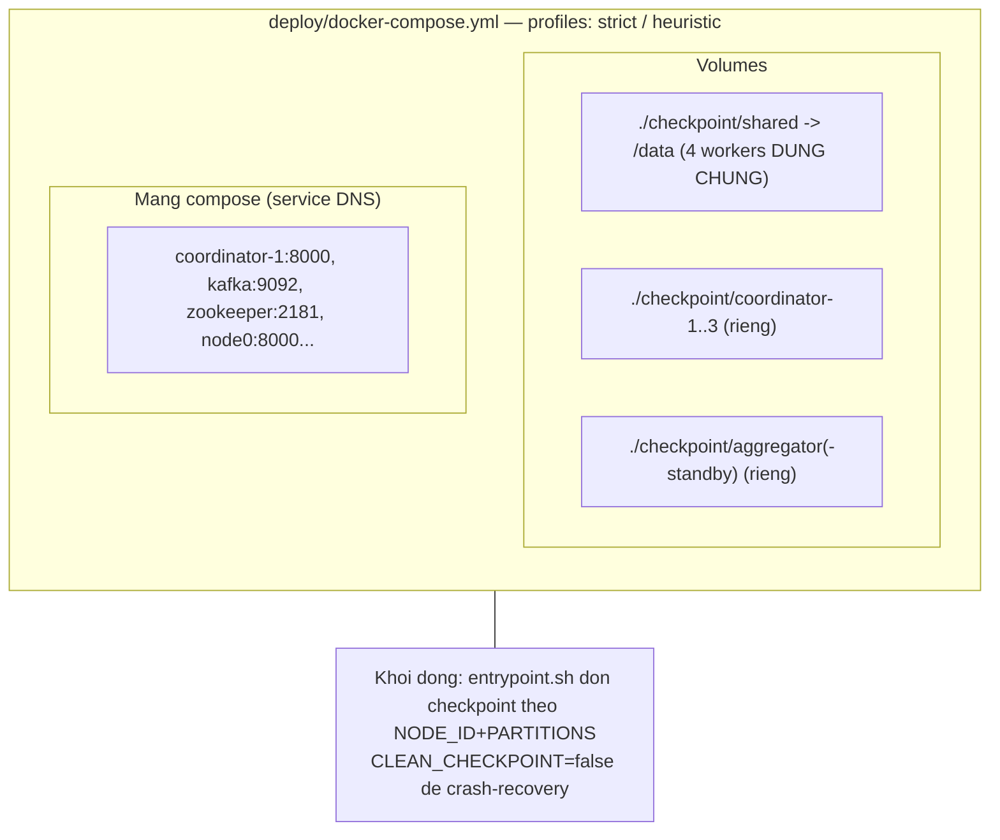

**Nguyên tắc vận hành:**
1. Chỉ chạy `deploy/docker-compose.yml` (các compose khác không được dùng).
2. Workers chia 12 partition: node0=`0,1,2`, node1=`3,4,5`, node2=`6,7,8`, node3=`9,10,11`.
3. `MODE`/`DELTA_BASE_S`/`LOG_LEVEL`/`PUNCTUATION_MODE` truyền qua biến môi trường compose.
4. Quan sát: Dashboard (Streamlit) + Grafana/Prometheus + MinIO console.

---

## 11. Bản đồ file ↔ thành phần

| Thành phần | File |
|------------|------|
| Entry/dispatch, HTTP+gRPC server, poll loop | [run.py](../run.py) |
| Strict engine (window, dedupe, checkpoint) | [strict/engine.py](../strict/engine.py) |
| Strict worker (multi-partition) | [strict/worker.py](../strict/worker.py) |
| Coordinator (W_global, Raft) | [strict/coordinator.py](../strict/coordinator.py) |
| Failover / Failback manager | [strict/failover.py](../strict/failover.py) |
| Ingestor health monitor | [strict/ingestor_health.py](../strict/ingestor_health.py) |
| Heuristic engine (DDSketch, L_eff) | [heuristic/engine.py](../heuristic/engine.py) |
| Heuristic aggregator (HA) | [heuristic/aggregator.py](../heuristic/aggregator.py) |
| RocksDB wrapper | [common/rocks_store.py](../common/rocks_store.py) |
| Tiered storage (MinIO) | [common/tiered_storage.py](../common/tiered_storage.py) |
| Monitoring / Prometheus | [common/monitoring.py](../common/monitoring.py) |
| Dashboard | [deploy/dashboard.py](../deploy/dashboard.py) |
| Deploy + cleanup | [deploy/docker-compose.yml](../deploy/docker-compose.yml) · [deploy/entrypoint.sh](../deploy/entrypoint.sh) |
