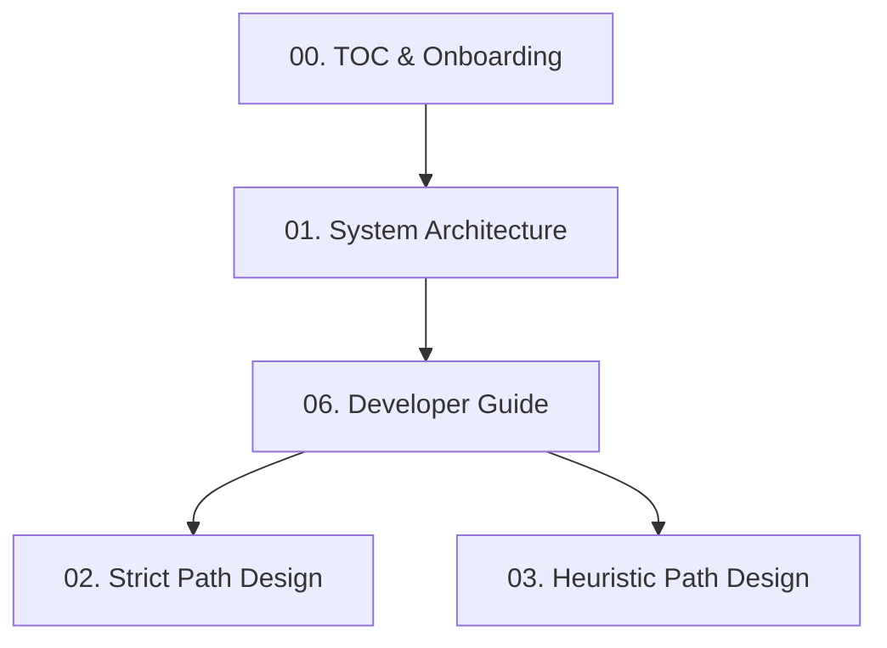
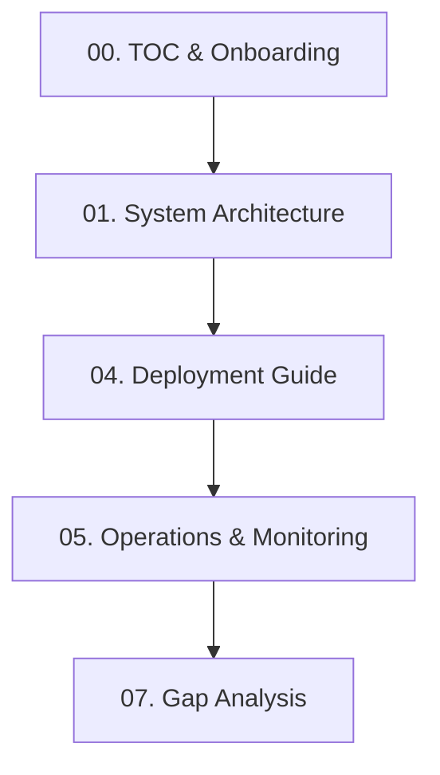

# DOCUMENT 00: TABLE OF CONTENTS & PROJECT ONBOARDING GUIDE

This document serves as the entry point for anyone wishing to understand, develop, or operate the **distributed Stateful Stream Processing system (refactor)**. The system is designed to process out-of-order log data utilizing two primary watermark mechanisms: **Strict Watermark** (zero data loss) and **Heuristic Watermark** (low latency based on DDSketch estimation).

---

## 1. Document Map

This documentation suite is structured into 8 distinct sections to reflect the technical architecture and cater to different roles within the project:

1. **[Document 00: Table of Contents & Onboarding](file:///D:/dev/csdlpt/refactor/docs/00_TOC_AND_PROJECT_ONBOARDING.md)** (This file)
   * General overview, document map, and glossary.
2. **[Document 01: System Architecture Overview](file:///D:/dev/csdlpt/refactor/docs/01_SYSTEM_ARCHITECTURE_OVERVIEW.md)**
   * The Dual-Path architecture, details on the 4 roles (`coordinator`, `aggregator`, `worker`, `ingestor`), Hybrid Routing, and sequence flows.
3. **[Document 02: Strict Path Detailed Design](file:///D:/dev/csdlpt/refactor/docs/02_STRICT_PATH_DETAILED_DESIGN.md)**
   * Punctuation-based Watermarks, Cluster HA coordination (Raft, heartbeats, fencing tokens), state management (RocksDB + MinIO), and failover protocols.
4. **[Document 03: Heuristic Path Detailed Design](file:///D:/dev/csdlpt/refactor/docs/03_HEURISTIC_PATH_DETAILED_DESIGN.md)**
   * DDSketch-based Watermarks, Sliding Window DDSketch, cold start, negative lag handlers, DLQ pipeline, and the Correction Protocol.
5. **[Document 04: Deployment and Configuration Guide](file:///D:/dev/csdlpt/refactor/docs/04_DEPLOYMENT_AND_CONFIGURATION_GUIDE.md)**
   * Capacity planning, ZooKeeper/Kafka production configuration, real client integration adapters, environment variables, and feature flags.
6. **[Document 05: Operations and Monitoring Guide](file:///D:/dev/csdlpt/refactor/docs/05_OPERATIONS_AND_MONITORING_GUIDE.md)**
   * Prometheus metrics, automatic alert rules, PagerDuty integration, and Incident Runbooks.
7. **[Document 06: Developer Onboarding and Testing Guide](file:///D:/dev/csdlpt/refactor/docs/06_DEVELOPER_ONBOARDING_AND_TESTING_GUIDE.md)**
   * Local setup, file mapping, testing strategy, and CLI command execution.
8. **[Document 07: Gap Analysis and Limitations](file:///D:/dev/csdlpt/refactor/docs/07_GAP_ANALYSIS_AND_LIMITATIONS.md)**
   * Summary of completed gaps, security out-of-scope details (TLS, SASL/SCRAM, mTLS), and compose configurations.

---

## 2. Recommended Reading Path

Depending on your role, approach this documentation using the following paths:

### For Developers onboarding to the codebase:

### For Operations / DevOps / SRE Engineers:

---

## 3. Glossary

To ensure alignment across all documents, here are definitions for the core concepts:

| Term | Definition |
|---|---|
| **Event-Time** | The timestamp when the event actually occurred at the log source (e.g., client side). |
| **Arrival-Time** (Processing-Time) | The timestamp when the stream processor (worker) receives the log event. |
| **Log Lag** | The transmission latency, computed as `arrival_time - event_time`. Typically follows a heavy-tailed distribution. |
| **Watermark** | A monotonically increasing time boundary indicating event-time progress. E.g., Watermark = $T$ implies the system assumes no further events with Event-Time $< T$ will arrive. |
| **Allowed Lateness** | The maximum allowed lateness for event processing before it is routed to the DLQ. |
| **Punctuation Token** | A special token injected into the stream by the Ingestor to signal a committed Event-Time (T_commit) for watermark calculation in Strict Mode. |
| **DDSketch** | A quantile sketch data structure with a bounded relative error ($\alpha$), used in Heuristic Mode to compute empirical log latencies. |
| **DLQ (Dead Letter Queue)** | A Kafka topic holding late-arriving events for offline reconciliation and corrections. |
| **Fencing Token** | A monotonically increasing integer passed in heartbeats to reject stale leader commands and prevent split-brain issues. |
| **RocksDB** | An embedded, high-performance key-value store used as the local state store on the worker nodes. |
| **Tiered Storage** | Tiered state management. Stale closed windows are flushed from local RocksDB (Tier 1 - SSD) to Object Storage (Tier 3 - MinIO) to free disk space. |
| **Exactly-Once** | A processing guarantee ensuring that each event is processed exactly once, avoiding duplicate results even in case of node crashes. |
